Stability of Vaginal microbiota during pregnancy and its importance for early infant microbiota using ASV
================

-   [0 - Prep](#prep)
    -   [0.1 - Load libraries](#load-libraries)
    -   [0.2 Download main data](#download-main-data)
    -   [0.3 Download precalculated data](#download-precalculated-data)
    -   [0.4 - Overview of samples, read counts and observed richness](#overview-of-samples-read-counts-and-observed-richness)
-   [1 - Vaginal microbiome](#vaginal-microbiome)
    -   [1.1 - Data prep](#data-prep)
    -   [1.2 - Observed vaginal ASV's:](#observed-vaginal-asvs)
    -   [1.3 - Community State Types](#community-state-types)
        -   [1.3.1 - Define Community State Types](#define-community-state-types)
            -   [1.3.1.1 - Find optimal number of clusters](#find-optimal-number-of-clusters)
            -   [1.3.1.2 - Create CSTs](#create-csts)
        -   [1.3.2 - CST composition and stability](#cst-composition-and-stability)
            -   [1.3.2.1 - Prepare data](#prepare-data)
            -   [1.3.2.2 - Describe CST composition and stability](#describe-cst-composition-and-stability)
            -   [1.3.2.3 - Stability between w24 and w36 (Permutational)](#stability-between-w24-and-w36-permutational)
                -   [1.3.2.3.1 - Perform permutation calculations](#perform-permutation-calculations)
                -   [1.3.2.3.2 - CST stability results](#cst-stability-results)
    -   [1.4 Beta diversity of vaginal](#beta-diversity-of-vaginal)
        -   [1.4.1 - NMDS plot of vaginal samples](#nmds-plot-of-vaginal-samples)
        -   [1.4.2 - Statistical test of beta diversity](#statistical-test-of-beta-diversity)
-   [2 - Infant Samples](#infant-samples)
    -   [2.1 - Delivery mode](#delivery-mode)
    -   [2.2 - Airway microbiome](#airway-microbiome)
        -   [2.2.1 - Subset airway samples](#subset-airway-samples)
        -   [2.2.2 - Dominant airway taxa and overall richness](#dominant-airway-taxa-and-overall-richness)
        -   [2.2.3 - Airway alpha diversity](#airway-alpha-diversity)
        -   [2.2.4 - Airway beta diversity](#airway-beta-diversity)
            -   [2.2.4.1 - Preparation](#preparation)
            -   [2.2.4.2 - Plots and statistics](#plots-and-statistics)
    -   [2.3 - Fecal microbiome](#fecal-microbiome)
        -   [2.3.1 - Subset fecal samples](#subset-fecal-samples)
        -   [2.3.2 - Dominant fecal taxa and overall richness](#dominant-fecal-taxa-and-overall-richness)
        -   [2.3.3 - Fecal alpha diversity](#fecal-alpha-diversity)
        -   [2.3.4 - Fecal beta diversity](#fecal-beta-diversity)
            -   [2.3.4.1 - Preparation](#preparation-1)
            -   [2.3.4.2 - Plots and statistics](#plots-and-statistics-1)
-   [3 - Transfer](#transfer)
    -   [3.1 - Preparation](#preparation-2)
        -   [3.1.1 - Calculation of ALL individual ASV models](#calculation-of-all-individual-asv-models)
        -   [3.1.2 - Permutational inference calculation](#permutational-inference-calculation)
            -   [3.1.2.2 - Format output](#format-output)
            -   [3.1.2.3 - Overview of testable ASVs](#overview-of-testable-asvs)
            -   [3.1.2.4 - ASVs with significant transfer odds](#asvs-with-significant-transfer-odds)
        -   [3.1.3 - Plot ASV transfer odds](#plot-asv-transfer-odds)
            -   [3.1.3.1 - Figure S3a - vaginal delivery](#figure-s3a---vaginal-delivery)
            -   [3.1.3.2 - Figure S3b - sectio delivery](#figure-s3b---sectio-delivery)
            -   [3.1.3.3 - Figure S3c - Acute sectio delivery](#figure-s3c---acute-sectio-delivery)
            -   [3.1.3.4 - Figure S3d - Planned sectio delivery](#figure-s3d---planned-sectio-delivery)
            -   [3.1.3.5 - Figure S3 statistics](#figure-s3-statistics)
    -   [3.2 - Weighted Odds Ratio](#weighted-odds-ratio)
        -   [3.2.1 - OVERALL ratio between positive and negative odds](#overall-ratio-between-positive-and-negative-odds)
            -   [3.2.1.1 - WTR Calculation](#wtr-calculation)
            -   [3.2.1.2 - WTR tables and figures](#wtr-tables-and-figures)
        -   [3.2.2 - WTR at order level](#wtr-at-order-level)
            -   [3.2.2.1 - Comparing vaginal to sectio delivery](#comparing-vaginal-to-sectio-delivery)
                -   [3.2.2.1.1 - Calculations](#calculations)
                -   [3.2.2.1.2 - Output](#output)
            -   [3.2.2.2 - Comparing vaginal to planend and acute sectio delivery](#comparing-vaginal-to-planend-and-acute-sectio-delivery)
                -   [3.2.2.2.1 - Calculations](#calculations-1)
                -   [3.2.2.2.2 - Output](#output-1)
    -   [3.3 - Transfer of mothers dominant ASV](#transfer-of-mothers-dominant-asv)
        -   [3.3.1 - Calculations](#calculations-2)
        -   [3.3.2 - Output](#output-2)
    -   [3.4 - Phylogenetic tree with transfer odds](#phylogenetic-tree-with-transfer-odds)

0 - Prep
========

Data for this project is from the COPSAC2010 cohort of 711 children / mother pairs. In this project we include vaginal samples (week 24 and week 36), airway samples (1 week, 1 month, and 3 months), and fecal samples (1 week, 1 month, and 1 year) for all mother-child dyads which include a week 36 vaginal sample (665 mothers and 651 children). We describe the vaginal microbiome development from mid pregnancy (week 24) to late pregnancy (week 36), and the transfer to the airways and gut of the children in the first year of life. A special focus is on the differences between transfer to vaginal and sectio born children.

0.1 - Load libraries
--------------------

0.2 Download main data
----------------------

**COPSACbirthmicrobiome\_ASV.RData** contains the phyloseq object that is used for all subsequent analysis and with this the whole analysis can be easily replicated

0.3 Download precalculated data
-------------------------------

To reduce the computational requirements during this analysis, we have precalculated the most computer intensive parts and if these are downloaded the calculations can be skipped. This means that you can either run this code chunk or all following code chunks which are currently set not to be evaluated.

0.4 - Overview of samples, read counts and observed richness
------------------------------------------------------------

    ## [1] "Phyloseq object used"

    ## phyloseq-class experiment-level object
    ## otu_table()   OTU Table:         [ 15514 taxa and 4756 samples ]
    ## sample_data() Sample Data:       [ 4756 samples by 4 sample variables ]
    ## tax_table()   Taxonomy Table:    [ 15514 taxa by 10 taxonomic ranks ]
    ## phy_tree()    Phylogenetic Tree: [ 15514 tips and 15356 internal nodes ]

    ## [1] "sample count per time and type"

    ##    Compartment         Time Samples
    ## 1      Vaginal      Week_24     657
    ## 4      Vaginal      Week_36     665
    ## 8        Fecal     One_week     533
    ## 11       Fecal    One_month     575
    ## 17       Fecal     One_year     580
    ## 9       Airway     One_week     526
    ## 12      Airway    One_month     606
    ## 15      Airway Three_months     614

    ## [1] "ASVs observed per compartment"

    ## nfec nair nvag 
    ## 6818 7500 3287

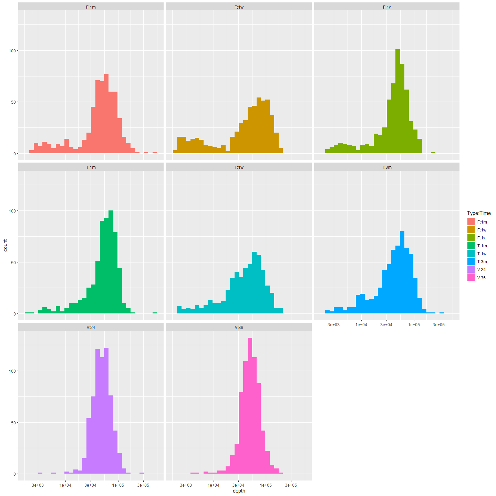

<table style="width:100%;">
<caption>Summary stats for compartment</caption>
<colgroup>
<col width="3%" />
<col width="8%" />
<col width="7%" />
<col width="6%" />
<col width="6%" />
<col width="6%" />
<col width="10%" />
<col width="9%" />
<col width="7%" />
<col width="8%" />
<col width="8%" />
<col width="8%" />
<col width="8%" />
</colgroup>
<thead>
<tr class="header">
<th align="left">Type</th>
<th align="right">median_count</th>
<th align="right">mean_count</th>
<th align="right">sd_count</th>
<th align="right">q25_count</th>
<th align="right">q75_count</th>
<th align="right">median_observed</th>
<th align="right">mean_observed</th>
<th align="right">sd_observed</th>
<th align="right">min_observed</th>
<th align="right">max_observed</th>
<th align="right">q25_observed</th>
<th align="right">q75_observed</th>
</tr>
</thead>
<tbody>
<tr class="odd">
<td align="left">F</td>
<td align="right">50014.5</td>
<td align="right">55171.8</td>
<td align="right">38967.9</td>
<td align="right">30132.2</td>
<td align="right">75199.0</td>
<td align="right">37</td>
<td align="right">45.2</td>
<td align="right">27.3</td>
<td align="right">6</td>
<td align="right">298</td>
<td align="right">26</td>
<td align="right">60</td>
</tr>
<tr class="even">
<td align="left">T</td>
<td align="right">51232.0</td>
<td align="right">54496.2</td>
<td align="right">35433.9</td>
<td align="right">29259.2</td>
<td align="right">73810.5</td>
<td align="right">26</td>
<td align="right">28.8</td>
<td align="right">15.6</td>
<td align="right">1</td>
<td align="right">231</td>
<td align="right">19</td>
<td align="right">36</td>
</tr>
<tr class="odd">
<td align="left">V</td>
<td align="right">50121.0</td>
<td align="right">53875.3</td>
<td align="right">23442.5</td>
<td align="right">38329.8</td>
<td align="right">64631.5</td>
<td align="right">20</td>
<td align="right">25.0</td>
<td align="right">18.8</td>
<td align="right">2</td>
<td align="right">167</td>
<td align="right">12</td>
<td align="right">32</td>
</tr>
</tbody>
</table>

<table style="width:100%;">
<caption>Summary stats for compartment/timepoint</caption>
<colgroup>
<col width="3%" />
<col width="3%" />
<col width="8%" />
<col width="7%" />
<col width="5%" />
<col width="6%" />
<col width="6%" />
<col width="9%" />
<col width="8%" />
<col width="7%" />
<col width="8%" />
<col width="8%" />
<col width="8%" />
<col width="8%" />
</colgroup>
<thead>
<tr class="header">
<th align="left">Type</th>
<th align="left">Time</th>
<th align="right">median_count</th>
<th align="right">mean_count</th>
<th align="right">sd_count</th>
<th align="right">q25_count</th>
<th align="right">q75_count</th>
<th align="right">median_observed</th>
<th align="right">mean_observed</th>
<th align="right">sd_observed</th>
<th align="right">min_observed</th>
<th align="right">max_observed</th>
<th align="right">q25_observed</th>
<th align="right">q75_observed</th>
</tr>
</thead>
<tbody>
<tr class="odd">
<td align="left">F</td>
<td align="left">1m</td>
<td align="right">51612.0</td>
<td align="right">57232.7</td>
<td align="right">41400.8</td>
<td align="right">33938.5</td>
<td align="right">75985.5</td>
<td align="right">29</td>
<td align="right">31.9</td>
<td align="right">15.0</td>
<td align="right">6</td>
<td align="right">175</td>
<td align="right">22</td>
<td align="right">39.0</td>
</tr>
<tr class="even">
<td align="left">F</td>
<td align="left">1w</td>
<td align="right">53540.0</td>
<td align="right">59559.5</td>
<td align="right">44625.8</td>
<td align="right">23051.0</td>
<td align="right">91744.0</td>
<td align="right">29</td>
<td align="right">32.1</td>
<td align="right">19.1</td>
<td align="right">8</td>
<td align="right">298</td>
<td align="right">22</td>
<td align="right">37.0</td>
</tr>
<tr class="odd">
<td align="left">F</td>
<td align="left">1y</td>
<td align="right">47810.0</td>
<td align="right">49096.4</td>
<td align="right">28920.9</td>
<td align="right">31266.0</td>
<td align="right">63858.5</td>
<td align="right">67</td>
<td align="right">70.5</td>
<td align="right">25.3</td>
<td align="right">12</td>
<td align="right">175</td>
<td align="right">54</td>
<td align="right">84.2</td>
</tr>
<tr class="even">
<td align="left">T</td>
<td align="left">1m</td>
<td align="right">58918.0</td>
<td align="right">60030.7</td>
<td align="right">35014.2</td>
<td align="right">40285.5</td>
<td align="right">77725.5</td>
<td align="right">27</td>
<td align="right">29.1</td>
<td align="right">16.2</td>
<td align="right">3</td>
<td align="right">226</td>
<td align="right">20</td>
<td align="right">35.0</td>
</tr>
<tr class="odd">
<td align="left">T</td>
<td align="left">1w</td>
<td align="right">45304.5</td>
<td align="right">51252.8</td>
<td align="right">35794.3</td>
<td align="right">23772.5</td>
<td align="right">72282.2</td>
<td align="right">20</td>
<td align="right">22.6</td>
<td align="right">13.3</td>
<td align="right">2</td>
<td align="right">231</td>
<td align="right">16</td>
<td align="right">26.0</td>
</tr>
<tr class="even">
<td align="left">T</td>
<td align="left">3m</td>
<td align="right">46566.0</td>
<td align="right">51812.3</td>
<td align="right">34933.3</td>
<td align="right">27468.2</td>
<td align="right">70207.2</td>
<td align="right">33</td>
<td align="right">34.0</td>
<td align="right">14.9</td>
<td align="right">1</td>
<td align="right">114</td>
<td align="right">24</td>
<td align="right">44.0</td>
</tr>
<tr class="odd">
<td align="left">V</td>
<td align="left">24</td>
<td align="right">49918.0</td>
<td align="right">53074.2</td>
<td align="right">23023.6</td>
<td align="right">37689.0</td>
<td align="right">63701.0</td>
<td align="right">20</td>
<td align="right">25.3</td>
<td align="right">17.9</td>
<td align="right">2</td>
<td align="right">125</td>
<td align="right">13</td>
<td align="right">32.0</td>
</tr>
<tr class="even">
<td align="left">V</td>
<td align="left">36</td>
<td align="right">50341.0</td>
<td align="right">54666.7</td>
<td align="right">23840.0</td>
<td align="right">38704.0</td>
<td align="right">65933.0</td>
<td align="right">19</td>
<td align="right">24.7</td>
<td align="right">19.7</td>
<td align="right">2</td>
<td align="right">167</td>
<td align="right">11</td>
<td align="right">31.0</td>
</tr>
</tbody>
</table>

1 - Vaginal microbiome
======================

1.1 - Data prep
---------------

**vag\_taxglm.RData** contains phyloseq objects with vaginal samples at phylum, genus and ASV level for both read counts and relative abundances, as well as a rarefied (2000 reads/sample) at ASV level. **OrdinationRes.RData** contains weighted UniFrac distances and jensen-Shannon divergence, as well as NMDS ordinations of both

1.2 - Observed vaginal ASV's:
-----------------------------

The distribution of the vaginal reads are here summarized on phylum, genus and individual ASV level.

| Included   |  Phylum|  Genus|   ASV|
|:-----------|-------:|------:|-----:|
| All        |      28|    463|  3287|
| &gt; 0.01% |      16|    193|   958|
| &gt; 0.1%  |      10|     94|   420|
| &gt; 1%    |       8|     41|   173|

| Kingdom  | Phylum         |  taxprc|
|:---------|:---------------|-------:|
| Bacteria | Firmicutes     |    85.2|
| Bacteria | Actinobacteria |    12.0|
| Bacteria | Proteobacteria |     1.5|
| Bacteria | Bacteroidetes  |     0.8|
| Bacteria | Fusobacteria   |     0.2|
| Bacteria | Tenericutes    |     0.1|

<table style="width:100%;">
<caption>Average abundance according to genus</caption>
<colgroup>
<col width="8%" />
<col width="13%" />
<col width="18%" />
<col width="16%" />
<col width="17%" />
<col width="18%" />
<col width="6%" />
</colgroup>
<thead>
<tr class="header">
<th align="left">Kingdom</th>
<th align="left">Phylum</th>
<th align="left">Class</th>
<th align="left">Order</th>
<th align="left">Family</th>
<th align="left">Genus</th>
<th align="right">taxprc</th>
</tr>
</thead>
<tbody>
<tr class="odd">
<td align="left">Bacteria</td>
<td align="left">Firmicutes</td>
<td align="left">Bacilli</td>
<td align="left">Lactobacillales</td>
<td align="left">Lactobacillaceae</td>
<td align="left">Lactobacillus</td>
<td align="right">81.1</td>
</tr>
<tr class="even">
<td align="left">Bacteria</td>
<td align="left">Actinobacteria</td>
<td align="left">Actinobacteria</td>
<td align="left">Bifidobacteriales</td>
<td align="left">Bifidobacteriaceae</td>
<td align="left">Gardnerella</td>
<td align="right">9.0</td>
</tr>
<tr class="odd">
<td align="left">Bacteria</td>
<td align="left">Actinobacteria</td>
<td align="left">Actinobacteria</td>
<td align="left">Bifidobacteriales</td>
<td align="left">Bifidobacteriaceae</td>
<td align="left">Bifidobacterium</td>
<td align="right">1.4</td>
</tr>
<tr class="even">
<td align="left">Bacteria</td>
<td align="left">Actinobacteria</td>
<td align="left">Coriobacteriia</td>
<td align="left">Coriobacteriales</td>
<td align="left">Atopobiaceae</td>
<td align="left">Atopobium</td>
<td align="right">1.3</td>
</tr>
<tr class="odd">
<td align="left">Bacteria</td>
<td align="left">Proteobacteria</td>
<td align="left">Gammaproteobacteria</td>
<td align="left">Enterobacteriales</td>
<td align="left">Enterobacteriaceae</td>
<td align="left">Escherichia_Shigella</td>
<td align="right">1.2</td>
</tr>
<tr class="even">
<td align="left">Bacteria</td>
<td align="left">Firmicutes</td>
<td align="left">Negativicutes</td>
<td align="left">Selenomonadales</td>
<td align="left">Veillonellaceae</td>
<td align="left">Megasphaera</td>
<td align="right">0.9</td>
</tr>
</tbody>
</table>

<table>
<caption>Average abundance according to ASV</caption>
<colgroup>
<col width="6%" />
<col width="10%" />
<col width="10%" />
<col width="12%" />
<col width="13%" />
<col width="9%" />
<col width="15%" />
<col width="16%" />
<col width="5%" />
</colgroup>
<thead>
<tr class="header">
<th align="left">Kingdom</th>
<th align="left">Phylum</th>
<th align="left">Class</th>
<th align="left">Order</th>
<th align="left">Family</th>
<th align="left">Genus</th>
<th align="left">Species</th>
<th align="left">name</th>
<th align="right">taxprc</th>
</tr>
</thead>
<tbody>
<tr class="odd">
<td align="left">Bacteria</td>
<td align="left">Firmicutes</td>
<td align="left">Bacilli</td>
<td align="left">Lactobacillales</td>
<td align="left">Lactobacillaceae</td>
<td align="left">Lactobacillus</td>
<td align="left">Genus_Lactobacillus</td>
<td align="left">Genus_Lactobacillus_323</td>
<td align="right">31.5</td>
</tr>
<tr class="even">
<td align="left">Bacteria</td>
<td align="left">Firmicutes</td>
<td align="left">Bacilli</td>
<td align="left">Lactobacillales</td>
<td align="left">Lactobacillaceae</td>
<td align="left">Lactobacillus</td>
<td align="left">Genus_Lactobacillus</td>
<td align="left">Genus_Lactobacillus_139</td>
<td align="right">29.5</td>
</tr>
<tr class="odd">
<td align="left">Bacteria</td>
<td align="left">Firmicutes</td>
<td align="left">Bacilli</td>
<td align="left">Lactobacillales</td>
<td align="left">Lactobacillaceae</td>
<td align="left">Lactobacillus</td>
<td align="left">Lactobacillus_gasseri</td>
<td align="left">Lactobacillus_gasseri_37</td>
<td align="right">10.4</td>
</tr>
<tr class="even">
<td align="left">Bacteria</td>
<td align="left">Actinobacteria</td>
<td align="left">Actinobacteria</td>
<td align="left">Bifidobacteriales</td>
<td align="left">Bifidobacteriaceae</td>
<td align="left">Gardnerella</td>
<td align="left">Genus_Gardnerella</td>
<td align="left">Genus_Gardnerella_40</td>
<td align="right">4.6</td>
</tr>
<tr class="odd">
<td align="left">Bacteria</td>
<td align="left">Firmicutes</td>
<td align="left">Bacilli</td>
<td align="left">Lactobacillales</td>
<td align="left">Lactobacillaceae</td>
<td align="left">Lactobacillus</td>
<td align="left">Genus_Lactobacillus</td>
<td align="left">Genus_Lactobacillus_268</td>
<td align="right">4.5</td>
</tr>
<tr class="even">
<td align="left">Bacteria</td>
<td align="left">Actinobacteria</td>
<td align="left">Actinobacteria</td>
<td align="left">Bifidobacteriales</td>
<td align="left">Bifidobacteriaceae</td>
<td align="left">Gardnerella</td>
<td align="left">Genus_Gardnerella</td>
<td align="left">Genus_Gardnerella_20</td>
<td align="right">3.8</td>
</tr>
</tbody>
</table>

The BLAST results and best matching species for each of the top 6 dominant ASVs can be found in the .xlsx file 88TaxToBlast.xlsx\*\*

1.3 - Community State Types
---------------------------

The vaginal microbiome is *not* a smooth continoum, but a set of very well defined clusters, here refered to as Community State Types (CST), and a few less well defined clusters. These are identified by clustering of *all* the samples based on Jensen Shannon Divergence as beta diversity measure. Partitioning around medoids clustering is then performed for a range of possible clusters and the optimal number defined based on various cluster statistics.

### 1.3.1 - Define Community State Types

#### 1.3.1.1 - Find optimal number of clusters

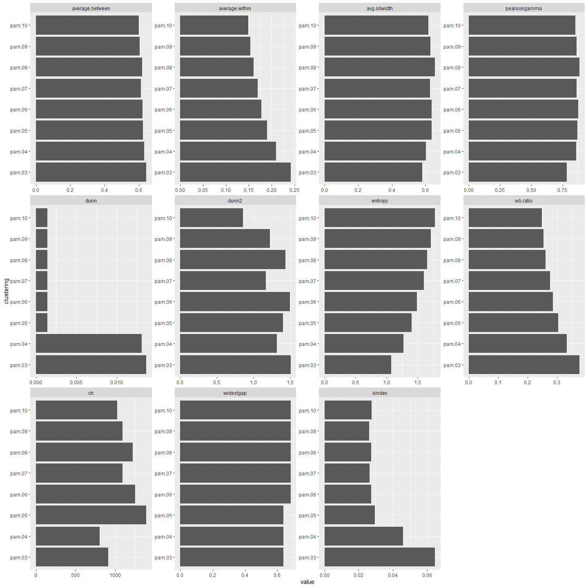

Based on the Pearson version of Hubert's gamma coefficient (pearsongamma), average silhouette width (avg.silwidth) and the Calinski and Harabasz index (ch) 5 or 6 clusters is optimal. Considering the Dunn2 index we consider *6* clusters to be optimal. These are refered to as community state types I to V, with IV being split into IV-a and IV-b.

#### 1.3.1.2 - Create CSTs

The ASVs for the top ASVs in each CST are written to **TaxToBlast.xlsx**, Blast results and identified species for each ASV have then been added to this file externally.

**phyX\_cst.RData** contains the updated phyloseq objects for all samples (phyX), vaginal samples (vagX), and rarefied vaginal samples (vagX.r)

### 1.3.2 - CST composition and stability

#### 1.3.2.1 - Prepare data

**CommunityStateTypes.RData** contains the necessary data regarding dominant taxa and alpha diversity of the CSTs

#### 1.3.2.2 - Describe CST composition and stability

Figure 1 - A: Boxplot of obserbed richness by CST, B: boxplot of shannon diversity index by CST, C: boxplot of the 2 most dominant ASV in each CST, colored by CST, and D: Alluvial plot with CST.

| CST        |  Samples|  observed\_mean|  observed\_sd|  SDI\_mean|  SDI\_sd|
|:-----------|--------:|---------------:|-------------:|----------:|--------:|
| CST\_I     |      479|           13.44|         10.68|       0.48|     0.47|
| CST\_II    |      172|           18.31|         15.68|       0.90|     0.61|
| CST\_III   |      446|           12.37|          9.85|       0.55|     0.52|
| CST\_IV\_a |       86|           22.21|         15.79|       1.30|     0.71|
| CST\_IV\_b |       68|           19.82|         14.53|       1.23|     0.59|
| CST\_V     |       71|           14.32|         11.44|       0.89|     0.47|

    ## [1] "Statistical test of alpha diversity by CST"

    ## Analysis of Variance Table
    ## 
    ## Response: Observed
    ##             Df Sum Sq Mean Sq F value    Pr(>F)    
    ## CST          5  12075 2414.94  17.245 < 2.2e-16 ***
    ## Residuals 1316 184286  140.04                      
    ## ---
    ## Signif. codes:  0 '***' 0.001 '**' 0.01 '*' 0.05 '.' 0.1 ' ' 1

    ##   Tukey multiple comparisons of means
    ##     95% family-wise confidence level
    ## 
    ## Fit: aov(formula = Observed ~ CST, data = cst.alpha)
    ## 
    ## $CST
    ##                         diff         lwr        upr     p adj
    ## CST_II-CST_I       4.8734524   1.8713975  7.8755074 0.0000581
    ## CST_III-CST_I     -1.0727880  -3.2950528  1.1494767 0.7405034
    ## CST_IV_a-CST_I     8.7688013   4.8136112 12.7239914 0.0000000
    ## CST_IV_b-CST_I     6.3830284   2.0064816 10.7595751 0.0004797
    ## CST_V-CST_I        0.8834426  -3.4113731  5.1782584 0.9919023
    ## CST_III-CST_II    -5.9462405  -8.9774971 -2.9149838 0.0000004
    ## CST_IV_a-CST_II    3.8953488  -0.5648737  8.3555714 0.1269766
    ## CST_IV_b-CST_II    1.5095759  -3.3282146  6.3473665 0.9488339
    ## CST_V-CST_II      -3.9900098  -8.7539891  0.7739694 0.1603017
    ## CST_IV_a-CST_III   9.8415893   5.8641892 13.8189894 0.0000000
    ## CST_IV_b-CST_III   7.4558164   3.0591877 11.8524452 0.0000215
    ## CST_V-CST_III      1.9562307  -2.3590474  6.2715088 0.7885822
    ## CST_IV_b-CST_IV_a -2.3857729  -7.8662302  3.0946844 0.8158579
    ## CST_V-CST_IV_a    -7.8853587 -13.3007712 -2.4699461 0.0004936
    ## CST_V-CST_IV_b    -5.4995857 -11.2299719  0.2308004 0.0684618

    ## Analysis of Variance Table
    ## 
    ## Response: Shannon
    ##             Df Sum Sq Mean Sq F value    Pr(>F)    
    ## CST          5  92.71 18.5411   66.18 < 2.2e-16 ***
    ## Residuals 1316 368.69  0.2802                      
    ## ---
    ## Signif. codes:  0 '***' 0.001 '**' 0.01 '*' 0.05 '.' 0.1 ' ' 1

    ##   Tukey multiple comparisons of means
    ##     95% family-wise confidence level
    ## 
    ## Fit: aov(formula = Shannon ~ CST, data = cst.alpha)
    ## 
    ## $CST
    ##                          diff         lwr        upr     p adj
    ## CST_II-CST_I       0.42730580  0.29302794  0.5615836 0.0000000
    ## CST_III-CST_I      0.07762367 -0.02177523  0.1770226 0.2251923
    ## CST_IV_a-CST_I     0.82552360  0.64861330  1.0024339 0.0000000
    ## CST_IV_b-CST_I     0.75856486  0.56280786  0.9543219 0.0000000
    ## CST_V-CST_I        0.40995745  0.21785616  0.6020587 0.0000000
    ## CST_III-CST_II    -0.34968213 -0.48526613 -0.2140981 0.0000000
    ## CST_IV_a-CST_II    0.39821780  0.19871809  0.5977175 0.0000002
    ## CST_IV_b-CST_II    0.33125907  0.11487125  0.5476469 0.0001950
    ## CST_V-CST_II      -0.01734834 -0.23043468  0.1957380 0.9999077
    ## CST_IV_a-CST_III   0.74789993  0.56999621  0.9258037 0.0000000
    ## CST_IV_b-CST_III   0.68094120  0.48428595  0.8775964 0.0000000
    ## CST_V-CST_III      0.33233379  0.13931724  0.5253503 0.0000149
    ## CST_IV_b-CST_IV_a -0.06695873 -0.31209217  0.1781747 0.9709838
    ## CST_V-CST_IV_a    -0.41556614 -0.65779021 -0.1733421 0.0000162
    ## CST_V-CST_IV_b    -0.34860741 -0.60491982 -0.0922950 0.0015199

<table style="width:100%;">
<caption>Top five Phylums / Genus / ASVs for each CST</caption>
<colgroup>
<col width="8%" />
<col width="4%" />
<col width="16%" />
<col width="9%" />
<col width="18%" />
<col width="9%" />
<col width="26%" />
<col width="7%" />
</colgroup>
<thead>
<tr class="header">
<th align="left">CST</th>
<th align="right">rnk</th>
<th align="left">Phylum</th>
<th align="right">Phylum_prc</th>
<th align="left">Genus_simple</th>
<th align="right">Genus_prc</th>
<th align="left">ASV</th>
<th align="right">ASV_prc</th>
</tr>
</thead>
<tbody>
<tr class="odd">
<td align="left">CST_I</td>
<td align="right">1</td>
<td align="left">Firmicutes</td>
<td align="right">94.95</td>
<td align="left">Lactobacillus</td>
<td align="right">91.94</td>
<td align="left">Genus_Lactobacillus_323</td>
<td align="right">84.35</td>
</tr>
<tr class="even">
<td align="left">CST_I</td>
<td align="right">2</td>
<td align="left">Actinobacteria</td>
<td align="right">3.32</td>
<td align="left">Bifidobacterium</td>
<td align="right">1.84</td>
<td align="left">Genus_Lactobacillus_139</td>
<td align="right">2.60</td>
</tr>
<tr class="odd">
<td align="left">CST_I</td>
<td align="right">3</td>
<td align="left">Proteobacteria</td>
<td align="right">1.25</td>
<td align="left">Enterococcus</td>
<td align="right">1.11</td>
<td align="left">Genus_Bifidobacterium_60</td>
<td align="right">1.54</td>
</tr>
<tr class="even">
<td align="left">CST_I</td>
<td align="right">4</td>
<td align="left">Bacteroidetes</td>
<td align="right">0.27</td>
<td align="left">Escherichia_Shigella</td>
<td align="right">1.02</td>
<td align="left">Genus_Enterococcus_34</td>
<td align="right">1.15</td>
</tr>
<tr class="odd">
<td align="left">CST_I</td>
<td align="right">5</td>
<td align="left">Tenericutes</td>
<td align="right">0.12</td>
<td align="left">Gardnerella</td>
<td align="right">0.96</td>
<td align="left">Genus_Escherichia_Shigella_101</td>
<td align="right">0.85</td>
</tr>
<tr class="even">
<td align="left">CST_II</td>
<td align="right">1</td>
<td align="left">Firmicutes</td>
<td align="right">84.91</td>
<td align="left">Lactobacillus</td>
<td align="right">80.21</td>
<td align="left">Lactobacillus_gasseri_37</td>
<td align="right">70.65</td>
</tr>
<tr class="odd">
<td align="left">CST_II</td>
<td align="right">2</td>
<td align="left">Actinobacteria</td>
<td align="right">11.54</td>
<td align="left">Gardnerella</td>
<td align="right">6.85</td>
<td align="left">Genus_Gardnerella_40</td>
<td align="right">4.04</td>
</tr>
<tr class="even">
<td align="left">CST_II</td>
<td align="right">3</td>
<td align="left">Proteobacteria</td>
<td align="right">1.94</td>
<td align="left">Bifidobacterium</td>
<td align="right">2.69</td>
<td align="left">Genus_Gardnerella_20</td>
<td align="right">2.49</td>
</tr>
<tr class="odd">
<td align="left">CST_II</td>
<td align="right">4</td>
<td align="left">Bacteroidetes</td>
<td align="right">1.31</td>
<td align="left">Escherichia_Shigella</td>
<td align="right">1.60</td>
<td align="left">Genus_Bifidobacterium_60</td>
<td align="right">2.44</td>
</tr>
<tr class="even">
<td align="left">CST_II</td>
<td align="right">5</td>
<td align="left">Epsilonbacteraeota</td>
<td align="right">0.17</td>
<td align="left">Atopobium</td>
<td align="right">1.36</td>
<td align="left">Lactobacillus_gasseri_47</td>
<td align="right">2.24</td>
</tr>
<tr class="odd">
<td align="left">CST_III</td>
<td align="right">1</td>
<td align="left">Firmicutes</td>
<td align="right">92.34</td>
<td align="left">Lactobacillus</td>
<td align="right">89.23</td>
<td align="left">Genus_Lactobacillus_139</td>
<td align="right">81.17</td>
</tr>
<tr class="even">
<td align="left">CST_III</td>
<td align="right">2</td>
<td align="left">Actinobacteria</td>
<td align="right">5.03</td>
<td align="left">Gardnerella</td>
<td align="right">3.67</td>
<td align="left">Genus_Lactobacillus_268</td>
<td align="right">2.55</td>
</tr>
<tr class="odd">
<td align="left">CST_III</td>
<td align="right">3</td>
<td align="left">Proteobacteria</td>
<td align="right">1.69</td>
<td align="left">Escherichia_Shigella</td>
<td align="right">1.20</td>
<td align="left">Genus_Lactobacillus_323</td>
<td align="right">2.03</td>
</tr>
<tr class="even">
<td align="left">CST_III</td>
<td align="right">4</td>
<td align="left">Bacteroidetes</td>
<td align="right">0.48</td>
<td align="left">Megasphaera</td>
<td align="right">0.93</td>
<td align="left">Genus_Gardnerella_20</td>
<td align="right">1.55</td>
</tr>
<tr class="odd">
<td align="left">CST_III</td>
<td align="right">5</td>
<td align="left">Fusobacteria</td>
<td align="right">0.34</td>
<td align="left">Bifidobacterium</td>
<td align="right">0.85</td>
<td align="left">Genus_Gardnerella_40</td>
<td align="right">1.53</td>
</tr>
<tr class="even">
<td align="left">CST_IV_a</td>
<td align="right">1</td>
<td align="left">Actinobacteria</td>
<td align="right">62.40</td>
<td align="left">Gardnerella</td>
<td align="right">58.26</td>
<td align="left">Genus_Gardnerella_40</td>
<td align="right">51.17</td>
</tr>
<tr class="odd">
<td align="left">CST_IV_a</td>
<td align="right">2</td>
<td align="left">Firmicutes</td>
<td align="right">32.20</td>
<td align="left">Lactobacillus</td>
<td align="right">19.53</td>
<td align="left">Genus_Gardnerella_20</td>
<td align="right">6.17</td>
</tr>
<tr class="even">
<td align="left">CST_IV_a</td>
<td align="right">3</td>
<td align="left">Bacteroidetes</td>
<td align="right">2.84</td>
<td align="left">Megasphaera</td>
<td align="right">5.52</td>
<td align="left">Genus_Megasphaera_22</td>
<td align="right">5.33</td>
</tr>
<tr class="odd">
<td align="left">CST_IV_a</td>
<td align="right">4</td>
<td align="left">Fusobacteria</td>
<td align="right">0.88</td>
<td align="left">Atopobium</td>
<td align="right">3.57</td>
<td align="left">Genus_Lactobacillus_139</td>
<td align="right">4.82</td>
</tr>
<tr class="even">
<td align="left">CST_IV_a</td>
<td align="right">5</td>
<td align="left">Proteobacteria</td>
<td align="right">0.82</td>
<td align="left">Prevotella</td>
<td align="right">2.54</td>
<td align="left">Lactobacillus_gasseri_37</td>
<td align="right">3.96</td>
</tr>
<tr class="odd">
<td align="left">CST_IV_b</td>
<td align="right">1</td>
<td align="left">Actinobacteria</td>
<td align="right">61.31</td>
<td align="left">Gardnerella</td>
<td align="right">46.75</td>
<td align="left">Genus_Gardnerella_20</td>
<td align="right">45.28</td>
</tr>
<tr class="even">
<td align="left">CST_IV_b</td>
<td align="right">2</td>
<td align="left">Firmicutes</td>
<td align="right">32.48</td>
<td align="left">Lactobacillus</td>
<td align="right">24.44</td>
<td align="left">Genus_Atopobium_36</td>
<td align="right">12.89</td>
</tr>
<tr class="odd">
<td align="left">CST_IV_b</td>
<td align="right">3</td>
<td align="left">Proteobacteria</td>
<td align="right">2.76</td>
<td align="left">Atopobium</td>
<td align="right">12.64</td>
<td align="left">Lactobacillus_gasseri_37</td>
<td align="right">12.84</td>
</tr>
<tr class="even">
<td align="left">CST_IV_b</td>
<td align="right">4</td>
<td align="left">Bacteroidetes</td>
<td align="right">2.42</td>
<td align="left">Escherichia_Shigella</td>
<td align="right">2.55</td>
<td align="left">Genus_Lactobacillus_323</td>
<td align="right">2.64</td>
</tr>
<tr class="odd">
<td align="left">CST_IV_b</td>
<td align="right">5</td>
<td align="left">Fusobacteria</td>
<td align="right">0.59</td>
<td align="left">Prevotella</td>
<td align="right">2.26</td>
<td align="left">Genus_Escherichia_Shigella_101</td>
<td align="right">2.59</td>
</tr>
<tr class="even">
<td align="left">CST_V</td>
<td align="right">1</td>
<td align="left">Firmicutes</td>
<td align="right">89.33</td>
<td align="left">Lactobacillus</td>
<td align="right">87.62</td>
<td align="left">Genus_Lactobacillus_268</td>
<td align="right">60.76</td>
</tr>
<tr class="odd">
<td align="left">CST_V</td>
<td align="right">2</td>
<td align="left">Actinobacteria</td>
<td align="right">7.93</td>
<td align="left">Gardnerella</td>
<td align="right">6.09</td>
<td align="left">Genus_Lactobacillus_139</td>
<td align="right">20.64</td>
</tr>
<tr class="even">
<td align="left">CST_V</td>
<td align="right">3</td>
<td align="left">Proteobacteria</td>
<td align="right">1.41</td>
<td align="left">Atopobium</td>
<td align="right">1.62</td>
<td align="left">Genus_Gardnerella_20</td>
<td align="right">2.69</td>
</tr>
<tr class="odd">
<td align="left">CST_V</td>
<td align="right">4</td>
<td align="left">Bacteroidetes</td>
<td align="right">1.00</td>
<td align="left">Prevotella</td>
<td align="right">0.95</td>
<td align="left">Genus_Gardnerella_7</td>
<td align="right">2.01</td>
</tr>
<tr class="even">
<td align="left">CST_V</td>
<td align="right">5</td>
<td align="left">Epsilonbacteraeota</td>
<td align="right">0.20</td>
<td align="left">Escherichia_Shigella</td>
<td align="right">0.89</td>
<td align="left">Genus_Lactobacillus_265</td>
<td align="right">1.71</td>
</tr>
</tbody>
</table>

    ## png 
    ##   2

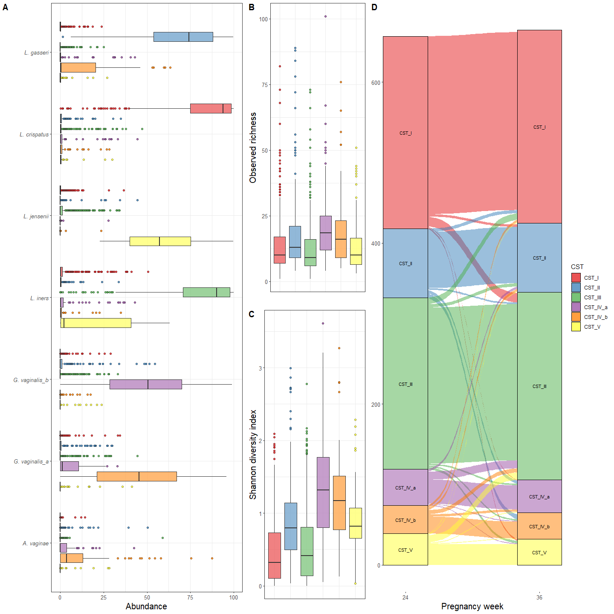

Figure 1: A) Boxplot of obserbed richness by CST, B) boxplot of shannon diversity index by CST, C) boxplot of the 2 most dominant ASV in each CST, colored by CST, and D) Alluvial plot with CST.

#### 1.3.2.3 - Stability between w24 and w36 (Permutational)

In order to test the stability between time points, a permutation procedure is used. Here, the distance based on individual women from week 24 to week 36 are compared with random assignments of pairs.

##### 1.3.2.3.1 - Perform permutation calculations

**Stability\_w24\_to\_2w6\_permresults.RData** contains the permutation results for CST stability

##### 1.3.2.3.2 - CST stability results

|  Women| In same (%) | Changed (%) |
|------:|:------------|:------------|
|    657| 562 (85.5)  | 95 (14.5)   |

| CST        | Time point (weeks) | Women |  In same (%)|
|:-----------|:------------------:|:-----:|------------:|
| CST\_I     |         24         |  239  |   221 (92.5)|
| CST\_I     |         36         |  237  |   221 (93.2)|
| CST\_II    |         24         |   86  |    70 (81.4)|
| CST\_II    |         36         |   84  |    70 (83.3)|
| CST\_III   |         24         |  213  |   194 (91.1)|
| CST\_III   |         36         |  232  |   194 (83.6)|
| CST\_IV\_a |         24         |   45  |    30 (66.7)|
| CST\_IV\_a |         36         |   41  |    30 (73.2)|
| CST\_IV\_b |         24         |   35  |    21 (60.0)|
| CST\_IV\_b |         36         |   31  |    21 (67.7)|
| CST\_V     |         24         |   39  |    26 (66.7)|
| CST\_V     |         36         |   32  |    26 (81.2)|

    ## [1] "Pearson's Chi-squared test of CST stability"

    ## 
    ##  Pearson's Chi-squared test
    ## 
    ## data:  df.cst.24$w36 by df.cst.24$CST 
    ## X-squared = 58.4038, df = 5, p-value = 2.596e-11
    ## alternative hypothesis: true difference in probabilities is not equal to 0 
    ## sample estimates:
    ##    proba in group CST_I   proba in group CST_II  proba in group CST_III 
    ##               0.9246862               0.8139535               0.9107981 
    ## proba in group CST_IV_a proba in group CST_IV_b    proba in group CST_V 
    ##               0.6666667               0.6000000               0.6666667 
    ## 
    ##         Pairwise comparisons using Pearson's Chi-squared tests with Yates' continuity correction
    ## 
    ##              CST_I  CST_II   CST_III CST_IV_a CST_IV_b
    ## CST_II   1.617e-02       -         -        -        -
    ## CST_III  7.758e-01 0.05140         -        -        -
    ## CST_IV_a 1.293e-05 0.14324 9.690e-05        -        -
    ## CST_IV_b 1.699e-06 0.04716 1.293e-05   0.7758        -
    ## CST_V    2.903e-05 0.15598 1.968e-04   1.0000   0.7758
    ## 
    ## P value adjustment method: fdr

| method |    n|  median\_dist|  median\_permdist|         R|     pv|
|:-------|----:|-------------:|-----------------:|---------:|------:|
| jsd    |  657|       0.03090|           0.63466|  20.53838|  4e-04|
| wuf    |  657|       0.00258|           0.00976|   3.77691|  4e-04|

| method | CST        |    n|  median\_dist|
|:-------|:-----------|----:|-------------:|
| jsd    | CST\_I     |  239|        0.0232|
| jsd    | CST\_II    |   86|        0.0639|
| jsd    | CST\_III   |  213|        0.0220|
| jsd    | CST\_IV\_a |   45|        0.0763|
| jsd    | CST\_IV\_b |   35|        0.0927|
| jsd    | CST\_V     |   39|        0.0680|
| wuf    | CST\_I     |  239|        0.0016|
| wuf    | CST\_II    |   86|        0.0160|
| wuf    | CST\_III   |  213|        0.0014|
| wuf    | CST\_IV\_a |   45|        0.0057|
| wuf    | CST\_IV\_b |   35|        0.0095|
| wuf    | CST\_V     |   39|        0.0039|

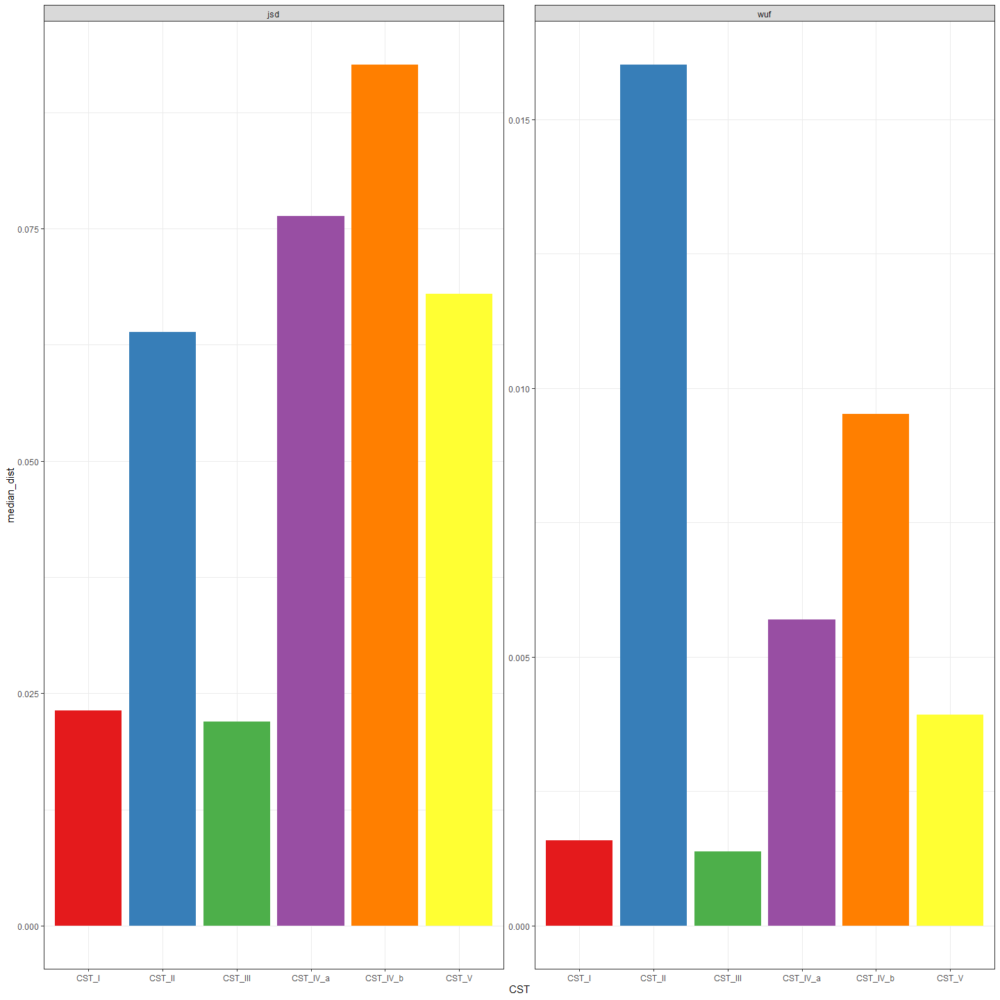

| method |  statistic|       p.value|  parameter|
|:-------|----------:|-------------:|----------:|
| jsd    |   49.61901|  1.658222e-09|          5|
| wuf    |  143.05238|  4.015201e-29|          5|

The statistics indicate that stability depends on CST.

1.4 Beta diversity of vaginal
-----------------------------

Here PCoA plots show the distirbution of the samples based on CST and beta diversity metric. Clearly, some of the CST are more well defined than others. E.g. CST\_IV\_b and CST\_IV\_c are all over the place. This is further confirmed by the statistical analysis of the betadispertion wich clearly show that CST IVa and CST IVb are significantly more dispersed than the other CSTs, with CST I and CST II being the tightest clusters

### 1.4.1 - NMDS plot of vaginal samples

Figure S1: NMDS plot based on jensen-Shannon divergence, samples colored by CST and grey lines connect samples from the individual women

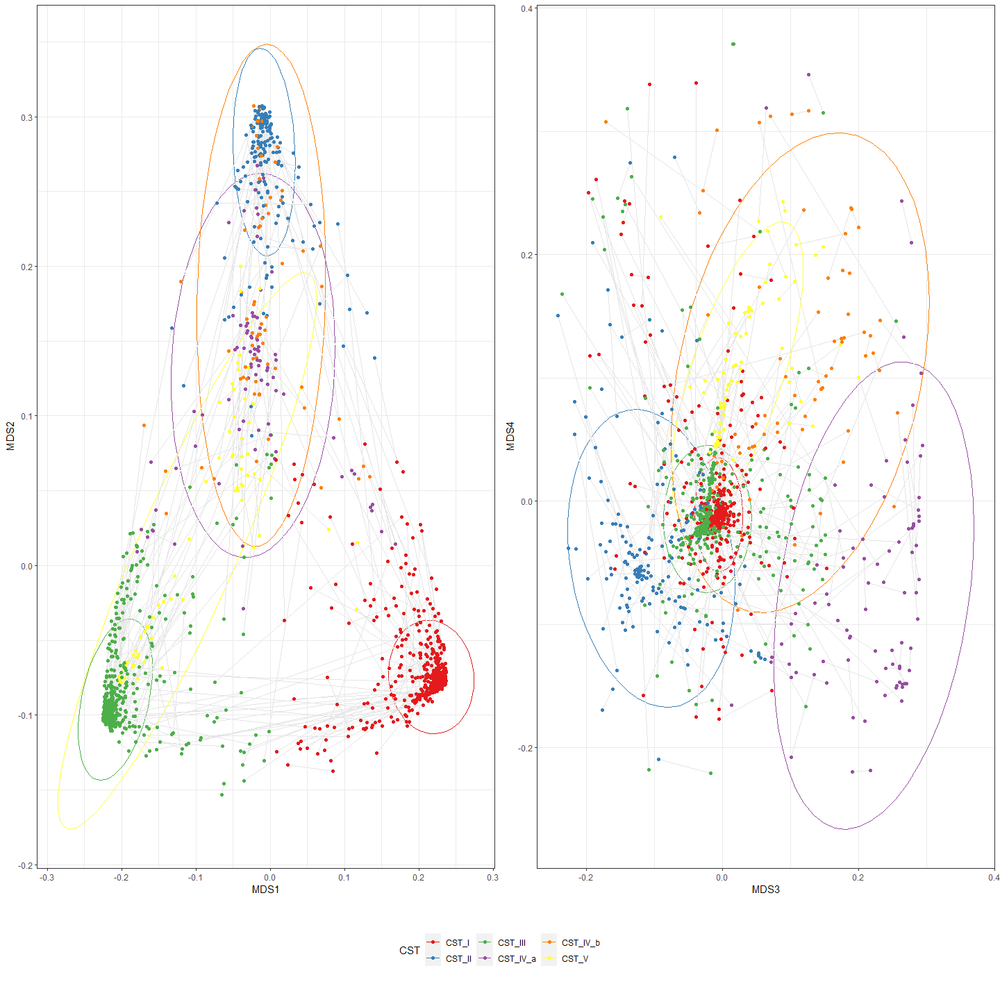

    ## png 
    ##   2

### 1.4.2 - Statistical test of beta diversity

Betadisper test differences in dispersion of each cluster, while PERMANOVA test how much of the overall differences can be explained by the variables

    ## Analysis of Variance Table
    ## 
    ## Response: Distances
    ##             Df  Sum Sq Mean Sq F value    Pr(>F)    
    ## Groups       5  3.3709 0.67418  43.072 < 2.2e-16 ***
    ## Residuals 1316 20.5984 0.01565                      
    ## ---
    ## Signif. codes:  0 '***' 0.001 '**' 0.01 '*' 0.05 '.' 0.1 ' ' 1

    ##   Tukey multiple comparisons of means
    ##     95% family-wise confidence level
    ## 
    ## Fit: aov(formula = distances ~ group, data = df)
    ## 
    ## $group
    ##                          diff          lwr          upr     p adj
    ## CST_II-CST_I       0.06275195  0.031013266  0.094490639 0.0000003
    ## CST_III-CST_I      0.01589486 -0.007599637  0.039389352 0.3836737
    ## CST_IV_a-CST_I     0.14997156  0.108156027  0.191787100 0.0000000
    ## CST_IV_b-CST_I     0.16691971  0.120649452  0.213189960 0.0000000
    ## CST_V-CST_I        0.08410557  0.038699403  0.129511738 0.0000022
    ## CST_III-CST_II    -0.04685709 -0.078904511 -0.014809679 0.0004588
    ## CST_IV_a-CST_II    0.08721961  0.040064710  0.134374512 0.0000023
    ## CST_IV_b-CST_II    0.10416775  0.053021083  0.155314425 0.0000001
    ## CST_V-CST_II       0.02135362 -0.029012696  0.071719933 0.8321304
    ## CST_IV_a-CST_III   0.13407671  0.092026358  0.176127054 0.0000000
    ## CST_IV_b-CST_III   0.15102485  0.104542281  0.197507416 0.0000000
    ## CST_V-CST_III      0.06821071  0.022588211  0.113833216 0.0003058
    ## CST_IV_b-CST_IV_a  0.01694814 -0.040993007  0.074889293 0.9610337
    ## CST_V-CST_IV_a    -0.06586599 -0.123119468 -0.008612516 0.0134341
    ## CST_V-CST_IV_b    -0.08281414 -0.143397613 -0.022230657 0.0014063

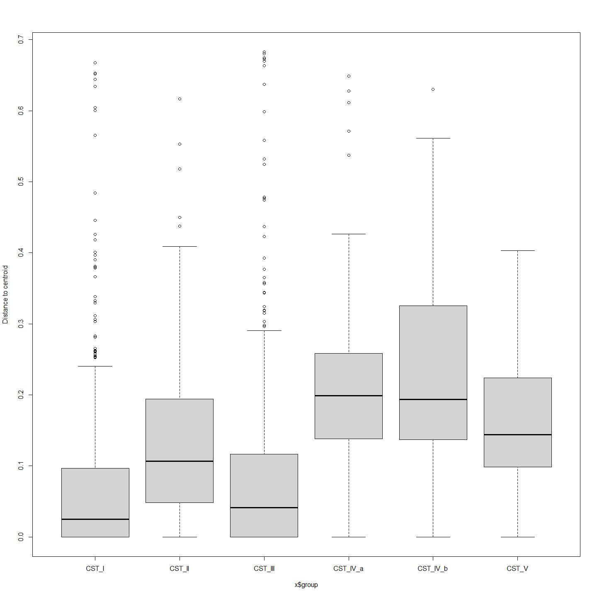

    ## [1] "PERMANOVA of Time point using Jensen-Shannon divergence"

    ## 
    ## Call:
    ## adonis(formula = vag.jsd ~ Time, data = df) 
    ## 
    ## Permutation: free
    ## Number of permutations: 999
    ## 
    ## Terms added sequentially (first to last)
    ## 
    ##             Df SumsOfSqs  MeanSqs F.Model      R2 Pr(>F)
    ## Time         1     0.046 0.046152 0.30907 0.00023  0.871
    ## Residuals 1320   197.113 0.149328         0.99977       
    ## Total     1321   197.159                  1.00000

    ## [1] "PERMANOVA of CST using Jensen-Shannon divergence"

    ## 
    ## Call:
    ## adonis(formula = vag.jsd ~ CST, data = df) 
    ## 
    ## Permutation: free
    ## Number of permutations: 999
    ## 
    ## Terms added sequentially (first to last)
    ## 
    ##             Df SumsOfSqs MeanSqs F.Model      R2 Pr(>F)    
    ## CST          5   158.310  31.662  1072.5 0.80296  0.001 ***
    ## Residuals 1316    38.849   0.030         0.19704           
    ## Total     1321   197.159                 1.00000           
    ## ---
    ## Signif. codes:  0 '***' 0.001 '**' 0.01 '*' 0.05 '.' 0.1 ' ' 1

2 - Infant Samples
==================

2.1 - Delivery mode
-------------------

    ##      Acute sectio    Normal Planned sectio
    ## [1,]     68.00000 519.00000      63.000000
    ## [2,]     10.46154  79.84615       9.692308

2.2 - Airway microbiome
-----------------------

### 2.2.1 - Subset airway samples

**air\_taxglm.RData** contains phyloseq objects with airway samples at phylum, genus and ASV level for both read counts and relative abundances, as well as a rarefied (2000 reads/sample) at ASV level.

### 2.2.2 - Dominant airway taxa and overall richness

The distribution of the airway reads are here summarized on phylum, genus and individual ASV level.

| Included   |  Phylum|  Genus|   ASV|
|:-----------|-------:|------:|-----:|
| All        |      35|    828|  7500|
| &gt; 0.01% |      13|    107|   288|
| &gt; 0.1%  |       8|     37|    58|
| &gt; 1%    |       4|     10|    13|

| Kingdom  | Phylum         | Class | Order | Family | Genus\_simple | Genus | Species | name | asw\_hash |  taxprc|
|:---------|:---------------|:------|:------|:-------|:--------------|:------|:--------|:-----|:----------|-------:|
| Bacteria | Firmicutes     | NA    | NA    | NA     | NA            | NA    | NA      | NA   | NA        |    60.8|
| Bacteria | Proteobacteria | NA    | NA    | NA     | NA            | NA    | NA      | NA   | NA        |    30.4|
| Bacteria | Actinobacteria | NA    | NA    | NA     | NA            | NA    | NA      | NA   | NA        |     5.5|
| Bacteria | Bacteroidetes  | NA    | NA    | NA     | NA            | NA    | NA      | NA   | NA        |     1.7|
| Bacteria | Fusobacteria   | NA    | NA    | NA     | NA            | NA    | NA      | NA   | NA        |     0.7|
| Bacteria | Cyanobacteria  | NA    | NA    | NA     | NA            | NA    | NA      | NA   | NA        |     0.3|

<table style="width:100%;">
<caption>Abundance according to genus</caption>
<colgroup>
<col width="6%" />
<col width="10%" />
<col width="13%" />
<col width="12%" />
<col width="14%" />
<col width="10%" />
<col width="10%" />
<col width="5%" />
<col width="3%" />
<col width="6%" />
<col width="5%" />
</colgroup>
<thead>
<tr class="header">
<th align="left">Kingdom</th>
<th align="left">Phylum</th>
<th align="left">Class</th>
<th align="left">Order</th>
<th align="left">Family</th>
<th align="left">Genus_simple</th>
<th align="left">Genus</th>
<th align="left">Species</th>
<th align="left">name</th>
<th align="left">asw_hash</th>
<th align="right">taxprc</th>
</tr>
</thead>
<tbody>
<tr class="odd">
<td align="left">Bacteria</td>
<td align="left">Firmicutes</td>
<td align="left">Bacilli</td>
<td align="left">Bacillales</td>
<td align="left">Staphylococcaceae</td>
<td align="left">Staphylococcus</td>
<td align="left">Staphylococcus</td>
<td align="left">NA</td>
<td align="left">NA</td>
<td align="left">NA</td>
<td align="right">25.6</td>
</tr>
<tr class="even">
<td align="left">Bacteria</td>
<td align="left">Firmicutes</td>
<td align="left">Bacilli</td>
<td align="left">Lactobacillales</td>
<td align="left">Streptococcaceae</td>
<td align="left">Streptococcus</td>
<td align="left">Streptococcus</td>
<td align="left">NA</td>
<td align="left">NA</td>
<td align="left">NA</td>
<td align="right">25.6</td>
</tr>
<tr class="odd">
<td align="left">Bacteria</td>
<td align="left">Proteobacteria</td>
<td align="left">Gammaproteobacteria</td>
<td align="left">Pseudomonadales</td>
<td align="left">Moraxellaceae</td>
<td align="left">Moraxella</td>
<td align="left">Moraxella</td>
<td align="left">NA</td>
<td align="left">NA</td>
<td align="left">NA</td>
<td align="right">14.8</td>
</tr>
<tr class="even">
<td align="left">Bacteria</td>
<td align="left">Proteobacteria</td>
<td align="left">Gammaproteobacteria</td>
<td align="left">Pasteurellales</td>
<td align="left">Pasteurellaceae</td>
<td align="left">Haemophilus</td>
<td align="left">Haemophilus</td>
<td align="left">NA</td>
<td align="left">NA</td>
<td align="left">NA</td>
<td align="right">6.0</td>
</tr>
<tr class="odd">
<td align="left">Bacteria</td>
<td align="left">Actinobacteria</td>
<td align="left">Actinobacteria</td>
<td align="left">Corynebacteriales</td>
<td align="left">Corynebacteriaceae</td>
<td align="left">Corynebacterium</td>
<td align="left">Corynebacterium</td>
<td align="left">NA</td>
<td align="left">NA</td>
<td align="left">NA</td>
<td align="right">4.1</td>
</tr>
<tr class="even">
<td align="left">Bacteria</td>
<td align="left">Firmicutes</td>
<td align="left">Bacilli</td>
<td align="left">Bacillales</td>
<td align="left">Bacillales_family_XI</td>
<td align="left">Gemella</td>
<td align="left">Gemella</td>
<td align="left">NA</td>
<td align="left">NA</td>
<td align="left">NA</td>
<td align="right">3.2</td>
</tr>
</tbody>
</table>

<table>
<caption>Abundance according to ASV</caption>
<colgroup>
<col width="4%" />
<col width="7%" />
<col width="9%" />
<col width="7%" />
<col width="10%" />
<col width="7%" />
<col width="7%" />
<col width="12%" />
<col width="13%" />
<col width="15%" />
<col width="3%" />
</colgroup>
<thead>
<tr class="header">
<th align="left">Kingdom</th>
<th align="left">Phylum</th>
<th align="left">Class</th>
<th align="left">Order</th>
<th align="left">Family</th>
<th align="left">Genus_simple</th>
<th align="left">Genus</th>
<th align="left">Species</th>
<th align="left">name</th>
<th align="left">asw_hash</th>
<th align="right">taxprc</th>
</tr>
</thead>
<tbody>
<tr class="odd">
<td align="left">Bacteria</td>
<td align="left">Firmicutes</td>
<td align="left">Bacilli</td>
<td align="left">Bacillales</td>
<td align="left">Staphylococcaceae</td>
<td align="left">Staphylococcus</td>
<td align="left">Staphylococcus</td>
<td align="left">Genus_Staphylococcus</td>
<td align="left">Genus_Staphylococcus_205</td>
<td align="left">cde00646e8aecf8aaac49a9bb9c96729</td>
<td align="right">24.2</td>
</tr>
<tr class="even">
<td align="left">Bacteria</td>
<td align="left">Firmicutes</td>
<td align="left">Bacilli</td>
<td align="left">Lactobacillales</td>
<td align="left">Streptococcaceae</td>
<td align="left">Streptococcus</td>
<td align="left">Streptococcus</td>
<td align="left">Genus_Streptococcus</td>
<td align="left">Genus_Streptococcus_177</td>
<td align="left">dca3a793a5b446cb1b22e8920013f081</td>
<td align="right">18.4</td>
</tr>
<tr class="odd">
<td align="left">Bacteria</td>
<td align="left">Proteobacteria</td>
<td align="left">Gammaproteobacteria</td>
<td align="left">Pseudomonadales</td>
<td align="left">Moraxellaceae</td>
<td align="left">Moraxella</td>
<td align="left">Moraxella</td>
<td align="left">Genus_Moraxella</td>
<td align="left">Genus_Moraxella_95</td>
<td align="left">aa0d9eb04bfc40cf6079830cf147dea2</td>
<td align="right">13.7</td>
</tr>
<tr class="even">
<td align="left">Bacteria</td>
<td align="left">Proteobacteria</td>
<td align="left">Gammaproteobacteria</td>
<td align="left">Pasteurellales</td>
<td align="left">Pasteurellaceae</td>
<td align="left">Haemophilus</td>
<td align="left">Haemophilus</td>
<td align="left">Genus_Haemophilus</td>
<td align="left">Genus_Haemophilus_69</td>
<td align="left">a788d9e0d723c68e3207e6d7ec7777cd</td>
<td align="right">3.5</td>
</tr>
<tr class="odd">
<td align="left">Bacteria</td>
<td align="left">Firmicutes</td>
<td align="left">Bacilli</td>
<td align="left">Lactobacillales</td>
<td align="left">Streptococcaceae</td>
<td align="left">Streptococcus</td>
<td align="left">Streptococcus</td>
<td align="left">Streptococcus_pneumoniae</td>
<td align="left">Streptococcus_pneumoniae_98</td>
<td align="left">1e8f827acf20b3a54137cc311289d5d4</td>
<td align="right">3.4</td>
</tr>
<tr class="even">
<td align="left">Bacteria</td>
<td align="left">Firmicutes</td>
<td align="left">Bacilli</td>
<td align="left">Bacillales</td>
<td align="left">Bacillales_family_XI</td>
<td align="left">Gemella</td>
<td align="left">Gemella</td>
<td align="left">Genus_Gemella</td>
<td align="left">Genus_Gemella_53</td>
<td align="left">daef7fbdc4bc9f2aef3e4ba4d46688d5</td>
<td align="right">3.1</td>
</tr>
</tbody>
</table>

### 2.2.3 - Airway alpha diversity

For this part we use the rarefied samples (2000 reads/sample)

| Time         |    n|  Observed\_mean|  Observed\_sd|  Shannon\_mean|  Shannon\_sd|
|:-------------|----:|---------------:|-------------:|--------------:|------------:|
| One.week     |  526|          16.580|         9.532|          1.114|        0.635|
| One.month    |  606|          20.467|        11.292|          1.326|        0.612|
| Three.months |  614|          25.125|        11.103|          1.518|        0.630|

| Time         | DELIVERY       |    n|  Observed\_mean|  Observed\_sd|  Shannon\_mean|  Shannon\_sd|
|:-------------|:---------------|----:|---------------:|-------------:|--------------:|------------:|
| One.week     | Acute sectio   |   50|          15.740|         5.830|          1.002|        0.644|
| One.week     | Normal         |  424|          16.816|        10.185|          1.128|        0.629|
| One.week     | Planned sectio |   52|          15.462|         6.314|          1.110|        0.668|
| One.month    | Acute sectio   |   64|          20.703|         8.883|          1.446|        0.698|
| One.month    | Normal         |  480|          20.773|        11.966|          1.315|        0.605|
| One.month    | Planned sectio |   62|          17.855|         7.149|          1.289|        0.568|
| Three.months | Acute sectio   |   65|          25.677|        11.741|          1.560|        0.663|
| Three.months | Normal         |  489|          25.344|        11.088|          1.519|        0.624|
| Three.months | Planned sectio |   60|          22.750|        10.388|          1.462|        0.653|

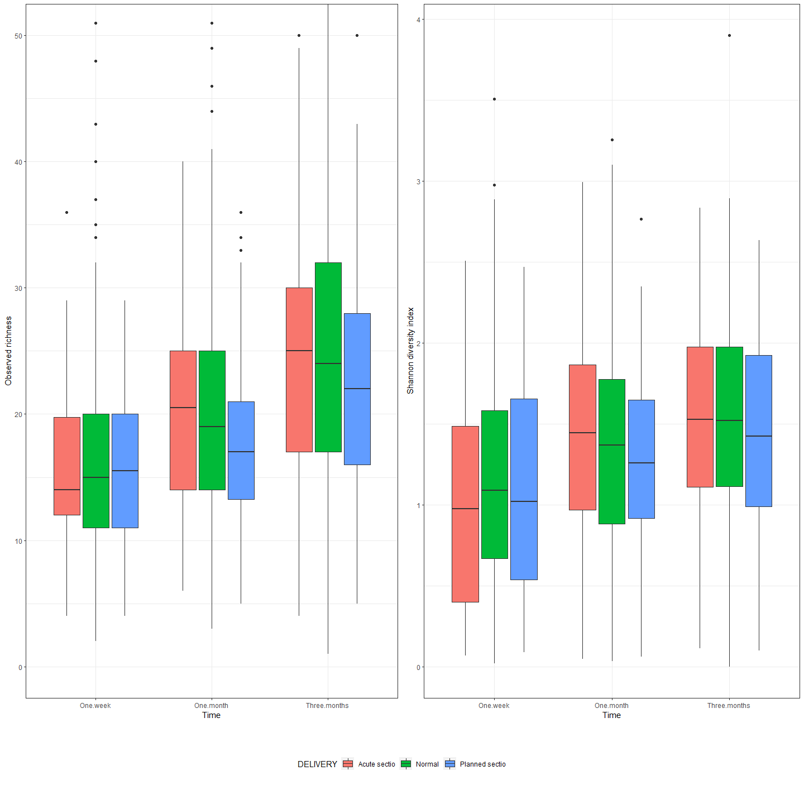

    ## [1] "Statistical test of alpha diversity by Time and Delivery method"

    ## Analysis of Variance Table
    ## 
    ## Response: Observed
    ##             Df Sum Sq Mean Sq F value  Pr(>F)    
    ## Time         2  20891 10445.5 91.1252 < 2e-16 ***
    ## DELIVERY     2    846   423.0  3.6903 0.02516 *  
    ## Residuals 1741 199568   114.6                    
    ## ---
    ## Signif. codes:  0 '***' 0.001 '**' 0.01 '*' 0.05 '.' 0.1 ' ' 1

    ##   Tukey multiple comparisons of means
    ##     95% family-wise confidence level
    ## 
    ## Fit: aov(formula = Observed ~ Time + DELIVERY, data = df.adiv)
    ## 
    ## $Time
    ##                            diff      lwr       upr p adj
    ## One.month-One.week     3.887149 2.390517  5.383780     0
    ## Three.months-One.week  8.545559 7.053465 10.037653     0
    ## Three.months-One.month 4.658410 3.220340  6.096481     0
    ## 
    ## $DELIVERY
    ##                                   diff       lwr        upr     p adj
    ## Normal-Acute sectio          0.2037826 -1.790309  2.1978739 0.9688195
    ## Planned sectio-Acute sectio -2.1341848 -4.807850  0.5394805 0.1470299
    ## Planned sectio-Normal       -2.3379674 -4.357287 -0.3186474 0.0183126

    ## Analysis of Variance Table
    ## 
    ## Response: Shannon
    ##             Df Sum Sq Mean Sq F value Pr(>F)    
    ## Time         2  46.25 23.1232 59.1001 <2e-16 ***
    ## DELIVERY     2   0.33  0.1652  0.4222 0.6557    
    ## Residuals 1741 681.18  0.3913                   
    ## ---
    ## Signif. codes:  0 '***' 0.001 '**' 0.01 '*' 0.05 '.' 0.1 ' ' 1

    ##   Tukey multiple comparisons of means
    ##     95% family-wise confidence level
    ## 
    ## Fit: aov(formula = Shannon ~ Time + DELIVERY, data = df.adiv)
    ## 
    ## $Time
    ##                             diff       lwr       upr p adj
    ## One.month-One.week     0.2118842 0.1244465 0.2993219 0e+00
    ## Three.months-One.week  0.4039750 0.3168024 0.4911476 0e+00
    ## Three.months-One.month 0.1920908 0.1080744 0.2761072 3e-07
    ## 
    ## $DELIVERY
    ##                                    diff        lwr        upr     p adj
    ## Normal-Acute sectio         -0.02598445 -0.1424852 0.09051634 0.8600079
    ## Planned sectio-Acute sectio -0.06077442 -0.2169780 0.09542912 0.6323593
    ## Planned sectio-Normal       -0.03478997 -0.1527647 0.08318476 0.7683547

    ## [1] "Alpha diversity does not differ dependent on mothers vaginal CST at week 36"

    ## Analysis of Variance Table
    ## 
    ## Response: Observed
    ##             Df Sum Sq Mean Sq F value Pr(>F)    
    ## Time         2  20891 10445.5 90.9177 <2e-16 ***
    ## CST_w36      5    735   147.0  1.2799 0.2698    
    ## Residuals 1738 199679   114.9                   
    ## ---
    ## Signif. codes:  0 '***' 0.001 '**' 0.01 '*' 0.05 '.' 0.1 ' ' 1

    ## Analysis of Variance Table
    ## 
    ## Response: Shannon
    ##             Df Sum Sq Mean Sq F value Pr(>F)    
    ## Time         2  46.25 23.1232 59.1229 <2e-16 ***
    ## CST_w36      5   1.77  0.3533  0.9033 0.4779    
    ## Residuals 1738 679.74  0.3911                   
    ## ---
    ## Signif. codes:  0 '***' 0.001 '**' 0.01 '*' 0.05 '.' 0.1 ' ' 1

### 2.2.4 - Airway beta diversity

#### 2.2.4.1 - Preparation

Calculation of Weighted UniFrac distances and NMDS ordination for airway samples Output of this section in './air\_OrdinationRes.RData'

**air\_OrdinationRes.RData** contains weighted UniFrac distances and NMDS ordination of the airway samples

#### 2.2.4.2 - Plots and statistics

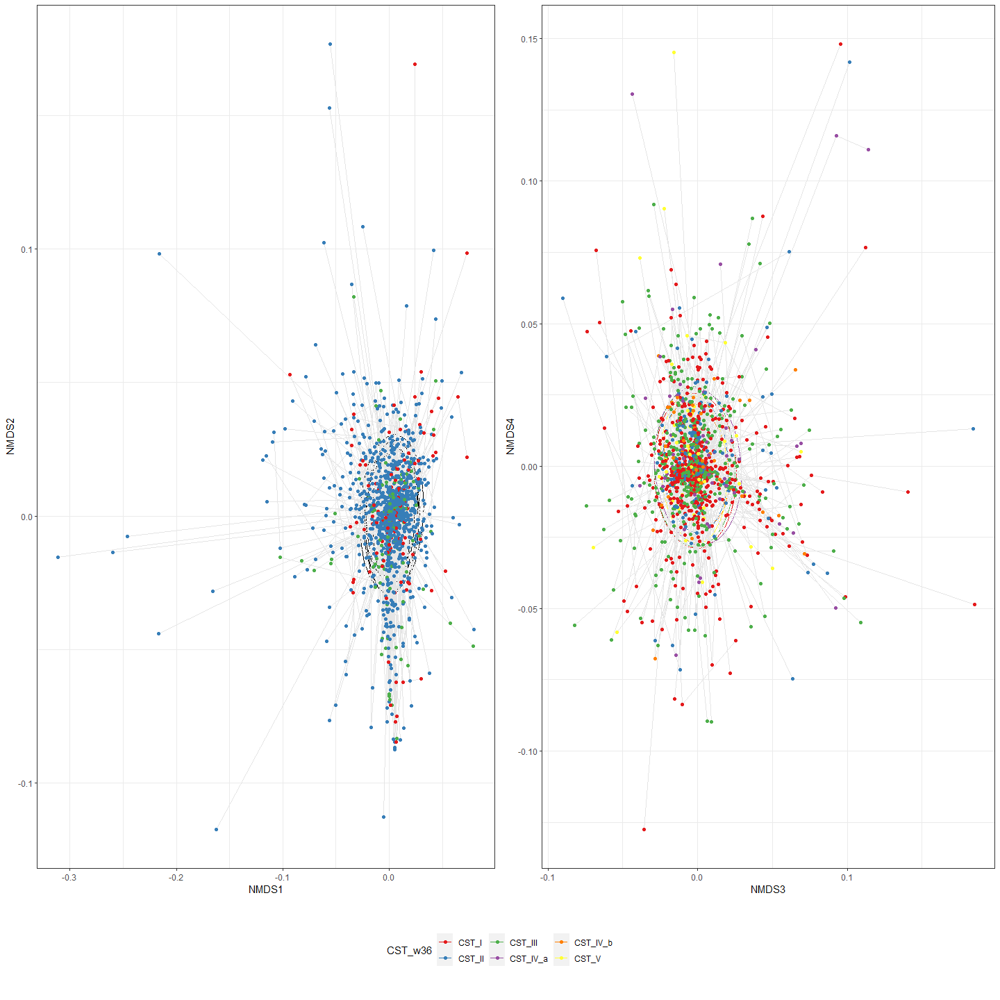

    ## png 
    ##   2

    ## [1] "PERMANOVA of Time using weighted Unifrac distances"

    ## 
    ## Call:
    ## adonis(formula = air.WUnifrac ~ Time, data = df.plot, strata = df.plot$dyadnb) 
    ## 
    ## Blocks:  strata 
    ## Permutation: free
    ## Number of permutations: 999
    ## 
    ## Terms added sequentially (first to last)
    ## 
    ##             Df SumsOfSqs   MeanSqs F.Model      R2 Pr(>F)    
    ## Time         2   0.01549 0.0077448  11.701 0.01325  0.001 ***
    ## Residuals 1743   1.15367 0.0006619         0.98675           
    ## Total     1745   1.16916                   1.00000           
    ## ---
    ## Signif. codes:  0 '***' 0.001 '**' 0.01 '*' 0.05 '.' 0.1 ' ' 1

    ## [1] "PERMANOVA of mothers CST at week 36 using weighted Unifrac distances"

    ## 
    ## Call:
    ## adonis(formula = air.WUnifrac ~ CST_w36, data = df.plot, strata = df.plot$dyadnb) 
    ## 
    ## Blocks:  strata 
    ## Permutation: free
    ## Number of permutations: 999
    ## 
    ## Terms added sequentially (first to last)
    ## 
    ##             Df SumsOfSqs    MeanSqs F.Model      R2 Pr(>F)
    ## CST_w36      5   0.00465 0.00093031  1.3901 0.00398      1
    ## Residuals 1740   1.16451 0.00066926         0.99602       
    ## Total     1745   1.16916                    1.00000

    ## 
    ## Call:
    ## adonis(formula = air.WUnifrac ~ Time * CST_w36, data = df.plot,      strata = df.plot$dyadnb) 
    ## 
    ## Blocks:  strata 
    ## Permutation: free
    ## Number of permutations: 999
    ## 
    ## Terms added sequentially (first to last)
    ## 
    ##                Df SumsOfSqs   MeanSqs F.Model      R2 Pr(>F)    
    ## Time            2   0.01549 0.0077448 11.6933 0.01325  0.001 ***
    ## CST_w36         5   0.00454 0.0009089  1.3722 0.00389  0.950    
    ## Time:CST_w36   10   0.00463 0.0004630  0.6990 0.00396  0.896    
    ## Residuals    1728   1.14450 0.0006623         0.97890           
    ## Total        1745   1.16916                   1.00000           
    ## ---
    ## Signif. codes:  0 '***' 0.001 '**' 0.01 '*' 0.05 '.' 0.1 ' ' 1

    ## [1] "PERMANOVA of Delivery using weighted Unifrac distances"

    ## 
    ## Call:
    ## adonis(formula = air.WUnifrac ~ DELIVERY, data = df.plot, strata = df.plot$dyadnb) 
    ## 
    ## Blocks:  strata 
    ## Permutation: free
    ## Number of permutations: 999
    ## 
    ## Terms added sequentially (first to last)
    ## 
    ##             Df SumsOfSqs    MeanSqs F.Model      R2 Pr(>F)
    ## DELIVERY     2   0.00287 0.00143643  2.1467 0.00246      1
    ## Residuals 1743   1.16629 0.00066913         0.99754       
    ## Total     1745   1.16916                    1.00000

    ## 
    ## Call:
    ## adonis(formula = air.WUnifrac ~ Time * DELIVERY, data = df.plot,      strata = df.plot$dyadnb) 
    ## 
    ## Blocks:  strata 
    ## Permutation: free
    ## Number of permutations: 999
    ## 
    ## Terms added sequentially (first to last)
    ## 
    ##                 Df SumsOfSqs   MeanSqs F.Model      R2 Pr(>F)    
    ## Time             2   0.01549 0.0077448 11.7102 0.01325  0.001 ***
    ## DELIVERY         2   0.00278 0.0013891  2.1004 0.00238  0.968    
    ## Time:DELIVERY    4   0.00210 0.0005242  0.7926 0.00179  0.459    
    ## Residuals     1737   1.14879 0.0006614         0.98258           
    ## Total         1745   1.16916                   1.00000           
    ## ---
    ## Signif. codes:  0 '***' 0.001 '**' 0.01 '*' 0.05 '.' 0.1 ' ' 1

2.3 - Fecal microbiome
----------------------

### 2.3.1 - Subset fecal samples

**fec\_taxglm.RData** contains phyloseq objects with fecal samples at phylum, genus and ASV level for both read counts and relative abundances, as well as a rarefied (2000 reads/sample) at ASV level.

### 2.3.2 - Dominant fecal taxa and overall richness

The distribution of the fecal reads are here summarized on phylum, genus and individual ASV level.

| Included   |  Phylum|  Genus|   ASV|
|:-----------|-------:|------:|-----:|
| All        |      33|    707|  6818|
| &gt; 0.01% |       8|    105|   306|
| &gt; 0.1%  |       5|     44|    87|
| &gt; 1%    |       5|     14|    22|

| Kingdom  | Phylum          | Class | Order | Family | Genus\_simple | Genus | Species | name | asw\_hash |  taxprc|
|:---------|:----------------|:------|:------|:-------|:--------------|:------|:--------|:-----|:----------|-------:|
| Bacteria | Bacteroidetes   | NA    | NA    | NA     | NA            | NA    | NA      | NA   | NA        |    34.4|
| Bacteria | Proteobacteria  | NA    | NA    | NA     | NA            | NA    | NA      | NA   | NA        |    26.4|
| Bacteria | Firmicutes      | NA    | NA    | NA     | NA            | NA    | NA      | NA   | NA        |    21.4|
| Bacteria | Actinobacteria  | NA    | NA    | NA     | NA            | NA    | NA      | NA   | NA        |    16.2|
| Bacteria | Verrucomicrobia | NA    | NA    | NA     | NA            | NA    | NA      | NA   | NA        |     1.4|
| Bacteria | Fusobacteria    | NA    | NA    | NA     | NA            | NA    | NA      | NA   | NA        |     0.1|

<table style="width:100%;">
<caption>Distribution of reads according to genus</caption>
<colgroup>
<col width="5%" />
<col width="9%" />
<col width="12%" />
<col width="10%" />
<col width="11%" />
<col width="15%" />
<col width="15%" />
<col width="5%" />
<col width="3%" />
<col width="5%" />
<col width="4%" />
</colgroup>
<thead>
<tr class="header">
<th align="left">Kingdom</th>
<th align="left">Phylum</th>
<th align="left">Class</th>
<th align="left">Order</th>
<th align="left">Family</th>
<th align="left">Genus_simple</th>
<th align="left">Genus</th>
<th align="left">Species</th>
<th align="left">name</th>
<th align="left">asw_hash</th>
<th align="right">taxprc</th>
</tr>
</thead>
<tbody>
<tr class="odd">
<td align="left">Bacteria</td>
<td align="left">Bacteroidetes</td>
<td align="left">Bacteroidia</td>
<td align="left">Bacteroidales</td>
<td align="left">Bacteroidaceae</td>
<td align="left">Bacteroides</td>
<td align="left">Bacteroides</td>
<td align="left">NA</td>
<td align="left">NA</td>
<td align="left">NA</td>
<td align="right">29.2</td>
</tr>
<tr class="even">
<td align="left">Bacteria</td>
<td align="left">Actinobacteria</td>
<td align="left">Actinobacteria</td>
<td align="left">Bifidobacteriales</td>
<td align="left">Bifidobacteriaceae</td>
<td align="left">Bifidobacterium</td>
<td align="left">Bifidobacterium</td>
<td align="left">NA</td>
<td align="left">NA</td>
<td align="left">NA</td>
<td align="right">15.6</td>
</tr>
<tr class="odd">
<td align="left">Bacteria</td>
<td align="left">Proteobacteria</td>
<td align="left">Gammaproteobacteria</td>
<td align="left">Enterobacteriales</td>
<td align="left">Enterobacteriaceae</td>
<td align="left">Escherichia_Shigella</td>
<td align="left">Escherichia_Shigella</td>
<td align="left">NA</td>
<td align="left">NA</td>
<td align="left">NA</td>
<td align="right">14.1</td>
</tr>
<tr class="even">
<td align="left">Bacteria</td>
<td align="left">Proteobacteria</td>
<td align="left">Gammaproteobacteria</td>
<td align="left">Enterobacteriales</td>
<td align="left">Enterobacteriaceae</td>
<td align="left">Family_Enterobacteriaceae</td>
<td align="left">Family_Enterobacteriaceae</td>
<td align="left">NA</td>
<td align="left">NA</td>
<td align="left">NA</td>
<td align="right">9.2</td>
</tr>
<tr class="odd">
<td align="left">Bacteria</td>
<td align="left">Firmicutes</td>
<td align="left">Negativicutes</td>
<td align="left">Selenomonadales</td>
<td align="left">Veillonellaceae</td>
<td align="left">Veillonella</td>
<td align="left">Veillonella</td>
<td align="left">NA</td>
<td align="left">NA</td>
<td align="left">NA</td>
<td align="right">3.3</td>
</tr>
<tr class="even">
<td align="left">Bacteria</td>
<td align="left">Firmicutes</td>
<td align="left">Clostridia</td>
<td align="left">Clostridiales</td>
<td align="left">Clostridiaceae_1</td>
<td align="left">Clostridium_ss_1</td>
<td align="left">Clostridium_ss_1</td>
<td align="left">NA</td>
<td align="left">NA</td>
<td align="left">NA</td>
<td align="right">3.0</td>
</tr>
</tbody>
</table>

<table>
<caption>Distribution of reads according to ASV</caption>
<colgroup>
<col width="4%" />
<col width="6%" />
<col width="8%" />
<col width="7%" />
<col width="8%" />
<col width="11%" />
<col width="11%" />
<col width="11%" />
<col width="13%" />
<col width="14%" />
<col width="3%" />
</colgroup>
<thead>
<tr class="header">
<th align="left">Kingdom</th>
<th align="left">Phylum</th>
<th align="left">Class</th>
<th align="left">Order</th>
<th align="left">Family</th>
<th align="left">Genus_simple</th>
<th align="left">Genus</th>
<th align="left">Species</th>
<th align="left">name</th>
<th align="left">asw_hash</th>
<th align="right">taxprc</th>
</tr>
</thead>
<tbody>
<tr class="odd">
<td align="left">Bacteria</td>
<td align="left">Proteobacteria</td>
<td align="left">Gammaproteobacteria</td>
<td align="left">Enterobacteriales</td>
<td align="left">Enterobacteriaceae</td>
<td align="left">Escherichia_Shigella</td>
<td align="left">Escherichia_Shigella</td>
<td align="left">Genus_Escherichia_Shigella</td>
<td align="left">Genus_Escherichia_Shigella_101</td>
<td align="left">20cfe7f61d18f6525cc71caae0ab28dc</td>
<td align="right">13.2</td>
</tr>
<tr class="even">
<td align="left">Bacteria</td>
<td align="left">Actinobacteria</td>
<td align="left">Actinobacteria</td>
<td align="left">Bifidobacteriales</td>
<td align="left">Bifidobacteriaceae</td>
<td align="left">Bifidobacterium</td>
<td align="left">Bifidobacterium</td>
<td align="left">Genus_Bifidobacterium</td>
<td align="left">Genus_Bifidobacterium_60</td>
<td align="left">6ec6d03fbef9f16e3581ccdc60e7d266</td>
<td align="right">10.0</td>
</tr>
<tr class="odd">
<td align="left">Bacteria</td>
<td align="left">Bacteroidetes</td>
<td align="left">Bacteroidia</td>
<td align="left">Bacteroidales</td>
<td align="left">Bacteroidaceae</td>
<td align="left">Bacteroides</td>
<td align="left">Bacteroides</td>
<td align="left">Bacteroides_fragilis</td>
<td align="left">Bacteroides_fragilis_22</td>
<td align="left">d20d3658de331c939f54d8acaed7c4c1</td>
<td align="right">6.6</td>
</tr>
<tr class="even">
<td align="left">Bacteria</td>
<td align="left">Bacteroidetes</td>
<td align="left">Bacteroidia</td>
<td align="left">Bacteroidales</td>
<td align="left">Bacteroidaceae</td>
<td align="left">Bacteroides</td>
<td align="left">Bacteroides</td>
<td align="left">Genus_Bacteroides</td>
<td align="left">Genus_Bacteroides_293</td>
<td align="left">8c3ff6c4c4b125d5e72f5276d57be4d0</td>
<td align="right">6.3</td>
</tr>
<tr class="odd">
<td align="left">Bacteria</td>
<td align="left">Bacteroidetes</td>
<td align="left">Bacteroidia</td>
<td align="left">Bacteroidales</td>
<td align="left">Bacteroidaceae</td>
<td align="left">Bacteroides</td>
<td align="left">Bacteroides</td>
<td align="left">Genus_Bacteroides</td>
<td align="left">Genus_Bacteroides_260</td>
<td align="left">7078a2866c4a4b71fcc6ed7779369c8d</td>
<td align="right">5.1</td>
</tr>
<tr class="even">
<td align="left">Bacteria</td>
<td align="left">Proteobacteria</td>
<td align="left">Gammaproteobacteria</td>
<td align="left">Enterobacteriales</td>
<td align="left">Enterobacteriaceae</td>
<td align="left">Family_Enterobacteriaceae</td>
<td align="left">Family_Enterobacteriaceae</td>
<td align="left">Family_Enterobacteriaceae</td>
<td align="left">Family_Enterobacteriaceae_63</td>
<td align="left">4e8b51098d3b598eadf069dcc96e81aa</td>
<td align="right">4.6</td>
</tr>
</tbody>
</table>

### 2.3.3 - Fecal alpha diversity

For this part we use the rarefied samples (2000 reads/sample)

| Time      |    n|  Observed\_mean|  Observed\_sd|  Shannon\_mean|  Shannon\_sd|
|:----------|----:|---------------:|-------------:|--------------:|------------:|
| One.week  |  533|          23.206|        14.263|          1.515|        0.614|
| One.month |  575|          22.101|         9.367|          1.400|        0.541|
| One.year  |  580|          53.150|        18.538|          2.327|        0.597|

| Time      | DELIVERY       |    n|  Observed\_mean|  Observed\_sd|  Shannon\_mean|  Shannon\_sd|
|:----------|:---------------|----:|---------------:|-------------:|--------------:|------------:|
| One.week  | Acute sectio   |   56|          23.482|        11.557|          1.473|        0.658|
| One.week  | Normal         |  426|          22.869|        10.570|          1.515|        0.588|
| One.week  | Planned sectio |   51|          25.725|        32.563|          1.563|        0.773|
| One.month | Acute sectio   |   64|          21.672|         8.142|          1.301|        0.470|
| One.month | Normal         |  461|          22.221|         9.576|          1.414|        0.543|
| One.month | Planned sectio |   50|          21.540|         9.008|          1.399|        0.596|
| One.year  | Acute sectio   |   60|          49.883|        18.762|          2.271|        0.666|
| One.year  | Normal         |  466|          53.573|        18.482|          2.335|        0.587|
| One.year  | Planned sectio |   54|          53.130|        18.763|          2.329|        0.611|

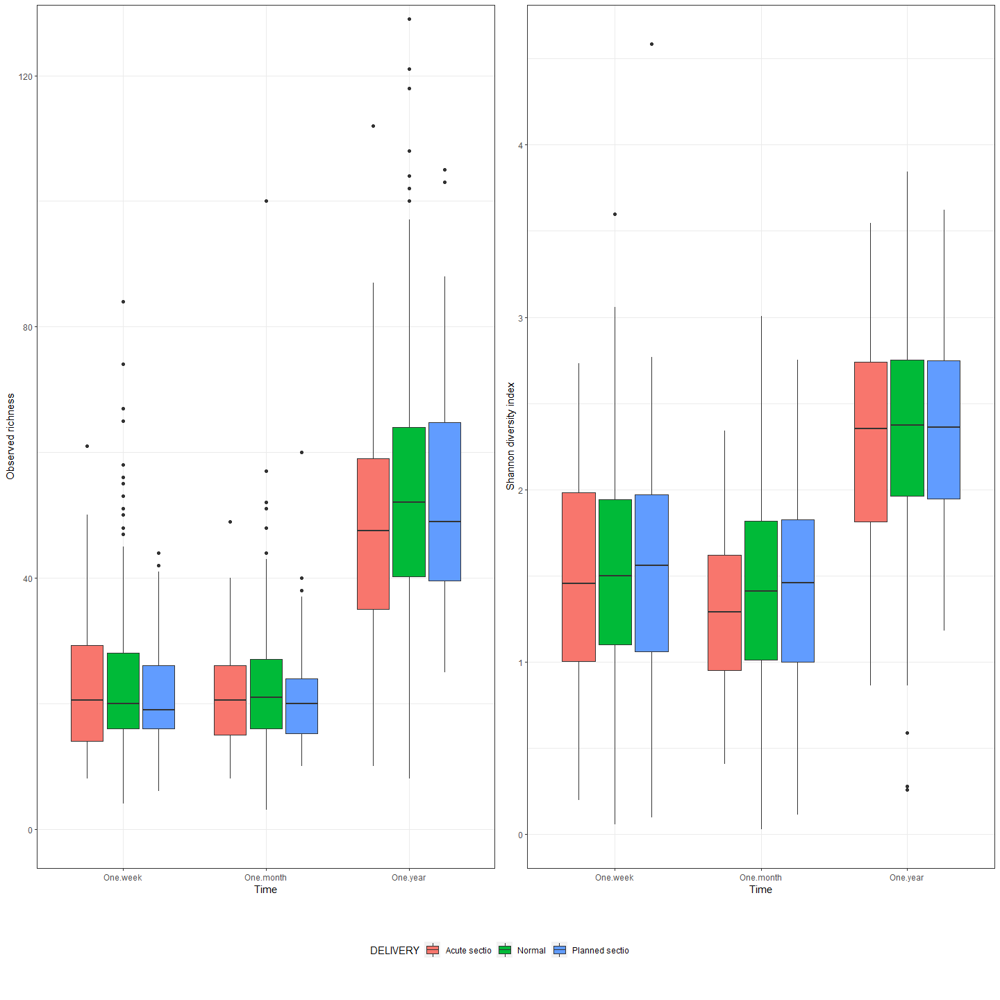

    ## [1] "Statistical test of alpha diversity by Time and Delivery method"

    ## Analysis of Variance Table
    ## 
    ## Response: Observed
    ##             Df Sum Sq Mean Sq  F value Pr(>F)    
    ## Time         2 354897  177448 835.9279 <2e-16 ***
    ## DELIVERY     2    313     156   0.7369 0.4788    
    ## Residuals 1683 357263     212                    
    ## ---
    ## Signif. codes:  0 '***' 0.001 '**' 0.01 '*' 0.05 '.' 0.1 ' ' 1

    ##   Tukey multiple comparisons of means
    ##     95% family-wise confidence level
    ## 
    ## Fit: aov(formula = Observed ~ Time + DELIVERY, data = df.adiv)
    ## 
    ## $Time
    ##                         diff       lwr        upr     p adj
    ## One.month-One.week -1.105509 -3.160507  0.9494882 0.4170142
    ## One.year-One.week  29.943621 27.892889 31.9943532 0.0000000
    ## One.year-One.month 31.049130 29.037806 33.0604545 0.0000000
    ## 
    ## $DELIVERY
    ##                                 diff       lwr      upr     p adj
    ## Normal-Acute sectio         1.235954 -1.475642 3.947549 0.5333632
    ## Planned sectio-Acute sectio 1.796473 -1.948591 5.541538 0.4985965
    ## Planned sectio-Normal       0.560520 -2.337657 3.458697 0.8927733

    ## Analysis of Variance Table
    ## 
    ## Response: Shannon
    ##             Df Sum Sq Mean Sq  F value Pr(>F)    
    ## Time         2 293.27 146.636 429.8028 <2e-16 ***
    ## DELIVERY     2   0.92   0.462   1.3549 0.2583    
    ## Residuals 1683 574.19   0.341                    
    ## ---
    ## Signif. codes:  0 '***' 0.001 '**' 0.01 '*' 0.05 '.' 0.1 ' ' 1

    ##   Tukey multiple comparisons of means
    ##     95% family-wise confidence level
    ## 
    ## Fit: aov(formula = Shannon ~ Time + DELIVERY, data = df.adiv)
    ## 
    ## $Time
    ##                          diff        lwr         upr     p adj
    ## One.month-One.week -0.1149787 -0.1973632 -0.03259411 0.0031055
    ## One.year-One.week   0.8125265  0.7303130  0.89474009 0.0000000
    ## One.year-One.month  0.9275052  0.8468715  1.00813890 0.0000000
    ## 
    ## $DELIVERY
    ##                                    diff         lwr       upr     p adj
    ## Normal-Acute sectio         0.074407660 -0.03429982 0.1831151 0.2434904
    ## Planned sectio-Acute sectio 0.083511039 -0.06662806 0.2336501 0.3926698
    ## Planned sectio-Normal       0.009103379 -0.10708413 0.1252909 0.9815499

    ## [1] "Alpha diversity does not differ dependent on mothers vaginal CST at week 36"

    ## Analysis of Variance Table
    ## 
    ## Response: Observed
    ##             Df Sum Sq Mean Sq  F value Pr(>F)    
    ## Time         2 354897  177448 836.2606 <2e-16 ***
    ## CST_w36      5   1092     218   1.0288 0.3989    
    ## Residuals 1680 356484     212                    
    ## ---
    ## Signif. codes:  0 '***' 0.001 '**' 0.01 '*' 0.05 '.' 0.1 ' ' 1

    ## Analysis of Variance Table
    ## 
    ## Response: Shannon
    ##             Df Sum Sq Mean Sq  F value Pr(>F)    
    ## Time         2 293.27 146.636 429.0059 <2e-16 ***
    ## CST_w36      5   0.88   0.177   0.5169 0.7637    
    ## Residuals 1680 574.23   0.342                    
    ## ---
    ## Signif. codes:  0 '***' 0.001 '**' 0.01 '*' 0.05 '.' 0.1 ' ' 1

### 2.3.4 - Fecal beta diversity

#### 2.3.4.1 - Preparation

Calculation of Weighted UniFrac distances and NMDS ordination for fecal samples

**fec\_OrdinationRes.RData** contains weighted UniFrac distances and NMDS ordination of the fecal samples

#### 2.3.4.2 - Plots and statistics

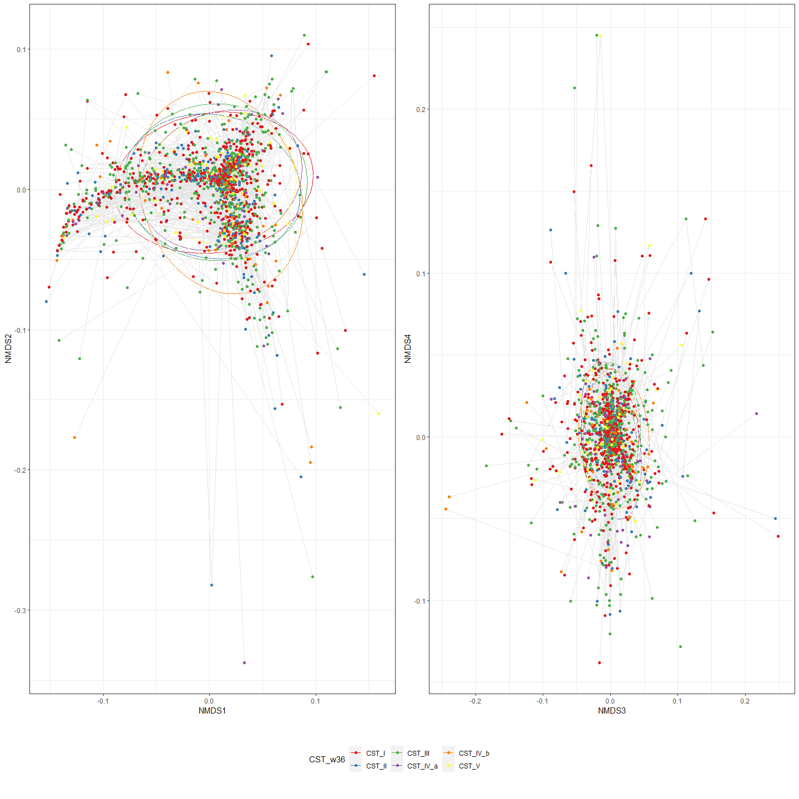

    ## png 
    ##   2

    ## [1] "PERMANOVA of Time using weighted Unifrac distances"

    ## 
    ## Call:
    ## adonis(formula = fec.WUnifrac ~ Time, data = df.plot, strata = df.plot$dyadnb) 
    ## 
    ## Blocks:  strata 
    ## Permutation: free
    ## Number of permutations: 999
    ## 
    ## Terms added sequentially (first to last)
    ## 
    ##             Df SumsOfSqs   MeanSqs F.Model      R2 Pr(>F)    
    ## Time         2   0.05639 0.0281953  30.617 0.03507  0.001 ***
    ## Residuals 1685   1.55172 0.0009209         0.96493           
    ## Total     1687   1.60811                   1.00000           
    ## ---
    ## Signif. codes:  0 '***' 0.001 '**' 0.01 '*' 0.05 '.' 0.1 ' ' 1

    ## [1] "PERMANOVA of mothers CST at week 36 using weighted Unifrac distances"

    ## 
    ## Call:
    ## adonis(formula = fec.WUnifrac ~ CST_w36, data = df.plot, strata = df.plot$dyadnb) 
    ## 
    ## Blocks:  strata 
    ## Permutation: free
    ## Number of permutations: 999
    ## 
    ## Terms added sequentially (first to last)
    ## 
    ##             Df SumsOfSqs    MeanSqs F.Model      R2 Pr(>F)
    ## CST_w36      5   0.01092 0.00218339  2.2993 0.00679      1
    ## Residuals 1682   1.59720 0.00094958         0.99321       
    ## Total     1687   1.60811                    1.00000

    ## 
    ## Call:
    ## adonis(formula = fec.WUnifrac ~ Time * CST_w36, data = df.plot,      strata = df.plot$dyadnb) 
    ## 
    ## Blocks:  strata 
    ## Permutation: free
    ## Number of permutations: 999
    ## 
    ## Terms added sequentially (first to last)
    ## 
    ##                Df SumsOfSqs   MeanSqs F.Model      R2 Pr(>F)    
    ## Time            2   0.05639 0.0281953 30.7926 0.03507  0.001 ***
    ## CST_w36         5   0.01162 0.0023244  2.5386 0.00723  0.001 ***
    ## Time:CST_w36   10   0.01096 0.0010964  1.1974 0.00682  0.554    
    ## Residuals    1670   1.52914 0.0009157         0.95089           
    ## Total        1687   1.60811                   1.00000           
    ## ---
    ## Signif. codes:  0 '***' 0.001 '**' 0.01 '*' 0.05 '.' 0.1 ' ' 1

    ## [1] "PERMANOVA of Delivery using weighted Unifrac distances"

    ## 
    ## Call:
    ## adonis(formula = fec.WUnifrac ~ DELIVERY, data = df.plot, strata = df.plot$dyadnb) 
    ## 
    ## Blocks:  strata 
    ## Permutation: free
    ## Number of permutations: 999
    ## 
    ## Terms added sequentially (first to last)
    ## 
    ##             Df SumsOfSqs   MeanSqs F.Model      R2 Pr(>F)
    ## DELIVERY     2   0.00703 0.0035144  3.6986 0.00437      1
    ## Residuals 1685   1.60108 0.0009502         0.99563       
    ## Total     1687   1.60811                   1.00000

    ## 
    ## Call:
    ## adonis(formula = fec.WUnifrac ~ Time * DELIVERY, data = df.plot,      strata = df.plot$dyadnb) 
    ## 
    ## Blocks:  strata 
    ## Permutation: free
    ## Number of permutations: 999
    ## 
    ## Terms added sequentially (first to last)
    ## 
    ##                 Df SumsOfSqs   MeanSqs F.Model      R2 Pr(>F)    
    ## Time             2   0.05639 0.0281953 30.9488 0.03507  0.001 ***
    ## DELIVERY         2   0.00698 0.0034906  3.8315 0.00434  0.001 ***
    ## Time:DELIVERY    4   0.01512 0.0037808  4.1500 0.00940  0.001 ***
    ## Residuals     1679   1.52962 0.0009110         0.95119           
    ## Total         1687   1.60811                   1.00000           
    ## ---
    ## Signif. codes:  0 '***' 0.001 '**' 0.01 '*' 0.05 '.' 0.1 ' ' 1

3 - Transfer
============

3.1 - Preparation
-----------------

### 3.1.1 - Calculation of ALL individual ASV models

This is the foundation of all further analysis of transfer from mother to infant Output of this section in './ORresults.RData'

**ORresults.RData** contains all calculated odds ratios for transfer across delivery mode, infant sample type and time point

### 3.1.2 - Permutational inference calculation

A permutation test between c-sectio and vaginal birth are conducted for all combinations. \#\#\#\# 3.1.2.1 - Calculations

**weighted\_permutation\_results\_onesided.RData** contains the permutations results for the transfer odds

#### 3.1.2.2 - Format output

**STATtot.RData** contains the formated transfer results as well as supporting tables and lists

#### 3.1.2.3 - Overview of testable ASVs

Table 1 - testable ASV's

<table style="width:100%;">
<caption>Table1: Individual transfermodels, coverage of testable ASVs and strongest results</caption>
<colgroup>
<col width="6%" />
<col width="4%" />
<col width="6%" />
<col width="4%" />
<col width="9%" />
<col width="9%" />
<col width="4%" />
<col width="6%" />
<col width="12%" />
<col width="12%" />
<col width="11%" />
<col width="11%" />
</colgroup>
<thead>
<tr class="header">
<th align="left">delivery</th>
<th align="right">time</th>
<th align="left">type</th>
<th align="right">nASV</th>
<th align="right">relativeAbuM</th>
<th align="right">relativeAbuC</th>
<th align="right">pmin</th>
<th align="right">pminadj</th>
<th align="right">n_crude_below_01</th>
<th align="right">n_crude_below_05</th>
<th align="right">n_fdr_below_05</th>
<th align="right">n_fdr_below_10</th>
</tr>
</thead>
<tbody>
<tr class="odd">
<td align="left">csec</td>
<td align="right">7</td>
<td align="left">Airways</td>
<td align="right">104</td>
<td align="right">30.994</td>
<td align="right">36.451</td>
<td align="right">0.058</td>
<td align="right">0.990</td>
<td align="right">0</td>
<td align="right">0</td>
<td align="right">0</td>
<td align="right">0</td>
</tr>
<tr class="even">
<td align="left">csec</td>
<td align="right">7</td>
<td align="left">Fecal</td>
<td align="right">160</td>
<td align="right">31.606</td>
<td align="right">73.259</td>
<td align="right">0.000</td>
<td align="right">0.008</td>
<td align="right">3</td>
<td align="right">5</td>
<td align="right">1</td>
<td align="right">1</td>
</tr>
<tr class="odd">
<td align="left">csec</td>
<td align="right">30</td>
<td align="left">Airways</td>
<td align="right">131</td>
<td align="right">56.383</td>
<td align="right">84.976</td>
<td align="right">0.008</td>
<td align="right">0.347</td>
<td align="right">3</td>
<td align="right">6</td>
<td align="right">0</td>
<td align="right">0</td>
</tr>
<tr class="even">
<td align="left">csec</td>
<td align="right">30</td>
<td align="left">Fecal</td>
<td align="right">181</td>
<td align="right">60.471</td>
<td align="right">83.228</td>
<td align="right">0.008</td>
<td align="right">0.991</td>
<td align="right">1</td>
<td align="right">4</td>
<td align="right">0</td>
<td align="right">0</td>
</tr>
<tr class="odd">
<td align="left">csec</td>
<td align="right">90</td>
<td align="left">Airways</td>
<td align="right">152</td>
<td align="right">56.791</td>
<td align="right">84.419</td>
<td align="right">0.033</td>
<td align="right">0.992</td>
<td align="right">0</td>
<td align="right">3</td>
<td align="right">0</td>
<td align="right">0</td>
</tr>
<tr class="even">
<td align="left">csec</td>
<td align="right">300</td>
<td align="left">Fecal</td>
<td align="right">161</td>
<td align="right">61.669</td>
<td align="right">59.292</td>
<td align="right">0.018</td>
<td align="right">0.991</td>
<td align="right">0</td>
<td align="right">2</td>
<td align="right">0</td>
<td align="right">0</td>
</tr>
<tr class="odd">
<td align="left">norm</td>
<td align="right">7</td>
<td align="left">Airways</td>
<td align="right">293</td>
<td align="right">63.970</td>
<td align="right">45.965</td>
<td align="right">0.002</td>
<td align="right">0.691</td>
<td align="right">3</td>
<td align="right">13</td>
<td align="right">0</td>
<td align="right">0</td>
</tr>
<tr class="even">
<td align="left">norm</td>
<td align="right">7</td>
<td align="left">Fecal</td>
<td align="right">354</td>
<td align="right">65.154</td>
<td align="right">90.692</td>
<td align="right">0.000</td>
<td align="right">0.012</td>
<td align="right">12</td>
<td align="right">28</td>
<td align="right">2</td>
<td align="right">4</td>
</tr>
<tr class="odd">
<td align="left">norm</td>
<td align="right">30</td>
<td align="left">Airways</td>
<td align="right">342</td>
<td align="right">63.859</td>
<td align="right">90.155</td>
<td align="right">0.000</td>
<td align="right">0.001</td>
<td align="right">8</td>
<td align="right">14</td>
<td align="right">1</td>
<td align="right">2</td>
</tr>
<tr class="even">
<td align="left">norm</td>
<td align="right">30</td>
<td align="left">Fecal</td>
<td align="right">395</td>
<td align="right">65.809</td>
<td align="right">92.392</td>
<td align="right">0.002</td>
<td align="right">0.312</td>
<td align="right">11</td>
<td align="right">28</td>
<td align="right">0</td>
<td align="right">0</td>
</tr>
<tr class="odd">
<td align="left">norm</td>
<td align="right">90</td>
<td align="left">Airways</td>
<td align="right">364</td>
<td align="right">62.224</td>
<td align="right">87.668</td>
<td align="right">0.001</td>
<td align="right">0.260</td>
<td align="right">3</td>
<td align="right">9</td>
<td align="right">0</td>
<td align="right">0</td>
</tr>
<tr class="even">
<td align="left">norm</td>
<td align="right">300</td>
<td align="left">Fecal</td>
<td align="right">404</td>
<td align="right">64.182</td>
<td align="right">84.451</td>
<td align="right">0.003</td>
<td align="right">0.457</td>
<td align="right">7</td>
<td align="right">17</td>
<td align="right">0</td>
<td align="right">0</td>
</tr>
</tbody>
</table>

<table>
<caption>Individual transfermodels, coverage of testable ASVs and strongest results for acute and planned CS</caption>
<colgroup>
<col width="9%" />
<col width="4%" />
<col width="6%" />
<col width="4%" />
<col width="9%" />
<col width="9%" />
<col width="4%" />
<col width="6%" />
<col width="12%" />
<col width="12%" />
<col width="10%" />
<col width="10%" />
</colgroup>
<thead>
<tr class="header">
<th align="left">delivery</th>
<th align="right">time</th>
<th align="left">type</th>
<th align="right">nASV</th>
<th align="right">relativeAbuM</th>
<th align="right">relativeAbuC</th>
<th align="right">pmin</th>
<th align="right">pminadj</th>
<th align="right">n_crude_below_01</th>
<th align="right">n_crude_below_05</th>
<th align="right">n_fdr_below_05</th>
<th align="right">n_fdr_below_10</th>
</tr>
</thead>
<tbody>
<tr class="odd">
<td align="left">csec_acute</td>
<td align="right">7</td>
<td align="left">Airways</td>
<td align="right">65</td>
<td align="right">20.616</td>
<td align="right">16.849</td>
<td align="right">0.171</td>
<td align="right">0.980</td>
<td align="right">0</td>
<td align="right">0</td>
<td align="right">0</td>
<td align="right">0</td>
</tr>
<tr class="even">
<td align="left">csec_acute</td>
<td align="right">7</td>
<td align="left">Fecal</td>
<td align="right">105</td>
<td align="right">21.214</td>
<td align="right">63.576</td>
<td align="right">0.001</td>
<td align="right">0.068</td>
<td align="right">1</td>
<td align="right">2</td>
<td align="right">0</td>
<td align="right">1</td>
</tr>
<tr class="odd">
<td align="left">csec_acute</td>
<td align="right">30</td>
<td align="left">Airways</td>
<td align="right">81</td>
<td align="right">50.822</td>
<td align="right">59.373</td>
<td align="right">0.005</td>
<td align="right">0.374</td>
<td align="right">1</td>
<td align="right">4</td>
<td align="right">0</td>
<td align="right">0</td>
</tr>
<tr class="even">
<td align="left">csec_acute</td>
<td align="right">30</td>
<td align="left">Fecal</td>
<td align="right">121</td>
<td align="right">55.910</td>
<td align="right">75.822</td>
<td align="right">0.016</td>
<td align="right">0.984</td>
<td align="right">0</td>
<td align="right">3</td>
<td align="right">0</td>
<td align="right">0</td>
</tr>
<tr class="odd">
<td align="left">csec_acute</td>
<td align="right">90</td>
<td align="left">Airways</td>
<td align="right">105</td>
<td align="right">50.661</td>
<td align="right">85.466</td>
<td align="right">0.052</td>
<td align="right">0.985</td>
<td align="right">0</td>
<td align="right">0</td>
<td align="right">0</td>
<td align="right">0</td>
</tr>
<tr class="even">
<td align="left">csec_acute</td>
<td align="right">300</td>
<td align="left">Fecal</td>
<td align="right">100</td>
<td align="right">58.004</td>
<td align="right">50.603</td>
<td align="right">0.017</td>
<td align="right">0.983</td>
<td align="right">0</td>
<td align="right">4</td>
<td align="right">0</td>
<td align="right">0</td>
</tr>
<tr class="odd">
<td align="left">csec_planned</td>
<td align="right">7</td>
<td align="left">Airways</td>
<td align="right">58</td>
<td align="right">30.109</td>
<td align="right">36.183</td>
<td align="right">0.038</td>
<td align="right">0.981</td>
<td align="right">0</td>
<td align="right">1</td>
<td align="right">0</td>
<td align="right">0</td>
</tr>
<tr class="even">
<td align="left">csec_planned</td>
<td align="right">7</td>
<td align="left">Fecal</td>
<td align="right">89</td>
<td align="right">28.119</td>
<td align="right">58.184</td>
<td align="right">0.020</td>
<td align="right">0.873</td>
<td align="right">0</td>
<td align="right">3</td>
<td align="right">0</td>
<td align="right">0</td>
</tr>
<tr class="odd">
<td align="left">csec_planned</td>
<td align="right">30</td>
<td align="left">Airways</td>
<td align="right">75</td>
<td align="right">23.747</td>
<td align="right">81.034</td>
<td align="right">0.016</td>
<td align="right">0.984</td>
<td align="right">0</td>
<td align="right">2</td>
<td align="right">0</td>
<td align="right">0</td>
</tr>
<tr class="even">
<td align="left">csec_planned</td>
<td align="right">30</td>
<td align="left">Fecal</td>
<td align="right">107</td>
<td align="right">30.836</td>
<td align="right">46.935</td>
<td align="right">0.037</td>
<td align="right">0.980</td>
<td align="right">0</td>
<td align="right">1</td>
<td align="right">0</td>
<td align="right">0</td>
</tr>
<tr class="odd">
<td align="left">csec_planned</td>
<td align="right">90</td>
<td align="left">Airways</td>
<td align="right">87</td>
<td align="right">28.459</td>
<td align="right">76.014</td>
<td align="right">0.033</td>
<td align="right">0.983</td>
<td align="right">0</td>
<td align="right">1</td>
<td align="right">0</td>
<td align="right">0</td>
</tr>
<tr class="even">
<td align="left">csec_planned</td>
<td align="right">300</td>
<td align="left">Fecal</td>
<td align="right">91</td>
<td align="right">35.645</td>
<td align="right">33.860</td>
<td align="right">0.054</td>
<td align="right">0.981</td>
<td align="right">0</td>
<td align="right">0</td>
<td align="right">0</td>
<td align="right">0</td>
</tr>
</tbody>
</table>

#### 3.1.2.4 - ASVs with significant transfer odds

<table style="width:100%;">
<caption>Transfer models that were significant after FDR correction</caption>
<colgroup>
<col width="2%" />
<col width="3%" />
<col width="4%" />
<col width="2%" />
<col width="2%" />
<col width="2%" />
<col width="2%" />
<col width="6%" />
<col width="6%" />
<col width="8%" />
<col width="7%" />
<col width="9%" />
<col width="9%" />
<col width="9%" />
<col width="11%" />
<col width="13%" />
</colgroup>
<thead>
<tr class="header">
<th align="right">time</th>
<th align="left">type</th>
<th align="left">delivery</th>
<th align="right">n00</th>
<th align="right">n10</th>
<th align="right">n01</th>
<th align="right">n11</th>
<th align="left">Order3</th>
<th align="left">Phylum</th>
<th align="left">Class</th>
<th align="left">Order</th>
<th align="left">Family</th>
<th align="left">Genus_simple</th>
<th align="left">Genus</th>
<th align="left">Species</th>
<th align="left">otu</th>
</tr>
</thead>
<tbody>
<tr class="odd">
<td align="right">7</td>
<td align="left">Fecal</td>
<td align="left">csec</td>
<td align="right">102</td>
<td align="right">2</td>
<td align="right">0</td>
<td align="right">3</td>
<td align="left">other</td>
<td align="left">Proteobacteria</td>
<td align="left">Gammaproteobacteria</td>
<td align="left">Enterobacteriales</td>
<td align="left">Enterobacteriaceae</td>
<td align="left">Escherichia_Shigella</td>
<td align="left">Escherichia_Shigella</td>
<td align="left">Genus_Escherichia_Shigella</td>
<td align="left">Genus_Escherichia_Shigella_145</td>
</tr>
<tr class="even">
<td align="right">7</td>
<td align="left">Fecal</td>
<td align="left">norm</td>
<td align="right">423</td>
<td align="right">1</td>
<td align="right">0</td>
<td align="right">2</td>
<td align="left">Proteobacteria</td>
<td align="left">Proteobacteria</td>
<td align="left">Gammaproteobacteria</td>
<td align="left">Cardiobacteriales</td>
<td align="left">Wohlfahrtiimonadaceae</td>
<td align="left">Koukoulia</td>
<td align="left">Koukoulia</td>
<td align="left">Genus_Koukoulia</td>
<td align="left">Genus_Koukoulia_3</td>
</tr>
<tr class="odd">
<td align="right">7</td>
<td align="left">Fecal</td>
<td align="left">norm</td>
<td align="right">265</td>
<td align="right">144</td>
<td align="right">3</td>
<td align="right">14</td>
<td align="left">Bacteroidales</td>
<td align="left">Bacteroidetes</td>
<td align="left">Bacteroidia</td>
<td align="left">Bacteroidales</td>
<td align="left">Prevotellaceae</td>
<td align="left">Prevotella</td>
<td align="left">Prevotella</td>
<td align="left">Genus_Prevotella</td>
<td align="left">Genus_Prevotella_20</td>
</tr>
<tr class="even">
<td align="right">30</td>
<td align="left">Airways</td>
<td align="left">norm</td>
<td align="right">284</td>
<td align="right">149</td>
<td align="right">14</td>
<td align="right">33</td>
<td align="left">other</td>
<td align="left">Tenericutes</td>
<td align="left">Mollicutes</td>
<td align="left">Mycoplasmatales</td>
<td align="left">Mycoplasmataceae</td>
<td align="left">Ureaplasma</td>
<td align="left">Ureaplasma</td>
<td align="left">Genus_Ureaplasma</td>
<td align="left">Genus_Ureaplasma_8</td>
</tr>
</tbody>
</table>

| otu                               |  time| type    | delivery      |  n00|  n10|  n01|  n11|     pval|     padj|
|:----------------------------------|-----:|:--------|:--------------|----:|----:|----:|----:|--------:|--------:|
| Genus\_Escherichia\_Shigella\_145 |     7| Airways | csec          |   96|    5|    1|    0|  0.95098|  0.99020|
| Genus\_Escherichia\_Shigella\_145 |     7| Fecal   | csec          |  102|    2|    0|    3|  0.00005|  0.00806|
| Genus\_Escherichia\_Shigella\_145 |    30| Airways | csec          |  121|    4|    0|    1|  0.03968|  0.86640|
| Genus\_Escherichia\_Shigella\_145 |    30| Fecal   | csec          |  104|    3|    5|    2|  0.02977|  0.99123|
| Genus\_Escherichia\_Shigella\_145 |    90| Airways | csec          |  120|    4|    1|    0|  0.96800|  0.99200|
| Genus\_Escherichia\_Shigella\_145 |   300| Fecal   | csec          |  107|    3|    3|    1|  0.13483|  0.99123|
| Genus\_Escherichia\_Shigella\_145 |     7| Airways | csec\_acute   |   47|    2|    1|    0|  0.96000|  0.98000|
| Genus\_Escherichia\_Shigella\_145 |     7| Fecal   | csec\_acute   |   54|    0|    0|    2|  0.00065|  0.06818|
| Genus\_Escherichia\_Shigella\_145 |    30| Airways | csec\_acute   |   62|    1|    0|    1|  0.03125|  0.84375|
| Genus\_Escherichia\_Shigella\_145 |    30| Fecal   | csec\_acute   |   61|    1|    1|    1|  0.06200|  0.98437|
| Genus\_Escherichia\_Shigella\_145 |   300| Fecal   | csec\_acute   |   57|    1|    1|    1|  0.06610|  0.98333|
| Genus\_Escherichia\_Shigella\_145 |     7| Fecal   | csec\_planned |   48|    2|    0|    1|  0.05882|  0.98039|
| Genus\_Escherichia\_Shigella\_145 |    30| Fecal   | csec\_planned |   43|    2|    4|    1|  0.27602|  0.98000|
| Genus\_Escherichia\_Shigella\_145 |    90| Airways | csec\_planned |   56|    3|    1|    0|  0.95000|  0.98333|
| Genus\_Escherichia\_Shigella\_145 |   300| Fecal   | csec\_planned |   50|    2|    2|    0|  0.92662|  0.98148|
| Genus\_Escherichia\_Shigella\_145 |     7| Airways | norm          |  409|   14|    0|    1|  0.03538|  0.79735|
| Genus\_Escherichia\_Shigella\_145 |     7| Fecal   | norm          |  397|   18|   10|    1|  0.39831|  0.99765|
| Genus\_Escherichia\_Shigella\_145 |    30| Fecal   | norm          |  427|   18|   14|    2|  0.14909|  0.99783|
| Genus\_Escherichia\_Shigella\_145 |   300| Fecal   | norm          |  443|   21|    2|    0|  0.91181|  0.99785|
| Genus\_Koukoulia\_3               |     7| Fecal   | csec          |  105|    1|    1|    0|  0.99065|  0.99065|
| Genus\_Koukoulia\_3               |    30| Airways | csec          |  123|    1|    2|    0|  0.98413|  0.99206|
| Genus\_Koukoulia\_3               |    30| Airways | csec\_planned |   60|    1|    1|    0|  0.98387|  0.98387|
| Genus\_Koukoulia\_3               |     7| Fecal   | norm          |  423|    1|    0|    2|  0.00003|  0.01173|
| Genus\_Koukoulia\_3               |    30| Airways | norm          |  473|    3|    4|    0|  0.97516|  0.99792|
| Genus\_Prevotella\_20             |     7| Fecal   | csec          |   58|   47|    1|    1|  0.69829|  0.99065|
| Genus\_Prevotella\_20             |    30| Fecal   | csec          |   62|   46|    3|    3|  0.51872|  0.99123|
| Genus\_Prevotella\_20             |    90| Airways | csec          |   68|   54|    2|    1|  0.59029|  0.99200|
| Genus\_Prevotella\_20             |   300| Fecal   | csec          |   58|   50|    4|    2|  0.42658|  0.99123|
| Genus\_Prevotella\_20             |     7| Fecal   | csec\_acute   |   31|   23|    1|    1|  0.67792|  0.98214|
| Genus\_Prevotella\_20             |    30| Fecal   | csec\_acute   |   36|   26|    1|    1|  0.66964|  0.98437|
| Genus\_Prevotella\_20             |    90| Airways | csec\_acute   |   36|   27|    1|    1|  0.67981|  0.98462|
| Genus\_Prevotella\_20             |   300| Fecal   | csec\_acute   |   31|   25|    3|    1|  0.41416|  0.98333|
| Genus\_Prevotella\_20             |    30| Fecal   | csec\_planned |   26|   20|    2|    2|  0.59815|  0.98000|
| Genus\_Prevotella\_20             |    90| Airways | csec\_planned |   32|   27|    1|    0|  0.55000|  0.98333|
| Genus\_Prevotella\_20             |   300| Fecal   | csec\_planned |   27|   25|    1|    1|  0.73585|  0.98148|
| Genus\_Prevotella\_20             |     7| Airways | norm          |  268|  155|    1|    0|  0.63443|  0.99764|
| Genus\_Prevotella\_20             |     7| Fecal   | norm          |  265|  144|    3|   14|  0.00013|  0.02353|
| Genus\_Prevotella\_20             |    30| Airways | norm          |  300|  175|    2|    3|  0.26749|  0.99792|
| Genus\_Prevotella\_20             |    30| Fecal   | norm          |  268|  151|   27|   15|  0.55546|  0.99783|
| Genus\_Prevotella\_20             |    90| Airways | norm          |  313|  172|    2|    2|  0.44748|  0.99796|
| Genus\_Prevotella\_20             |   300| Fecal   | norm          |  282|  163|   13|    8|  0.53032|  0.99785|
| Genus\_Ureaplasma\_8              |     7| Airways | csec          |   65|   35|    0|    2|  0.12930|  0.99020|
| Genus\_Ureaplasma\_8              |    30| Airways | csec          |   78|   44|    0|    4|  0.01944|  0.63667|
| Genus\_Ureaplasma\_8              |    90| Airways | csec          |   79|   42|    1|    3|  0.13251|  0.99200|
| Genus\_Ureaplasma\_8              |     7| Airways | csec\_acute   |   28|   20|    0|    2|  0.18857|  0.98000|
| Genus\_Ureaplasma\_8              |    30| Airways | csec\_acute   |   34|   27|    0|    3|  0.09745|  0.98437|
| Genus\_Ureaplasma\_8              |    90| Airways | csec\_acute   |   34|   28|    1|    2|  0.44151|  0.98462|
| Genus\_Ureaplasma\_8              |    30| Airways | csec\_planned |   44|   17|    0|    1|  0.29032|  0.98387|
| Genus\_Ureaplasma\_8              |    90| Airways | csec\_planned |   45|   14|    0|    1|  0.25000|  0.98333|
| Genus\_Ureaplasma\_8              |     7| Airways | norm          |  269|  154|    1|    0|  0.63679|  0.99764|
| Genus\_Ureaplasma\_8              |    30| Airways | norm          |  284|  149|   14|   33|  0.00000|  0.00081|
| Genus\_Ureaplasma\_8              |    30| Fecal   | norm          |  290|  169|    0|    2|  0.13708|  0.99783|
| Genus\_Ureaplasma\_8              |    90| Airways | norm          |  296|  161|   11|   21|  0.00071|  0.25976|

### 3.1.3 - Plot ASV transfer odds

The odds for transfer between mother (week 36) and child. Top panel shows the OR (x-axis) and the strength (p-value). Lower panel shows OR (y-axis) versus the population wide vaginal abundance (x-axis). This shows, that 1) there is trend of transfer from more ASV's being positive (OR&gt;1) than negative, more signal in fecal, and that those which obtain the strongest tranfer results are those which are in low populationwide vaginal abundance.

#### 3.1.3.1 - Figure S3a - vaginal delivery

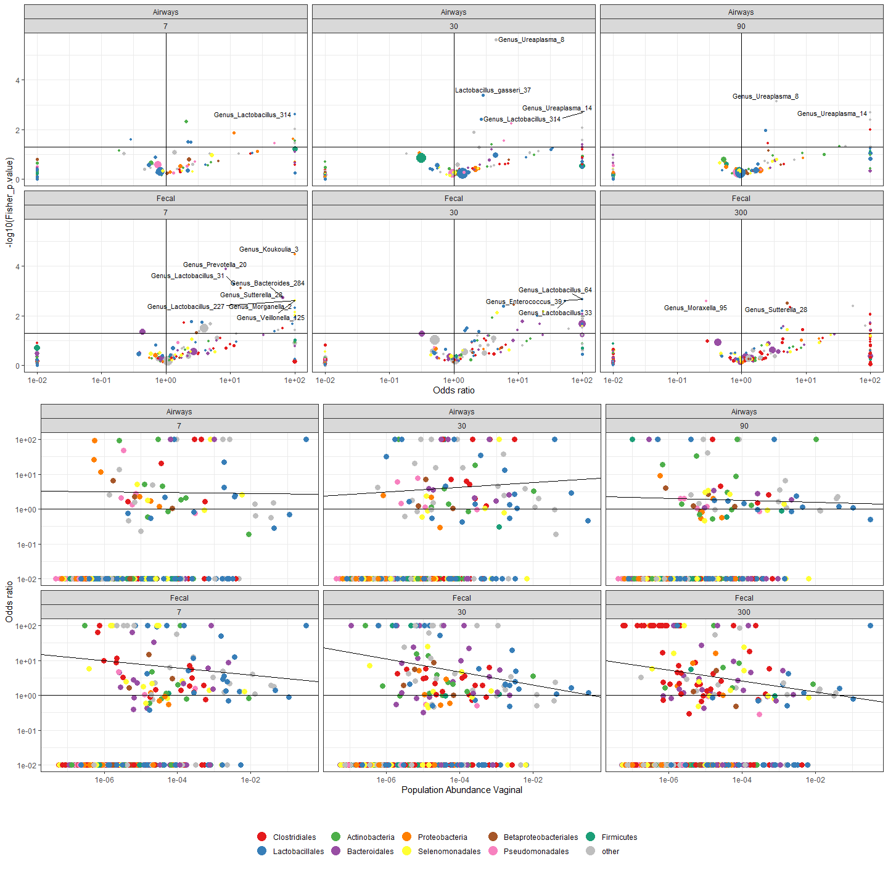

    ## png 
    ##   2

#### 3.1.3.2 - Figure S3b - sectio delivery

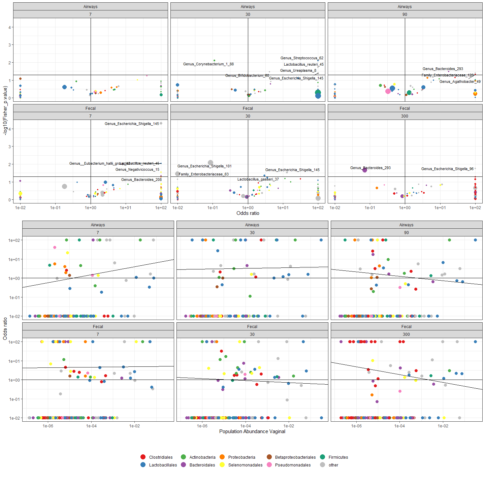

    ## png 
    ##   2

#### 3.1.3.3 - Figure S3c - Acute sectio delivery

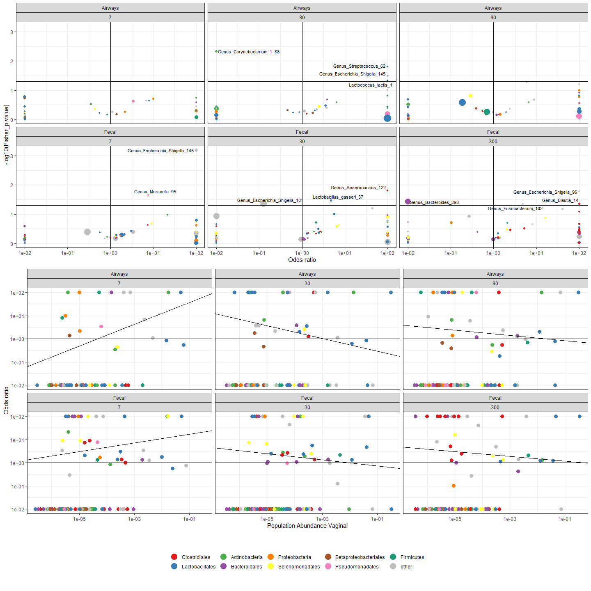

    ## png 
    ##   2

#### 3.1.3.4 - Figure S3d - Planned sectio delivery

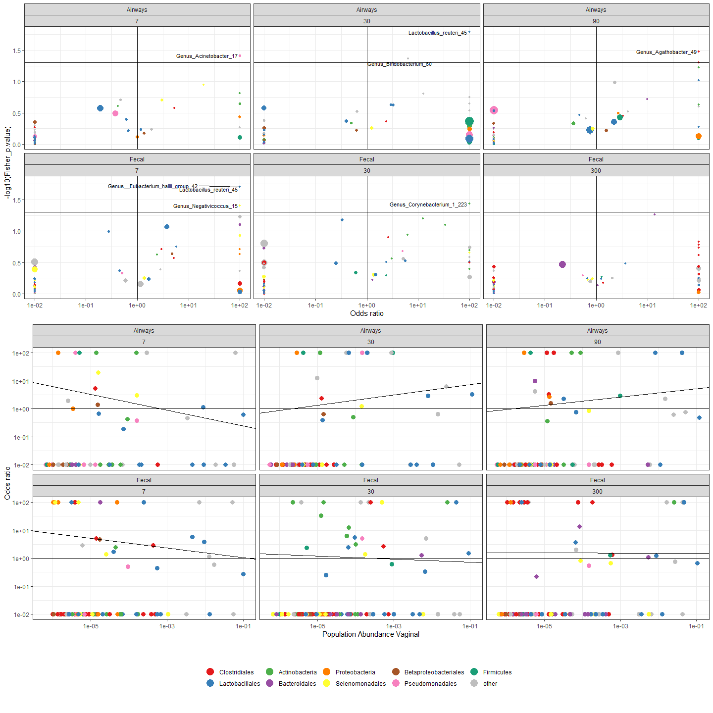

    ## png 
    ##   2

#### 3.1.3.5 - Figure S3 statistics

| type    | delivery      |  time| term           |  estimate|  std.error|  p.value|
|:--------|:--------------|-----:|:---------------|---------:|----------:|--------:|
| Airways | csec          |     7| log10(abuMrel) |    0.2101|     0.1135|   0.0669|
| Airways | csec          |    30| log10(abuMrel) |    0.0193|     0.0950|   0.8391|
| Airways | csec          |    90| log10(abuMrel) |   -0.1157|     0.0815|   0.1580|
| Airways | csec\_acute   |     7| log10(abuMrel) |    0.4703|     0.1387|   0.0012|
| Airways | csec\_acute   |    30| log10(abuMrel) |   -0.2729|     0.1453|   0.0640|
| Airways | csec\_acute   |    90| log10(abuMrel) |   -0.1132|     0.1123|   0.3157|
| Airways | csec\_planned |     7| log10(abuMrel) |   -0.2807|     0.1431|   0.0549|
| Airways | csec\_planned |    30| log10(abuMrel) |    0.1851|     0.1256|   0.1448|
| Airways | csec\_planned |    90| log10(abuMrel) |    0.1479|     0.1310|   0.2620|
| Airways | norm          |     7| log10(abuMrel) |   -0.0114|     0.0559|   0.8385|
| Airways | norm          |    30| log10(abuMrel) |    0.0686|     0.0481|   0.1543|
| Airways | norm          |    90| log10(abuMrel) |   -0.0279|     0.0553|   0.6142|
| Fecal   | csec          |     7| log10(abuMrel) |    0.0120|     0.0813|   0.8832|
| Fecal   | csec          |    30| log10(abuMrel) |   -0.0535|     0.0722|   0.4595|
| Fecal   | csec          |   300| log10(abuMrel) |   -0.2048|     0.0834|   0.0151|
| Fecal   | csec\_acute   |     7| log10(abuMrel) |    0.1879|     0.1319|   0.1575|
| Fecal   | csec\_acute   |    30| log10(abuMrel) |   -0.1311|     0.1018|   0.2003|
| Fecal   | csec\_acute   |   300| log10(abuMrel) |   -0.1030|     0.1296|   0.4287|
| Fecal   | csec\_planned |     7| log10(abuMrel) |   -0.1708|     0.1080|   0.1174|
| Fecal   | csec\_planned |    30| log10(abuMrel) |   -0.0570|     0.1189|   0.6329|
| Fecal   | csec\_planned |   300| log10(abuMrel) |   -0.0015|     0.1258|   0.9903|
| Fecal   | norm          |     7| log10(abuMrel) |   -0.1048|     0.0525|   0.0466|
| Fecal   | norm          |    30| log10(abuMrel) |   -0.1862|     0.0466|   0.0001|
| Fecal   | norm          |   300| log10(abuMrel) |   -0.1565|     0.0513|   0.0024|

3.2 - Weighted Odds Ratio
-------------------------

In order to make a commen measure for the tranfer signal, a weigthed transfer ratio (WTR) for each compartment and delivery mode. WTR were defined as WP/WN, where WP = sum(-log(OR) x log(p\_value)) for ASV with OR&gt;1 and WN = sum(-log(OR) x log(p\_value)) for ASV with OR&lt;1. WTR should be around 1 in case of no tranfer, and larger when present, but due to the high sparsity, the null distribution is not always centered around 1. To calculate the significance of any WTR, the dyads are scrampled to construct a null distribution for the ratio and then compared to the model ratio to calculate a p value.

### 3.2.1 - OVERALL ratio between positive and negative odds

#### 3.2.1.1 - WTR Calculation

    ## [1] 1000.000000    1.166687    2.625665
    ## [1] 1000.0000000    1.1831848    0.9266438
    ## [1] 1000.000000    1.257659    1.637983
    ## [1] 1000.000000    1.024887    4.866919
    ## [1] 1000.0000000    0.9870758    4.4888655
    ## [1] 1000.000000    1.124888    2.508102
    ## [1] 1000.000000    1.221003    1.210353
    ## [1] 1000.000000    1.243899    2.084463
    ## [1] 1000.000000    1.294678    1.262205
    ## [1] 1000.000000    1.178839    2.286674
    ## [1] 1000.000000    1.172651    3.442376
    ## [1] 1000.000000    1.109528    1.602513

**RatioStats\_onesided.RData** contains the formatted output of this section.

#### 3.2.1.2 - WTR tables and figures

Figure 2: The figure shows time point on x-axis, ratio on y-axis color is mode of delivery and panel is compartment. The text reflects the p-value.

| type    | delivery |  time|   np|   nn|    ratio|     pv|  SElgratio|  permmedian|  modelratio|  model\_over\_perm|
|:--------|:---------|-----:|----:|----:|--------:|------:|----------:|-----------:|-----------:|------------------:|
| Airways | csec     |     7|   23|   81|  1.21035|  0.014|    0.41770|     1.16669|     2.62567|            2.25053|
| Airways | csec     |    30|   32|   99|  2.08446|  0.758|    0.39974|     1.18318|     0.92664|            0.78318|
| Airways | csec     |    90|   29|  123|  1.26220|  0.220|    0.41513|     1.25766|     1.63798|            1.30241|
| Airways | norm     |     7|   47|  246|  2.28667|  0.000|    0.34948|     1.02489|     4.86692|            4.74874|
| Airways | norm     |    30|   65|  277|  3.44238|  0.000|    0.31533|     0.98708|     4.48887|            4.54764|
| Airways | norm     |    90|   55|  309|  1.60251|  0.011|    0.33780|     1.12489|     2.50810|            2.22965|
| Fecal   | csec     |     7|   41|  119|  2.62567|  0.509|    0.50692|     1.22100|     1.21035|            0.99128|
| Fecal   | csec     |    30|   37|  144|  0.92664|  0.099|    0.47341|     1.24390|     2.08446|            1.67575|
| Fecal   | csec     |   300|   41|  120|  1.63798|  0.519|    0.47288|     1.29468|     1.26220|            0.97492|
| Fecal   | norm     |     7|   86|  268|  4.86692|  0.036|    0.41119|     1.17884|     2.28667|            1.93977|
| Fecal   | norm     |    30|   94|  301|  4.48887|  0.000|    0.36215|     1.17265|     3.44238|            2.93555|
| Fecal   | norm     |   300|  101|  303|  2.50810|  0.106|    0.33217|     1.10953|     1.60251|            1.44432|

    ## png 
    ##   2

<table>
<caption>Inference for the difference in weigted ratios between sectio- and vaginal born children</caption>
<colgroup>
<col width="9%" />
<col width="6%" />
<col width="19%" />
<col width="7%" />
<col width="26%" />
<col width="23%" />
<col width="6%" />
</colgroup>
<thead>
<tr class="header">
<th align="left">Type</th>
<th align="right">Time</th>
<th align="right">Model_ratioratio</th>
<th align="right">niter</th>
<th align="right">Perm_ratioratio_median</th>
<th align="right">Perm_ratioratio_mean</th>
<th align="right">pv</th>
</tr>
</thead>
<tbody>
<tr class="odd">
<td align="left">Fecal</td>
<td align="right">7</td>
<td align="right">1.85</td>
<td align="right">1000</td>
<td align="right">1.47</td>
<td align="right">1.62</td>
<td align="right">0.30</td>
</tr>
<tr class="even">
<td align="left">Fecal</td>
<td align="right">30</td>
<td align="right">4.84</td>
<td align="right">1000</td>
<td align="right">1.48</td>
<td align="right">1.65</td>
<td align="right">0.01</td>
</tr>
<tr class="odd">
<td align="left">Fecal</td>
<td align="right">300</td>
<td align="right">1.53</td>
<td align="right">1000</td>
<td align="right">1.15</td>
<td align="right">1.29</td>
<td align="right">0.26</td>
</tr>
<tr class="even">
<td align="left">Airways</td>
<td align="right">7</td>
<td align="right">1.89</td>
<td align="right">1000</td>
<td align="right">1.28</td>
<td align="right">1.50</td>
<td align="right">0.24</td>
</tr>
<tr class="odd">
<td align="left">Airways</td>
<td align="right">30</td>
<td align="right">1.65</td>
<td align="right">1000</td>
<td align="right">1.34</td>
<td align="right">1.54</td>
<td align="right">0.34</td>
</tr>
<tr class="even">
<td align="left">Airways</td>
<td align="right">90</td>
<td align="right">1.27</td>
<td align="right">1000</td>
<td align="right">1.04</td>
<td align="right">1.19</td>
<td align="right">0.33</td>
</tr>
</tbody>
</table>

### 3.2.2 - WTR at order level

#### 3.2.2.1 - Comparing vaginal to sectio delivery

##### 3.2.2.1.1 - Calculations

**OrderRatioSTATs.RData** contains the WTR at order level for vaginal and CS deliveries

##### 3.2.2.1.2 - Output

Figure 3 - Individual taxonomic levels

| Order2                |  nmin|  nmax|  nsum|  nmedian|
|:----------------------|-----:|-----:|-----:|--------:|
| Bacillales            |     4|    17|    98|      6.5|
| Bacteroidales         |     7|    58|   345|     25.5|
| Betaproteobacteriales |     6|    24|   154|     11.5|
| Bifidobacteriales     |     5|    12|   103|      8.0|
| Clostridiales         |     5|   144|   647|     40.5|
| Corynebacteriales     |     2|    22|   140|     11.0|
| Enterobacteriales     |     5|    15|   103|      8.5|
| Lactobacillales       |    21|    49|   392|     31.0|
| Pseudomonadales       |     5|    23|   145|      9.5|
| Selenomonadales       |     5|    31|   206|     14.5|

<table style="width:100%;">
<caption>WTR and statistics for testable orders</caption>
<colgroup>
<col width="18%" />
<col width="10%" />
<col width="10%" />
<col width="8%" />
<col width="7%" />
<col width="13%" />
<col width="16%" />
<col width="8%" />
<col width="6%" />
</colgroup>
<thead>
<tr class="header">
<th align="left">Order</th>
<th align="right">Time (days)</th>
<th align="left">Compartment</th>
<th align="left">Delivery</th>
<th align="right">P-value</th>
<th align="right">SE (log ratio)</th>
<th align="right">Permutation median</th>
<th align="right">ASVs (n)</th>
<th align="right">WTR</th>
</tr>
</thead>
<tbody>
<tr class="odd">
<td align="left">Bacillales</td>
<td align="right">7</td>
<td align="left">Airways</td>
<td align="left">csec</td>
<td align="right">0.163</td>
<td align="right">3.391</td>
<td align="right">0.641</td>
<td align="right">7</td>
<td align="right">2.498</td>
</tr>
<tr class="even">
<td align="left">Bacillales</td>
<td align="right">7</td>
<td align="left">Airways</td>
<td align="left">norm</td>
<td align="right">0.250</td>
<td align="right">3.912</td>
<td align="right">0.398</td>
<td align="right">17</td>
<td align="right">3.096</td>
</tr>
<tr class="odd">
<td align="left">Bacillales</td>
<td align="right">7</td>
<td align="left">Fecal</td>
<td align="left">csec</td>
<td align="right">0.375</td>
<td align="right">4.424</td>
<td align="right">0.099</td>
<td align="right">6</td>
<td align="right">0.099</td>
</tr>
<tr class="even">
<td align="left">Bacillales</td>
<td align="right">7</td>
<td align="left">Fecal</td>
<td align="left">norm</td>
<td align="right">0.706</td>
<td align="right">4.153</td>
<td align="right">0.914</td>
<td align="right">10</td>
<td align="right">0.062</td>
</tr>
<tr class="odd">
<td align="left">Bacillales</td>
<td align="right">30</td>
<td align="left">Airways</td>
<td align="left">csec</td>
<td align="right">0.068</td>
<td align="right">2.673</td>
<td align="right">3.975</td>
<td align="right">6</td>
<td align="right">5.414</td>
</tr>
<tr class="even">
<td align="left">Bacillales</td>
<td align="right">30</td>
<td align="left">Airways</td>
<td align="left">norm</td>
<td align="right">0.580</td>
<td align="right">2.891</td>
<td align="right">1.244</td>
<td align="right">14</td>
<td align="right">0.892</td>
</tr>
<tr class="odd">
<td align="left">Bacillales</td>
<td align="right">30</td>
<td align="left">Fecal</td>
<td align="left">csec</td>
<td align="right">0.439</td>
<td align="right">4.401</td>
<td align="right">0.393</td>
<td align="right">6</td>
<td align="right">0.525</td>
</tr>
<tr class="even">
<td align="left">Bacillales</td>
<td align="right">30</td>
<td align="left">Fecal</td>
<td align="left">norm</td>
<td align="right">0.768</td>
<td align="right">3.568</td>
<td align="right">0.412</td>
<td align="right">5</td>
<td align="right">0.062</td>
</tr>
<tr class="odd">
<td align="left">Bacillales</td>
<td align="right">90</td>
<td align="left">Airways</td>
<td align="left">csec</td>
<td align="right">0.345</td>
<td align="right">3.140</td>
<td align="right">1.152</td>
<td align="right">7</td>
<td align="right">1.474</td>
</tr>
<tr class="even">
<td align="left">Bacillales</td>
<td align="right">90</td>
<td align="left">Airways</td>
<td align="left">norm</td>
<td align="right">0.246</td>
<td align="right">3.195</td>
<td align="right">0.833</td>
<td align="right">12</td>
<td align="right">3.866</td>
</tr>
<tr class="odd">
<td align="left">Bacillales</td>
<td align="right">300</td>
<td align="left">Fecal</td>
<td align="left">csec</td>
<td align="right">0.278</td>
<td align="right">4.739</td>
<td align="right">0.215</td>
<td align="right">4</td>
<td align="right">0.699</td>
</tr>
<tr class="even">
<td align="left">Bacillales</td>
<td align="right">300</td>
<td align="left">Fecal</td>
<td align="left">norm</td>
<td align="right">0.523</td>
<td align="right">3.642</td>
<td align="right">0.298</td>
<td align="right">4</td>
<td align="right">0.279</td>
</tr>
<tr class="odd">
<td align="left">Bacteroidales</td>
<td align="right">7</td>
<td align="left">Airways</td>
<td align="left">csec</td>
<td align="right">0.164</td>
<td align="right">5.330</td>
<td align="right">0.001</td>
<td align="right">7</td>
<td align="right">4.305</td>
</tr>
<tr class="even">
<td align="left">Bacteroidales</td>
<td align="right">7</td>
<td align="left">Airways</td>
<td align="left">norm</td>
<td align="right">0.331</td>
<td align="right">3.669</td>
<td align="right">1.143</td>
<td align="right">16</td>
<td align="right">1.971</td>
</tr>
<tr class="odd">
<td align="left">Bacteroidales</td>
<td align="right">7</td>
<td align="left">Fecal</td>
<td align="left">csec</td>
<td align="right">0.438</td>
<td align="right">2.004</td>
<td align="right">1.599</td>
<td align="right">16</td>
<td align="right">1.943</td>
</tr>
<tr class="even">
<td align="left">Bacteroidales</td>
<td align="right">7</td>
<td align="left">Fecal</td>
<td align="left">norm</td>
<td align="right">0.065</td>
<td align="right">0.945</td>
<td align="right">0.981</td>
<td align="right">48</td>
<td align="right">3.141</td>
</tr>
<tr class="odd">
<td align="left">Bacteroidales</td>
<td align="right">30</td>
<td align="left">Airways</td>
<td align="left">csec</td>
<td align="right">0.440</td>
<td align="right">4.183</td>
<td align="right">0.752</td>
<td align="right">10</td>
<td align="right">0.752</td>
</tr>
<tr class="even">
<td align="left">Bacteroidales</td>
<td align="right">30</td>
<td align="left">Airways</td>
<td align="left">norm</td>
<td align="right">0.004</td>
<td align="right">1.891</td>
<td align="right">0.914</td>
<td align="right">29</td>
<td align="right">10.037</td>
</tr>
<tr class="odd">
<td align="left">Bacteroidales</td>
<td align="right">30</td>
<td align="left">Fecal</td>
<td align="left">csec</td>
<td align="right">0.744</td>
<td align="right">1.330</td>
<td align="right">1.500</td>
<td align="right">25</td>
<td align="right">0.771</td>
</tr>
<tr class="even">
<td align="left">Bacteroidales</td>
<td align="right">30</td>
<td align="left">Fecal</td>
<td align="left">norm</td>
<td align="right">0.000</td>
<td align="right">0.853</td>
<td align="right">0.848</td>
<td align="right">47</td>
<td align="right">8.112</td>
</tr>
<tr class="odd">
<td align="left">Bacteroidales</td>
<td align="right">90</td>
<td align="left">Airways</td>
<td align="left">csec</td>
<td align="right">0.247</td>
<td align="right">2.767</td>
<td align="right">0.902</td>
<td align="right">13</td>
<td align="right">2.586</td>
</tr>
<tr class="even">
<td align="left">Bacteroidales</td>
<td align="right">90</td>
<td align="left">Airways</td>
<td align="left">norm</td>
<td align="right">0.874</td>
<td align="right">1.191</td>
<td align="right">1.018</td>
<td align="right">50</td>
<td align="right">0.247</td>
</tr>
<tr class="odd">
<td align="left">Bacteroidales</td>
<td align="right">300</td>
<td align="left">Fecal</td>
<td align="left">csec</td>
<td align="right">0.927</td>
<td align="right">0.917</td>
<td align="right">1.299</td>
<td align="right">26</td>
<td align="right">0.406</td>
</tr>
<tr class="even">
<td align="left">Bacteroidales</td>
<td align="right">300</td>
<td align="left">Fecal</td>
<td align="left">norm</td>
<td align="right">0.067</td>
<td align="right">0.672</td>
<td align="right">0.988</td>
<td align="right">58</td>
<td align="right">2.445</td>
</tr>
<tr class="odd">
<td align="left">Betaproteobacteriales</td>
<td align="right">7</td>
<td align="left">Airways</td>
<td align="left">csec</td>
<td align="right">0.894</td>
<td align="right">3.051</td>
<td align="right">0.971</td>
<td align="right">8</td>
<td align="right">0.062</td>
</tr>
<tr class="even">
<td align="left">Betaproteobacteriales</td>
<td align="right">7</td>
<td align="left">Airways</td>
<td align="left">norm</td>
<td align="right">0.604</td>
<td align="right">2.512</td>
<td align="right">0.867</td>
<td align="right">21</td>
<td align="right">0.456</td>
</tr>
<tr class="odd">
<td align="left">Betaproteobacteriales</td>
<td align="right">7</td>
<td align="left">Fecal</td>
<td align="left">csec</td>
<td align="right">0.459</td>
<td align="right">4.691</td>
<td align="right">0.178</td>
<td align="right">8</td>
<td align="right">0.178</td>
</tr>
<tr class="even">
<td align="left">Betaproteobacteriales</td>
<td align="right">7</td>
<td align="left">Fecal</td>
<td align="left">norm</td>
<td align="right">0.011</td>
<td align="right">3.218</td>
<td align="right">0.451</td>
<td align="right">16</td>
<td align="right">12.047</td>
</tr>
<tr class="odd">
<td align="left">Betaproteobacteriales</td>
<td align="right">30</td>
<td align="left">Airways</td>
<td align="left">csec</td>
<td align="right">0.808</td>
<td align="right">3.763</td>
<td align="right">0.564</td>
<td align="right">7</td>
<td align="right">0.062</td>
</tr>
<tr class="even">
<td align="left">Betaproteobacteriales</td>
<td align="right">30</td>
<td align="left">Airways</td>
<td align="left">norm</td>
<td align="right">0.534</td>
<td align="right">2.532</td>
<td align="right">0.860</td>
<td align="right">21</td>
<td align="right">0.710</td>
</tr>
<tr class="odd">
<td align="left">Betaproteobacteriales</td>
<td align="right">30</td>
<td align="left">Fecal</td>
<td align="left">csec</td>
<td align="right">0.688</td>
<td align="right">4.428</td>
<td align="right">0.278</td>
<td align="right">6</td>
<td align="right">0.062</td>
</tr>
<tr class="even">
<td align="left">Betaproteobacteriales</td>
<td align="right">30</td>
<td align="left">Fecal</td>
<td align="left">norm</td>
<td align="right">0.043</td>
<td align="right">3.302</td>
<td align="right">0.357</td>
<td align="right">14</td>
<td align="right">6.114</td>
</tr>
<tr class="odd">
<td align="left">Betaproteobacteriales</td>
<td align="right">90</td>
<td align="left">Airways</td>
<td align="left">csec</td>
<td align="right">0.881</td>
<td align="right">3.061</td>
<td align="right">0.721</td>
<td align="right">10</td>
<td align="right">0.062</td>
</tr>
<tr class="even">
<td align="left">Betaproteobacteriales</td>
<td align="right">90</td>
<td align="left">Airways</td>
<td align="left">norm</td>
<td align="right">0.448</td>
<td align="right">1.834</td>
<td align="right">0.765</td>
<td align="right">24</td>
<td align="right">0.916</td>
</tr>
<tr class="odd">
<td align="left">Betaproteobacteriales</td>
<td align="right">300</td>
<td align="left">Fecal</td>
<td align="left">csec</td>
<td align="right">0.634</td>
<td align="right">4.686</td>
<td align="right">0.406</td>
<td align="right">6</td>
<td align="right">0.062</td>
</tr>
<tr class="even">
<td align="left">Betaproteobacteriales</td>
<td align="right">300</td>
<td align="left">Fecal</td>
<td align="left">norm</td>
<td align="right">0.061</td>
<td align="right">2.976</td>
<td align="right">0.713</td>
<td align="right">13</td>
<td align="right">5.949</td>
</tr>
<tr class="odd">
<td align="left">Bifidobacteriales</td>
<td align="right">7</td>
<td align="left">Airways</td>
<td align="left">csec</td>
<td align="right">0.164</td>
<td align="right">3.130</td>
<td align="right">1.087</td>
<td align="right">5</td>
<td align="right">5.738</td>
</tr>
<tr class="even">
<td align="left">Bifidobacteriales</td>
<td align="right">7</td>
<td align="left">Airways</td>
<td align="left">norm</td>
<td align="right">0.151</td>
<td align="right">3.306</td>
<td align="right">0.683</td>
<td align="right">9</td>
<td align="right">6.283</td>
</tr>
<tr class="odd">
<td align="left">Bifidobacteriales</td>
<td align="right">7</td>
<td align="left">Fecal</td>
<td align="left">csec</td>
<td align="right">0.671</td>
<td align="right">2.270</td>
<td align="right">1.011</td>
<td align="right">6</td>
<td align="right">0.524</td>
</tr>
<tr class="even">
<td align="left">Bifidobacteriales</td>
<td align="right">7</td>
<td align="left">Fecal</td>
<td align="left">norm</td>
<td align="right">0.042</td>
<td align="right">1.615</td>
<td align="right">0.829</td>
<td align="right">12</td>
<td align="right">7.699</td>
</tr>
<tr class="odd">
<td align="left">Bifidobacteriales</td>
<td align="right">30</td>
<td align="left">Airways</td>
<td align="left">csec</td>
<td align="right">0.570</td>
<td align="right">4.206</td>
<td align="right">1.222</td>
<td align="right">7</td>
<td align="right">0.462</td>
</tr>
<tr class="even">
<td align="left">Bifidobacteriales</td>
<td align="right">30</td>
<td align="left">Airways</td>
<td align="left">norm</td>
<td align="right">0.067</td>
<td align="right">2.614</td>
<td align="right">0.998</td>
<td align="right">11</td>
<td align="right">5.236</td>
</tr>
<tr class="odd">
<td align="left">Bifidobacteriales</td>
<td align="right">30</td>
<td align="left">Fecal</td>
<td align="left">csec</td>
<td align="right">0.565</td>
<td align="right">1.764</td>
<td align="right">0.974</td>
<td align="right">8</td>
<td align="right">0.782</td>
</tr>
<tr class="even">
<td align="left">Bifidobacteriales</td>
<td align="right">30</td>
<td align="left">Fecal</td>
<td align="left">norm</td>
<td align="right">0.189</td>
<td align="right">1.643</td>
<td align="right">0.778</td>
<td align="right">12</td>
<td align="right">2.479</td>
</tr>
<tr class="odd">
<td align="left">Bifidobacteriales</td>
<td align="right">90</td>
<td align="left">Airways</td>
<td align="left">csec</td>
<td align="right">0.264</td>
<td align="right">3.419</td>
<td align="right">0.835</td>
<td align="right">6</td>
<td align="right">2.379</td>
</tr>
<tr class="even">
<td align="left">Bifidobacteriales</td>
<td align="right">90</td>
<td align="left">Airways</td>
<td align="left">norm</td>
<td align="right">0.173</td>
<td align="right">3.110</td>
<td align="right">0.633</td>
<td align="right">8</td>
<td align="right">3.439</td>
</tr>
<tr class="odd">
<td align="left">Bifidobacteriales</td>
<td align="right">300</td>
<td align="left">Fecal</td>
<td align="left">csec</td>
<td align="right">0.540</td>
<td align="right">1.882</td>
<td align="right">1.050</td>
<td align="right">8</td>
<td align="right">0.927</td>
</tr>
<tr class="even">
<td align="left">Bifidobacteriales</td>
<td align="right">300</td>
<td align="left">Fecal</td>
<td align="left">norm</td>
<td align="right">0.696</td>
<td align="right">1.735</td>
<td align="right">1.019</td>
<td align="right">11</td>
<td align="right">0.437</td>
</tr>
<tr class="odd">
<td align="left">Clostridiales</td>
<td align="right">7</td>
<td align="left">Airways</td>
<td align="left">csec</td>
<td align="right">0.577</td>
<td align="right">3.747</td>
<td align="right">0.533</td>
<td align="right">5</td>
<td align="right">0.129</td>
</tr>
<tr class="even">
<td align="left">Clostridiales</td>
<td align="right">7</td>
<td align="left">Airways</td>
<td align="left">norm</td>
<td align="right">0.115</td>
<td align="right">2.555</td>
<td align="right">1.405</td>
<td align="right">36</td>
<td align="right">4.257</td>
</tr>
<tr class="odd">
<td align="left">Clostridiales</td>
<td align="right">7</td>
<td align="left">Fecal</td>
<td align="left">csec</td>
<td align="right">0.236</td>
<td align="right">1.101</td>
<td align="right">1.010</td>
<td align="right">38</td>
<td align="right">1.881</td>
</tr>
<tr class="even">
<td align="left">Clostridiales</td>
<td align="right">7</td>
<td align="left">Fecal</td>
<td align="left">norm</td>
<td align="right">0.319</td>
<td align="right">0.739</td>
<td align="right">0.949</td>
<td align="right">93</td>
<td align="right">1.304</td>
</tr>
<tr class="odd">
<td align="left">Clostridiales</td>
<td align="right">30</td>
<td align="left">Airways</td>
<td align="left">csec</td>
<td align="right">0.266</td>
<td align="right">3.233</td>
<td align="right">0.858</td>
<td align="right">17</td>
<td align="right">2.374</td>
</tr>
<tr class="even">
<td align="left">Clostridiales</td>
<td align="right">30</td>
<td align="left">Airways</td>
<td align="left">norm</td>
<td align="right">0.056</td>
<td align="right">1.518</td>
<td align="right">1.415</td>
<td align="right">47</td>
<td align="right">4.584</td>
</tr>
<tr class="odd">
<td align="left">Clostridiales</td>
<td align="right">30</td>
<td align="left">Fecal</td>
<td align="left">csec</td>
<td align="right">0.821</td>
<td align="right">0.940</td>
<td align="right">1.057</td>
<td align="right">40</td>
<td align="right">0.437</td>
</tr>
<tr class="even">
<td align="left">Clostridiales</td>
<td align="right">30</td>
<td align="left">Fecal</td>
<td align="left">norm</td>
<td align="right">0.808</td>
<td align="right">0.621</td>
<td align="right">1.058</td>
<td align="right">109</td>
<td align="right">0.600</td>
</tr>
<tr class="odd">
<td align="left">Clostridiales</td>
<td align="right">90</td>
<td align="left">Airways</td>
<td align="left">csec</td>
<td align="right">0.176</td>
<td align="right">2.354</td>
<td align="right">1.360</td>
<td align="right">19</td>
<td align="right">3.305</td>
</tr>
<tr class="even">
<td align="left">Clostridiales</td>
<td align="right">90</td>
<td align="left">Airways</td>
<td align="left">norm</td>
<td align="right">0.417</td>
<td align="right">1.258</td>
<td align="right">1.036</td>
<td align="right">58</td>
<td align="right">1.284</td>
</tr>
<tr class="odd">
<td align="left">Clostridiales</td>
<td align="right">300</td>
<td align="left">Fecal</td>
<td align="left">csec</td>
<td align="right">0.001</td>
<td align="right">0.712</td>
<td align="right">1.234</td>
<td align="right">41</td>
<td align="right">5.893</td>
</tr>
<tr class="even">
<td align="left">Clostridiales</td>
<td align="right">300</td>
<td align="left">Fecal</td>
<td align="left">norm</td>
<td align="right">0.013</td>
<td align="right">0.544</td>
<td align="right">1.123</td>
<td align="right">144</td>
<td align="right">3.690</td>
</tr>
<tr class="odd">
<td align="left">Corynebacteriales</td>
<td align="right">7</td>
<td align="left">Airways</td>
<td align="left">csec</td>
<td align="right">0.231</td>
<td align="right">3.365</td>
<td align="right">0.759</td>
<td align="right">9</td>
<td align="right">3.371</td>
</tr>
<tr class="even">
<td align="left">Corynebacteriales</td>
<td align="right">7</td>
<td align="left">Airways</td>
<td align="left">norm</td>
<td align="right">0.087</td>
<td align="right">2.373</td>
<td align="right">0.849</td>
<td align="right">21</td>
<td align="right">4.323</td>
</tr>
<tr class="odd">
<td align="left">Corynebacteriales</td>
<td align="right">7</td>
<td align="left">Fecal</td>
<td align="left">csec</td>
<td align="right">0.523</td>
<td align="right">3.393</td>
<td align="right">0.821</td>
<td align="right">8</td>
<td align="right">0.725</td>
</tr>
<tr class="even">
<td align="left">Corynebacteriales</td>
<td align="right">7</td>
<td align="left">Fecal</td>
<td align="left">norm</td>
<td align="right">0.114</td>
<td align="right">2.538</td>
<td align="right">0.625</td>
<td align="right">11</td>
<td align="right">4.288</td>
</tr>
<tr class="odd">
<td align="left">Corynebacteriales</td>
<td align="right">30</td>
<td align="left">Airways</td>
<td align="left">csec</td>
<td align="right">0.614</td>
<td align="right">3.222</td>
<td align="right">2.342</td>
<td align="right">11</td>
<td align="right">0.741</td>
</tr>
<tr class="even">
<td align="left">Corynebacteriales</td>
<td align="right">30</td>
<td align="left">Airways</td>
<td align="left">norm</td>
<td align="right">0.462</td>
<td align="right">1.816</td>
<td align="right">0.737</td>
<td align="right">22</td>
<td align="right">0.857</td>
</tr>
<tr class="odd">
<td align="left">Corynebacteriales</td>
<td align="right">30</td>
<td align="left">Fecal</td>
<td align="left">csec</td>
<td align="right">0.076</td>
<td align="right">3.170</td>
<td align="right">0.417</td>
<td align="right">6</td>
<td align="right">4.250</td>
</tr>
<tr class="even">
<td align="left">Corynebacteriales</td>
<td align="right">30</td>
<td align="left">Fecal</td>
<td align="left">norm</td>
<td align="right">0.273</td>
<td align="right">2.458</td>
<td align="right">0.621</td>
<td align="right">12</td>
<td align="right">1.652</td>
</tr>
<tr class="odd">
<td align="left">Corynebacteriales</td>
<td align="right">90</td>
<td align="left">Airways</td>
<td align="left">csec</td>
<td align="right">0.744</td>
<td align="right">3.944</td>
<td align="right">1.480</td>
<td align="right">12</td>
<td align="right">0.112</td>
</tr>
<tr class="even">
<td align="left">Corynebacteriales</td>
<td align="right">90</td>
<td align="left">Airways</td>
<td align="left">norm</td>
<td align="right">0.366</td>
<td align="right">2.754</td>
<td align="right">1.009</td>
<td align="right">21</td>
<td align="right">1.800</td>
</tr>
<tr class="odd">
<td align="left">Corynebacteriales</td>
<td align="right">300</td>
<td align="left">Fecal</td>
<td align="left">csec</td>
<td align="right">0.257</td>
<td align="right">5.844</td>
<td align="right">0.002</td>
<td align="right">2</td>
<td align="right">0.062</td>
</tr>
<tr class="even">
<td align="left">Corynebacteriales</td>
<td align="right">300</td>
<td align="left">Fecal</td>
<td align="left">norm</td>
<td align="right">0.252</td>
<td align="right">4.638</td>
<td align="right">0.333</td>
<td align="right">5</td>
<td align="right">2.716</td>
</tr>
<tr class="odd">
<td align="left">Enterobacteriales</td>
<td align="right">7</td>
<td align="left">Airways</td>
<td align="left">csec</td>
<td align="right">0.338</td>
<td align="right">4.229</td>
<td align="right">0.474</td>
<td align="right">5</td>
<td align="right">1.515</td>
</tr>
<tr class="even">
<td align="left">Enterobacteriales</td>
<td align="right">7</td>
<td align="left">Airways</td>
<td align="left">norm</td>
<td align="right">0.105</td>
<td align="right">3.495</td>
<td align="right">0.459</td>
<td align="right">10</td>
<td align="right">5.423</td>
</tr>
<tr class="odd">
<td align="left">Enterobacteriales</td>
<td align="right">7</td>
<td align="left">Fecal</td>
<td align="left">csec</td>
<td align="right">0.053</td>
<td align="right">3.579</td>
<td align="right">0.997</td>
<td align="right">7</td>
<td align="right">12.677</td>
</tr>
<tr class="even">
<td align="left">Enterobacteriales</td>
<td align="right">7</td>
<td align="left">Fecal</td>
<td align="left">norm</td>
<td align="right">0.005</td>
<td align="right">2.286</td>
<td align="right">0.691</td>
<td align="right">15</td>
<td align="right">16.000</td>
</tr>
<tr class="odd">
<td align="left">Enterobacteriales</td>
<td align="right">30</td>
<td align="left">Airways</td>
<td align="left">csec</td>
<td align="right">0.066</td>
<td align="right">4.083</td>
<td align="right">0.511</td>
<td align="right">5</td>
<td align="right">14.357</td>
</tr>
<tr class="even">
<td align="left">Enterobacteriales</td>
<td align="right">30</td>
<td align="left">Airways</td>
<td align="left">norm</td>
<td align="right">0.006</td>
<td align="right">3.381</td>
<td align="right">0.327</td>
<td align="right">8</td>
<td align="right">16.000</td>
</tr>
<tr class="odd">
<td align="left">Enterobacteriales</td>
<td align="right">30</td>
<td align="left">Fecal</td>
<td align="left">csec</td>
<td align="right">0.668</td>
<td align="right">3.399</td>
<td align="right">0.815</td>
<td align="right">10</td>
<td align="right">0.325</td>
</tr>
<tr class="even">
<td align="left">Enterobacteriales</td>
<td align="right">30</td>
<td align="left">Fecal</td>
<td align="left">norm</td>
<td align="right">0.007</td>
<td align="right">2.613</td>
<td align="right">0.623</td>
<td align="right">11</td>
<td align="right">16.000</td>
</tr>
<tr class="odd">
<td align="left">Enterobacteriales</td>
<td align="right">90</td>
<td align="left">Airways</td>
<td align="left">csec</td>
<td align="right">0.158</td>
<td align="right">3.765</td>
<td align="right">0.469</td>
<td align="right">6</td>
<td align="right">3.857</td>
</tr>
<tr class="even">
<td align="left">Enterobacteriales</td>
<td align="right">90</td>
<td align="left">Airways</td>
<td align="left">norm</td>
<td align="right">0.037</td>
<td align="right">3.275</td>
<td align="right">0.505</td>
<td align="right">9</td>
<td align="right">13.791</td>
</tr>
<tr class="odd">
<td align="left">Enterobacteriales</td>
<td align="right">300</td>
<td align="left">Fecal</td>
<td align="left">csec</td>
<td align="right">0.115</td>
<td align="right">3.019</td>
<td align="right">0.771</td>
<td align="right">7</td>
<td align="right">7.967</td>
</tr>
<tr class="even">
<td align="left">Enterobacteriales</td>
<td align="right">300</td>
<td align="left">Fecal</td>
<td align="left">norm</td>
<td align="right">0.012</td>
<td align="right">2.624</td>
<td align="right">0.770</td>
<td align="right">10</td>
<td align="right">14.351</td>
</tr>
<tr class="odd">
<td align="left">Lactobacillales</td>
<td align="right">7</td>
<td align="left">Airways</td>
<td align="left">csec</td>
<td align="right">1.000</td>
<td align="right">1.265</td>
<td align="right">1.337</td>
<td align="right">21</td>
<td align="right">0.062</td>
</tr>
<tr class="even">
<td align="left">Lactobacillales</td>
<td align="right">7</td>
<td align="left">Airways</td>
<td align="left">norm</td>
<td align="right">0.241</td>
<td align="right">0.900</td>
<td align="right">1.192</td>
<td align="right">45</td>
<td align="right">2.038</td>
</tr>
<tr class="odd">
<td align="left">Lactobacillales</td>
<td align="right">7</td>
<td align="left">Fecal</td>
<td align="left">csec</td>
<td align="right">0.035</td>
<td align="right">1.037</td>
<td align="right">0.993</td>
<td align="right">24</td>
<td align="right">4.863</td>
</tr>
<tr class="even">
<td align="left">Lactobacillales</td>
<td align="right">7</td>
<td align="left">Fecal</td>
<td align="left">norm</td>
<td align="right">0.000</td>
<td align="right">0.705</td>
<td align="right">1.039</td>
<td align="right">42</td>
<td align="right">14.754</td>
</tr>
<tr class="odd">
<td align="left">Lactobacillales</td>
<td align="right">30</td>
<td align="left">Airways</td>
<td align="left">csec</td>
<td align="right">0.068</td>
<td align="right">0.980</td>
<td align="right">0.941</td>
<td align="right">24</td>
<td align="right">4.006</td>
</tr>
<tr class="even">
<td align="left">Lactobacillales</td>
<td align="right">30</td>
<td align="left">Airways</td>
<td align="left">norm</td>
<td align="right">0.001</td>
<td align="right">0.923</td>
<td align="right">1.472</td>
<td align="right">49</td>
<td align="right">9.293</td>
</tr>
<tr class="odd">
<td align="left">Lactobacillales</td>
<td align="right">30</td>
<td align="left">Fecal</td>
<td align="left">csec</td>
<td align="right">0.318</td>
<td align="right">1.010</td>
<td align="right">1.156</td>
<td align="right">26</td>
<td align="right">1.771</td>
</tr>
<tr class="even">
<td align="left">Lactobacillales</td>
<td align="right">30</td>
<td align="left">Fecal</td>
<td align="left">norm</td>
<td align="right">0.000</td>
<td align="right">0.859</td>
<td align="right">1.084</td>
<td align="right">44</td>
<td align="right">16.000</td>
</tr>
<tr class="odd">
<td align="left">Lactobacillales</td>
<td align="right">90</td>
<td align="left">Airways</td>
<td align="left">csec</td>
<td align="right">0.777</td>
<td align="right">1.067</td>
<td align="right">1.131</td>
<td align="right">23</td>
<td align="right">0.491</td>
</tr>
<tr class="even">
<td align="left">Lactobacillales</td>
<td align="right">90</td>
<td align="left">Airways</td>
<td align="left">norm</td>
<td align="right">0.014</td>
<td align="right">1.073</td>
<td align="right">1.446</td>
<td align="right">36</td>
<td align="right">7.564</td>
</tr>
<tr class="odd">
<td align="left">Lactobacillales</td>
<td align="right">300</td>
<td align="left">Fecal</td>
<td align="left">csec</td>
<td align="right">0.744</td>
<td align="right">1.178</td>
<td align="right">1.215</td>
<td align="right">22</td>
<td align="right">0.577</td>
</tr>
<tr class="even">
<td align="left">Lactobacillales</td>
<td align="right">300</td>
<td align="left">Fecal</td>
<td align="left">norm</td>
<td align="right">0.370</td>
<td align="right">0.935</td>
<td align="right">1.262</td>
<td align="right">36</td>
<td align="right">1.642</td>
</tr>
<tr class="odd">
<td align="left">Pseudomonadales</td>
<td align="right">7</td>
<td align="left">Airways</td>
<td align="left">csec</td>
<td align="right">0.233</td>
<td align="right">4.147</td>
<td align="right">0.942</td>
<td align="right">7</td>
<td align="right">3.702</td>
</tr>
<tr class="even">
<td align="left">Pseudomonadales</td>
<td align="right">7</td>
<td align="left">Airways</td>
<td align="left">norm</td>
<td align="right">0.224</td>
<td align="right">2.024</td>
<td align="right">0.497</td>
<td align="right">23</td>
<td align="right">1.432</td>
</tr>
<tr class="odd">
<td align="left">Pseudomonadales</td>
<td align="right">7</td>
<td align="left">Fecal</td>
<td align="left">csec</td>
<td align="right">0.537</td>
<td align="right">4.328</td>
<td align="right">0.425</td>
<td align="right">6</td>
<td align="right">0.404</td>
</tr>
<tr class="even">
<td align="left">Pseudomonadales</td>
<td align="right">7</td>
<td align="left">Fecal</td>
<td align="left">norm</td>
<td align="right">0.396</td>
<td align="right">3.074</td>
<td align="right">0.602</td>
<td align="right">14</td>
<td align="right">0.888</td>
</tr>
<tr class="odd">
<td align="left">Pseudomonadales</td>
<td align="right">30</td>
<td align="left">Airways</td>
<td align="left">csec</td>
<td align="right">0.347</td>
<td align="right">4.435</td>
<td align="right">1.692</td>
<td align="right">8</td>
<td align="right">1.692</td>
</tr>
<tr class="even">
<td align="left">Pseudomonadales</td>
<td align="right">30</td>
<td align="left">Airways</td>
<td align="left">norm</td>
<td align="right">0.122</td>
<td align="right">1.778</td>
<td align="right">0.553</td>
<td align="right">22</td>
<td align="right">2.366</td>
</tr>
<tr class="odd">
<td align="left">Pseudomonadales</td>
<td align="right">30</td>
<td align="left">Fecal</td>
<td align="left">csec</td>
<td align="right">0.476</td>
<td align="right">4.308</td>
<td align="right">0.261</td>
<td align="right">6</td>
<td align="right">0.261</td>
</tr>
<tr class="even">
<td align="left">Pseudomonadales</td>
<td align="right">30</td>
<td align="left">Fecal</td>
<td align="left">norm</td>
<td align="right">0.967</td>
<td align="right">2.584</td>
<td align="right">0.575</td>
<td align="right">12</td>
<td align="right">0.062</td>
</tr>
<tr class="odd">
<td align="left">Pseudomonadales</td>
<td align="right">90</td>
<td align="left">Airways</td>
<td align="left">csec</td>
<td align="right">0.849</td>
<td align="right">3.243</td>
<td align="right">1.282</td>
<td align="right">9</td>
<td align="right">0.062</td>
</tr>
<tr class="even">
<td align="left">Pseudomonadales</td>
<td align="right">90</td>
<td align="left">Airways</td>
<td align="left">norm</td>
<td align="right">0.838</td>
<td align="right">1.727</td>
<td align="right">0.546</td>
<td align="right">23</td>
<td align="right">0.115</td>
</tr>
<tr class="odd">
<td align="left">Pseudomonadales</td>
<td align="right">300</td>
<td align="left">Fecal</td>
<td align="left">csec</td>
<td align="right">0.922</td>
<td align="right">4.453</td>
<td align="right">0.215</td>
<td align="right">5</td>
<td align="right">0.062</td>
</tr>
<tr class="even">
<td align="left">Pseudomonadales</td>
<td align="right">300</td>
<td align="left">Fecal</td>
<td align="left">norm</td>
<td align="right">0.996</td>
<td align="right">4.095</td>
<td align="right">0.349</td>
<td align="right">10</td>
<td align="right">0.062</td>
</tr>
<tr class="odd">
<td align="left">Selenomonadales</td>
<td align="right">7</td>
<td align="left">Airways</td>
<td align="left">csec</td>
<td align="right">0.445</td>
<td align="right">4.376</td>
<td align="right">1.049</td>
<td align="right">5</td>
<td align="right">2.247</td>
</tr>
<tr class="even">
<td align="left">Selenomonadales</td>
<td align="right">7</td>
<td align="left">Airways</td>
<td align="left">norm</td>
<td align="right">0.053</td>
<td align="right">2.322</td>
<td align="right">0.822</td>
<td align="right">15</td>
<td align="right">5.295</td>
</tr>
<tr class="odd">
<td align="left">Selenomonadales</td>
<td align="right">7</td>
<td align="left">Fecal</td>
<td align="left">csec</td>
<td align="right">0.028</td>
<td align="right">1.773</td>
<td align="right">1.018</td>
<td align="right">12</td>
<td align="right">6.460</td>
</tr>
<tr class="even">
<td align="left">Selenomonadales</td>
<td align="right">7</td>
<td align="left">Fecal</td>
<td align="left">norm</td>
<td align="right">0.001</td>
<td align="right">1.479</td>
<td align="right">0.771</td>
<td align="right">25</td>
<td align="right">16.000</td>
</tr>
<tr class="odd">
<td align="left">Selenomonadales</td>
<td align="right">30</td>
<td align="left">Airways</td>
<td align="left">csec</td>
<td align="right">0.415</td>
<td align="right">4.325</td>
<td align="right">0.250</td>
<td align="right">6</td>
<td align="right">0.250</td>
</tr>
<tr class="even">
<td align="left">Selenomonadales</td>
<td align="right">30</td>
<td align="left">Airways</td>
<td align="left">norm</td>
<td align="right">0.517</td>
<td align="right">1.756</td>
<td align="right">0.836</td>
<td align="right">21</td>
<td align="right">0.801</td>
</tr>
<tr class="odd">
<td align="left">Selenomonadales</td>
<td align="right">30</td>
<td align="left">Fecal</td>
<td align="left">csec</td>
<td align="right">0.461</td>
<td align="right">1.704</td>
<td align="right">0.930</td>
<td align="right">14</td>
<td align="right">1.002</td>
</tr>
<tr class="even">
<td align="left">Selenomonadales</td>
<td align="right">30</td>
<td align="left">Fecal</td>
<td align="left">norm</td>
<td align="right">0.104</td>
<td align="right">1.281</td>
<td align="right">0.757</td>
<td align="right">30</td>
<td align="right">2.662</td>
</tr>
<tr class="odd">
<td align="left">Selenomonadales</td>
<td align="right">90</td>
<td align="left">Airways</td>
<td align="left">csec</td>
<td align="right">0.673</td>
<td align="right">3.505</td>
<td align="right">0.968</td>
<td align="right">10</td>
<td align="right">0.599</td>
</tr>
<tr class="even">
<td align="left">Selenomonadales</td>
<td align="right">90</td>
<td align="left">Airways</td>
<td align="left">norm</td>
<td align="right">0.673</td>
<td align="right">1.390</td>
<td align="right">0.648</td>
<td align="right">24</td>
<td align="right">0.406</td>
</tr>
<tr class="odd">
<td align="left">Selenomonadales</td>
<td align="right">300</td>
<td align="left">Fecal</td>
<td align="left">csec</td>
<td align="right">0.787</td>
<td align="right">1.810</td>
<td align="right">0.909</td>
<td align="right">13</td>
<td align="right">0.342</td>
</tr>
<tr class="even">
<td align="left">Selenomonadales</td>
<td align="right">300</td>
<td align="left">Fecal</td>
<td align="left">norm</td>
<td align="right">0.075</td>
<td align="right">1.287</td>
<td align="right">0.928</td>
<td align="right">31</td>
<td align="right">3.416</td>
</tr>
</tbody>
</table>

    ## png 
    ##   2

    ## png 
    ##   2

#### 3.2.2.2 - Comparing vaginal to planend and acute sectio delivery

##### 3.2.2.2.1 - Calculations

**OrderRatioSTATs\_split.RData** contains the WTR at order level when sectio is split into planned and acute sectio

##### 3.2.2.2.2 - Output

Figure S4 - WTR at order level - splitting Csec

| Order2                |  nmin|  nmax|  nsum|  nmedian|
|:----------------------|-----:|-----:|-----:|--------:|
| Bacteroidales         |     2|    58|   353|     13.0|
| Betaproteobacteriales |     3|    24|   173|      6.5|
| Clostridiales         |     2|   144|   670|     24.0|
| Enterobacteriales     |     2|    15|   112|      5.0|
| Lactobacillales       |    11|    49|   431|     16.5|
| Selenomonadales       |     3|    31|   219|      9.0|

<table>
<caption>WTR and statistics for testable orders</caption>
<colgroup>
<col width="18%" />
<col width="10%" />
<col width="10%" />
<col width="11%" />
<col width="7%" />
<col width="12%" />
<col width="15%" />
<col width="7%" />
<col width="6%" />
</colgroup>
<thead>
<tr class="header">
<th align="left">Order</th>
<th align="right">Time (days)</th>
<th align="left">Compartment</th>
<th align="left">Delivery</th>
<th align="right">P-value</th>
<th align="right">SE (log ratio)</th>
<th align="right">Permutation median</th>
<th align="right">ASVs (n)</th>
<th align="right">WTR</th>
</tr>
</thead>
<tbody>
<tr class="odd">
<td align="left">Bacteroidales</td>
<td align="right">7</td>
<td align="left">Airways</td>
<td align="left">csec_acute</td>
<td align="right">0.030</td>
<td align="right">5.640</td>
<td align="right">0.001</td>
<td align="right">4</td>
<td align="right">9.357</td>
</tr>
<tr class="even">
<td align="left">Bacteroidales</td>
<td align="right">7</td>
<td align="left">Airways</td>
<td align="left">csec_planned</td>
<td align="right">0.201</td>
<td align="right">5.561</td>
<td align="right">0.002</td>
<td align="right">3</td>
<td align="right">0.062</td>
</tr>
<tr class="odd">
<td align="left">Bacteroidales</td>
<td align="right">7</td>
<td align="left">Airways</td>
<td align="left">norm</td>
<td align="right">0.331</td>
<td align="right">3.669</td>
<td align="right">1.143</td>
<td align="right">16</td>
<td align="right">1.971</td>
</tr>
<tr class="even">
<td align="left">Bacteroidales</td>
<td align="right">7</td>
<td align="left">Fecal</td>
<td align="left">csec_acute</td>
<td align="right">0.533</td>
<td align="right">1.871</td>
<td align="right">1.254</td>
<td align="right">14</td>
<td align="right">1.208</td>
</tr>
<tr class="odd">
<td align="left">Bacteroidales</td>
<td align="right">7</td>
<td align="left">Fecal</td>
<td align="left">csec_planned</td>
<td align="right">0.605</td>
<td align="right">5.124</td>
<td align="right">5.678</td>
<td align="right">2</td>
<td align="right">2.577</td>
</tr>
<tr class="even">
<td align="left">Bacteroidales</td>
<td align="right">7</td>
<td align="left">Fecal</td>
<td align="left">norm</td>
<td align="right">0.065</td>
<td align="right">0.945</td>
<td align="right">0.981</td>
<td align="right">48</td>
<td align="right">3.141</td>
</tr>
<tr class="odd">
<td align="left">Bacteroidales</td>
<td align="right">30</td>
<td align="left">Airways</td>
<td align="left">csec_acute</td>
<td align="right">0.417</td>
<td align="right">4.006</td>
<td align="right">0.626</td>
<td align="right">8</td>
<td align="right">0.626</td>
</tr>
<tr class="even">
<td align="left">Bacteroidales</td>
<td align="right">30</td>
<td align="left">Airways</td>
<td align="left">csec_planned</td>
<td align="right">0.278</td>
<td align="right">5.592</td>
<td align="right">0.002</td>
<td align="right">5</td>
<td align="right">0.062</td>
</tr>
<tr class="odd">
<td align="left">Bacteroidales</td>
<td align="right">30</td>
<td align="left">Airways</td>
<td align="left">norm</td>
<td align="right">0.004</td>
<td align="right">1.891</td>
<td align="right">0.914</td>
<td align="right">29</td>
<td align="right">10.037</td>
</tr>
<tr class="even">
<td align="left">Bacteroidales</td>
<td align="right">30</td>
<td align="left">Fecal</td>
<td align="left">csec_acute</td>
<td align="right">0.220</td>
<td align="right">1.736</td>
<td align="right">1.259</td>
<td align="right">16</td>
<td align="right">2.659</td>
</tr>
<tr class="odd">
<td align="left">Bacteroidales</td>
<td align="right">30</td>
<td align="left">Fecal</td>
<td align="left">csec_planned</td>
<td align="right">0.839</td>
<td align="right">3.289</td>
<td align="right">1.361</td>
<td align="right">10</td>
<td align="right">0.062</td>
</tr>
<tr class="even">
<td align="left">Bacteroidales</td>
<td align="right">30</td>
<td align="left">Fecal</td>
<td align="left">norm</td>
<td align="right">0.000</td>
<td align="right">0.853</td>
<td align="right">0.848</td>
<td align="right">47</td>
<td align="right">8.112</td>
</tr>
<tr class="odd">
<td align="left">Bacteroidales</td>
<td align="right">90</td>
<td align="left">Airways</td>
<td align="left">csec_acute</td>
<td align="right">0.229</td>
<td align="right">2.990</td>
<td align="right">1.364</td>
<td align="right">10</td>
<td align="right">4.385</td>
</tr>
<tr class="even">
<td align="left">Bacteroidales</td>
<td align="right">90</td>
<td align="left">Airways</td>
<td align="left">csec_planned</td>
<td align="right">0.516</td>
<td align="right">4.866</td>
<td align="right">2.164</td>
<td align="right">5</td>
<td align="right">1.085</td>
</tr>
<tr class="odd">
<td align="left">Bacteroidales</td>
<td align="right">90</td>
<td align="left">Airways</td>
<td align="left">norm</td>
<td align="right">0.874</td>
<td align="right">1.191</td>
<td align="right">1.018</td>
<td align="right">50</td>
<td align="right">0.247</td>
</tr>
<tr class="even">
<td align="left">Bacteroidales</td>
<td align="right">300</td>
<td align="left">Fecal</td>
<td align="left">csec_acute</td>
<td align="right">0.924</td>
<td align="right">1.281</td>
<td align="right">1.311</td>
<td align="right">12</td>
<td align="right">0.301</td>
</tr>
<tr class="odd">
<td align="left">Bacteroidales</td>
<td align="right">300</td>
<td align="left">Fecal</td>
<td align="left">csec_planned</td>
<td align="right">0.716</td>
<td align="right">1.705</td>
<td align="right">1.253</td>
<td align="right">16</td>
<td align="right">0.742</td>
</tr>
<tr class="even">
<td align="left">Bacteroidales</td>
<td align="right">300</td>
<td align="left">Fecal</td>
<td align="left">norm</td>
<td align="right">0.067</td>
<td align="right">0.672</td>
<td align="right">0.988</td>
<td align="right">58</td>
<td align="right">2.445</td>
</tr>
<tr class="odd">
<td align="left">Betaproteobacteriales</td>
<td align="right">7</td>
<td align="left">Airways</td>
<td align="left">csec_acute</td>
<td align="right">0.778</td>
<td align="right">3.856</td>
<td align="right">0.804</td>
<td align="right">6</td>
<td align="right">0.062</td>
</tr>
<tr class="even">
<td align="left">Betaproteobacteriales</td>
<td align="right">7</td>
<td align="left">Airways</td>
<td align="left">csec_planned</td>
<td align="right">0.702</td>
<td align="right">3.431</td>
<td align="right">1.710</td>
<td align="right">5</td>
<td align="right">0.062</td>
</tr>
<tr class="odd">
<td align="left">Betaproteobacteriales</td>
<td align="right">7</td>
<td align="left">Airways</td>
<td align="left">norm</td>
<td align="right">0.604</td>
<td align="right">2.512</td>
<td align="right">0.867</td>
<td align="right">21</td>
<td align="right">0.456</td>
</tr>
<tr class="even">
<td align="left">Betaproteobacteriales</td>
<td align="right">7</td>
<td align="left">Fecal</td>
<td align="left">csec_acute</td>
<td align="right">0.607</td>
<td align="right">4.925</td>
<td align="right">0.484</td>
<td align="right">7</td>
<td align="right">0.062</td>
</tr>
<tr class="odd">
<td align="left">Betaproteobacteriales</td>
<td align="right">7</td>
<td align="left">Fecal</td>
<td align="left">csec_planned</td>
<td align="right">0.099</td>
<td align="right">4.705</td>
<td align="right">0.066</td>
<td align="right">3</td>
<td align="right">4.014</td>
</tr>
<tr class="even">
<td align="left">Betaproteobacteriales</td>
<td align="right">7</td>
<td align="left">Fecal</td>
<td align="left">norm</td>
<td align="right">0.011</td>
<td align="right">3.218</td>
<td align="right">0.451</td>
<td align="right">16</td>
<td align="right">12.047</td>
</tr>
<tr class="odd">
<td align="left">Betaproteobacteriales</td>
<td align="right">30</td>
<td align="left">Airways</td>
<td align="left">csec_acute</td>
<td align="right">0.485</td>
<td align="right">3.843</td>
<td align="right">0.282</td>
<td align="right">6</td>
<td align="right">0.282</td>
</tr>
<tr class="even">
<td align="left">Betaproteobacteriales</td>
<td align="right">30</td>
<td align="left">Airways</td>
<td align="left">csec_planned</td>
<td align="right">0.756</td>
<td align="right">4.093</td>
<td align="right">2.470</td>
<td align="right">5</td>
<td align="right">0.062</td>
</tr>
<tr class="odd">
<td align="left">Betaproteobacteriales</td>
<td align="right">30</td>
<td align="left">Airways</td>
<td align="left">norm</td>
<td align="right">0.534</td>
<td align="right">2.532</td>
<td align="right">0.860</td>
<td align="right">21</td>
<td align="right">0.710</td>
</tr>
<tr class="even">
<td align="left">Betaproteobacteriales</td>
<td align="right">30</td>
<td align="left">Fecal</td>
<td align="left">csec_acute</td>
<td align="right">0.409</td>
<td align="right">5.404</td>
<td align="right">0.001</td>
<td align="right">5</td>
<td align="right">0.062</td>
</tr>
<tr class="odd">
<td align="left">Betaproteobacteriales</td>
<td align="right">30</td>
<td align="left">Fecal</td>
<td align="left">csec_planned</td>
<td align="right">0.519</td>
<td align="right">5.164</td>
<td align="right">1.046</td>
<td align="right">3</td>
<td align="right">0.062</td>
</tr>
<tr class="even">
<td align="left">Betaproteobacteriales</td>
<td align="right">30</td>
<td align="left">Fecal</td>
<td align="left">norm</td>
<td align="right">0.043</td>
<td align="right">3.302</td>
<td align="right">0.357</td>
<td align="right">14</td>
<td align="right">6.114</td>
</tr>
<tr class="odd">
<td align="left">Betaproteobacteriales</td>
<td align="right">90</td>
<td align="left">Airways</td>
<td align="left">csec_acute</td>
<td align="right">0.836</td>
<td align="right">3.515</td>
<td align="right">1.648</td>
<td align="right">8</td>
<td align="right">0.062</td>
</tr>
<tr class="even">
<td align="left">Betaproteobacteriales</td>
<td align="right">90</td>
<td align="left">Airways</td>
<td align="left">csec_planned</td>
<td align="right">0.769</td>
<td align="right">3.139</td>
<td align="right">1.419</td>
<td align="right">7</td>
<td align="right">0.062</td>
</tr>
<tr class="odd">
<td align="left">Betaproteobacteriales</td>
<td align="right">90</td>
<td align="left">Airways</td>
<td align="left">norm</td>
<td align="right">0.448</td>
<td align="right">1.834</td>
<td align="right">0.765</td>
<td align="right">24</td>
<td align="right">0.916</td>
</tr>
<tr class="even">
<td align="left">Betaproteobacteriales</td>
<td align="right">300</td>
<td align="left">Fecal</td>
<td align="left">csec_acute</td>
<td align="right">0.331</td>
<td align="right">5.585</td>
<td align="right">0.001</td>
<td align="right">5</td>
<td align="right">0.062</td>
</tr>
<tr class="odd">
<td align="left">Betaproteobacteriales</td>
<td align="right">300</td>
<td align="left">Fecal</td>
<td align="left">csec_planned</td>
<td align="right">0.532</td>
<td align="right">5.053</td>
<td align="right">1.284</td>
<td align="right">4</td>
<td align="right">0.062</td>
</tr>
<tr class="even">
<td align="left">Betaproteobacteriales</td>
<td align="right">300</td>
<td align="left">Fecal</td>
<td align="left">norm</td>
<td align="right">0.061</td>
<td align="right">2.976</td>
<td align="right">0.713</td>
<td align="right">13</td>
<td align="right">5.949</td>
</tr>
<tr class="odd">
<td align="left">Clostridiales</td>
<td align="right">7</td>
<td align="left">Airways</td>
<td align="left">csec_acute</td>
<td align="right">0.593</td>
<td align="right">5.006</td>
<td align="right">1.935</td>
<td align="right">4</td>
<td align="right">0.062</td>
</tr>
<tr class="even">
<td align="left">Clostridiales</td>
<td align="right">7</td>
<td align="left">Airways</td>
<td align="left">csec_planned</td>
<td align="right">0.454</td>
<td align="right">5.588</td>
<td align="right">0.775</td>
<td align="right">2</td>
<td align="right">0.775</td>
</tr>
<tr class="odd">
<td align="left">Clostridiales</td>
<td align="right">7</td>
<td align="left">Airways</td>
<td align="left">norm</td>
<td align="right">0.115</td>
<td align="right">2.555</td>
<td align="right">1.405</td>
<td align="right">36</td>
<td align="right">4.257</td>
</tr>
<tr class="even">
<td align="left">Clostridiales</td>
<td align="right">7</td>
<td align="left">Fecal</td>
<td align="left">csec_acute</td>
<td align="right">0.628</td>
<td align="right">2.084</td>
<td align="right">1.071</td>
<td align="right">18</td>
<td align="right">0.691</td>
</tr>
<tr class="odd">
<td align="left">Clostridiales</td>
<td align="right">7</td>
<td align="left">Fecal</td>
<td align="left">csec_planned</td>
<td align="right">0.197</td>
<td align="right">1.647</td>
<td align="right">1.145</td>
<td align="right">26</td>
<td align="right">2.688</td>
</tr>
<tr class="even">
<td align="left">Clostridiales</td>
<td align="right">7</td>
<td align="left">Fecal</td>
<td align="left">norm</td>
<td align="right">0.319</td>
<td align="right">0.739</td>
<td align="right">0.949</td>
<td align="right">93</td>
<td align="right">1.304</td>
</tr>
<tr class="odd">
<td align="left">Clostridiales</td>
<td align="right">30</td>
<td align="left">Airways</td>
<td align="left">csec_acute</td>
<td align="right">0.235</td>
<td align="right">4.146</td>
<td align="right">0.762</td>
<td align="right">6</td>
<td align="right">3.628</td>
</tr>
<tr class="even">
<td align="left">Clostridiales</td>
<td align="right">30</td>
<td align="left">Airways</td>
<td align="left">csec_planned</td>
<td align="right">0.348</td>
<td align="right">5.005</td>
<td align="right">0.437</td>
<td align="right">11</td>
<td align="right">0.437</td>
</tr>
<tr class="odd">
<td align="left">Clostridiales</td>
<td align="right">30</td>
<td align="left">Airways</td>
<td align="left">norm</td>
<td align="right">0.056</td>
<td align="right">1.518</td>
<td align="right">1.415</td>
<td align="right">47</td>
<td align="right">4.584</td>
</tr>
<tr class="even">
<td align="left">Clostridiales</td>
<td align="right">30</td>
<td align="left">Fecal</td>
<td align="left">csec_acute</td>
<td align="right">0.494</td>
<td align="right">1.883</td>
<td align="right">1.123</td>
<td align="right">24</td>
<td align="right">1.145</td>
</tr>
<tr class="odd">
<td align="left">Clostridiales</td>
<td align="right">30</td>
<td align="left">Fecal</td>
<td align="left">csec_planned</td>
<td align="right">0.866</td>
<td align="right">1.539</td>
<td align="right">1.536</td>
<td align="right">26</td>
<td align="right">0.448</td>
</tr>
<tr class="even">
<td align="left">Clostridiales</td>
<td align="right">30</td>
<td align="left">Fecal</td>
<td align="left">norm</td>
<td align="right">0.808</td>
<td align="right">0.621</td>
<td align="right">1.058</td>
<td align="right">109</td>
<td align="right">0.600</td>
</tr>
<tr class="odd">
<td align="left">Clostridiales</td>
<td align="right">90</td>
<td align="left">Airways</td>
<td align="left">csec_acute</td>
<td align="right">0.561</td>
<td align="right">3.567</td>
<td align="right">1.520</td>
<td align="right">12</td>
<td align="right">1.301</td>
</tr>
<tr class="even">
<td align="left">Clostridiales</td>
<td align="right">90</td>
<td align="left">Airways</td>
<td align="left">csec_planned</td>
<td align="right">0.246</td>
<td align="right">3.826</td>
<td align="right">1.220</td>
<td align="right">11</td>
<td align="right">3.155</td>
</tr>
<tr class="odd">
<td align="left">Clostridiales</td>
<td align="right">90</td>
<td align="left">Airways</td>
<td align="left">norm</td>
<td align="right">0.417</td>
<td align="right">1.258</td>
<td align="right">1.036</td>
<td align="right">58</td>
<td align="right">1.284</td>
</tr>
<tr class="even">
<td align="left">Clostridiales</td>
<td align="right">300</td>
<td align="left">Fecal</td>
<td align="left">csec_acute</td>
<td align="right">0.008</td>
<td align="right">1.161</td>
<td align="right">1.161</td>
<td align="right">24</td>
<td align="right">8.456</td>
</tr>
<tr class="odd">
<td align="left">Clostridiales</td>
<td align="right">300</td>
<td align="left">Fecal</td>
<td align="left">csec_planned</td>
<td align="right">0.163</td>
<td align="right">0.943</td>
<td align="right">1.287</td>
<td align="right">19</td>
<td align="right">2.613</td>
</tr>
<tr class="even">
<td align="left">Clostridiales</td>
<td align="right">300</td>
<td align="left">Fecal</td>
<td align="left">norm</td>
<td align="right">0.013</td>
<td align="right">0.544</td>
<td align="right">1.123</td>
<td align="right">144</td>
<td align="right">3.690</td>
</tr>
<tr class="odd">
<td align="left">Enterobacteriales</td>
<td align="right">7</td>
<td align="left">Airways</td>
<td align="left">csec_acute</td>
<td align="right">0.262</td>
<td align="right">4.120</td>
<td align="right">0.377</td>
<td align="right">5</td>
<td align="right">2.297</td>
</tr>
<tr class="even">
<td align="left">Enterobacteriales</td>
<td align="right">7</td>
<td align="left">Airways</td>
<td align="left">csec_planned</td>
<td align="right">0.804</td>
<td align="right">4.628</td>
<td align="right">0.068</td>
<td align="right">2</td>
<td align="right">0.062</td>
</tr>
<tr class="odd">
<td align="left">Enterobacteriales</td>
<td align="right">7</td>
<td align="left">Airways</td>
<td align="left">norm</td>
<td align="right">0.105</td>
<td align="right">3.495</td>
<td align="right">0.459</td>
<td align="right">10</td>
<td align="right">5.423</td>
</tr>
<tr class="even">
<td align="left">Enterobacteriales</td>
<td align="right">7</td>
<td align="left">Fecal</td>
<td align="left">csec_acute</td>
<td align="right">0.028</td>
<td align="right">2.849</td>
<td align="right">1.375</td>
<td align="right">7</td>
<td align="right">16.000</td>
</tr>
<tr class="odd">
<td align="left">Enterobacteriales</td>
<td align="right">7</td>
<td align="left">Fecal</td>
<td align="left">csec_planned</td>
<td align="right">0.614</td>
<td align="right">3.952</td>
<td align="right">3.192</td>
<td align="right">3</td>
<td align="right">2.329</td>
</tr>
<tr class="even">
<td align="left">Enterobacteriales</td>
<td align="right">7</td>
<td align="left">Fecal</td>
<td align="left">norm</td>
<td align="right">0.005</td>
<td align="right">2.286</td>
<td align="right">0.691</td>
<td align="right">15</td>
<td align="right">16.000</td>
</tr>
<tr class="odd">
<td align="left">Enterobacteriales</td>
<td align="right">30</td>
<td align="left">Airways</td>
<td align="left">csec_acute</td>
<td align="right">0.054</td>
<td align="right">3.991</td>
<td align="right">0.678</td>
<td align="right">4</td>
<td align="right">15.075</td>
</tr>
<tr class="even">
<td align="left">Enterobacteriales</td>
<td align="right">30</td>
<td align="left">Airways</td>
<td align="left">csec_planned</td>
<td align="right">0.760</td>
<td align="right">4.955</td>
<td align="right">0.157</td>
<td align="right">2</td>
<td align="right">0.062</td>
</tr>
<tr class="odd">
<td align="left">Enterobacteriales</td>
<td align="right">30</td>
<td align="left">Airways</td>
<td align="left">norm</td>
<td align="right">0.006</td>
<td align="right">3.381</td>
<td align="right">0.327</td>
<td align="right">8</td>
<td align="right">16.000</td>
</tr>
<tr class="even">
<td align="left">Enterobacteriales</td>
<td align="right">30</td>
<td align="left">Fecal</td>
<td align="left">csec_acute</td>
<td align="right">0.577</td>
<td align="right">3.938</td>
<td align="right">0.977</td>
<td align="right">5</td>
<td align="right">0.631</td>
</tr>
<tr class="odd">
<td align="left">Enterobacteriales</td>
<td align="right">30</td>
<td align="left">Fecal</td>
<td align="left">csec_planned</td>
<td align="right">0.830</td>
<td align="right">3.708</td>
<td align="right">1.008</td>
<td align="right">4</td>
<td align="right">0.150</td>
</tr>
<tr class="even">
<td align="left">Enterobacteriales</td>
<td align="right">30</td>
<td align="left">Fecal</td>
<td align="left">norm</td>
<td align="right">0.007</td>
<td align="right">2.613</td>
<td align="right">0.623</td>
<td align="right">11</td>
<td align="right">16.000</td>
</tr>
<tr class="odd">
<td align="left">Enterobacteriales</td>
<td align="right">90</td>
<td align="left">Airways</td>
<td align="left">csec_acute</td>
<td align="right">0.073</td>
<td align="right">4.351</td>
<td align="right">0.278</td>
<td align="right">4</td>
<td align="right">6.447</td>
</tr>
<tr class="even">
<td align="left">Enterobacteriales</td>
<td align="right">90</td>
<td align="left">Airways</td>
<td align="left">csec_planned</td>
<td align="right">0.363</td>
<td align="right">4.560</td>
<td align="right">0.119</td>
<td align="right">4</td>
<td align="right">1.074</td>
</tr>
<tr class="odd">
<td align="left">Enterobacteriales</td>
<td align="right">90</td>
<td align="left">Airways</td>
<td align="left">norm</td>
<td align="right">0.037</td>
<td align="right">3.275</td>
<td align="right">0.505</td>
<td align="right">9</td>
<td align="right">13.791</td>
</tr>
<tr class="even">
<td align="left">Enterobacteriales</td>
<td align="right">300</td>
<td align="left">Fecal</td>
<td align="left">csec_acute</td>
<td align="right">0.076</td>
<td align="right">2.820</td>
<td align="right">0.841</td>
<td align="right">6</td>
<td align="right">11.455</td>
</tr>
<tr class="odd">
<td align="left">Enterobacteriales</td>
<td align="right">300</td>
<td align="left">Fecal</td>
<td align="left">csec_planned</td>
<td align="right">0.249</td>
<td align="right">4.995</td>
<td align="right">2.856</td>
<td align="right">3</td>
<td align="right">2.856</td>
</tr>
<tr class="even">
<td align="left">Enterobacteriales</td>
<td align="right">300</td>
<td align="left">Fecal</td>
<td align="left">norm</td>
<td align="right">0.012</td>
<td align="right">2.624</td>
<td align="right">0.770</td>
<td align="right">10</td>
<td align="right">14.351</td>
</tr>
<tr class="odd">
<td align="left">Lactobacillales</td>
<td align="right">7</td>
<td align="left">Airways</td>
<td align="left">csec_acute</td>
<td align="right">0.902</td>
<td align="right">1.794</td>
<td align="right">1.165</td>
<td align="right">13</td>
<td align="right">0.177</td>
</tr>
<tr class="even">
<td align="left">Lactobacillales</td>
<td align="right">7</td>
<td align="left">Airways</td>
<td align="left">csec_planned</td>
<td align="right">0.987</td>
<td align="right">1.420</td>
<td align="right">1.137</td>
<td align="right">11</td>
<td align="right">0.062</td>
</tr>
<tr class="odd">
<td align="left">Lactobacillales</td>
<td align="right">7</td>
<td align="left">Airways</td>
<td align="left">norm</td>
<td align="right">0.241</td>
<td align="right">0.900</td>
<td align="right">1.192</td>
<td align="right">45</td>
<td align="right">2.038</td>
</tr>
<tr class="even">
<td align="left">Lactobacillales</td>
<td align="right">7</td>
<td align="left">Fecal</td>
<td align="left">csec_acute</td>
<td align="right">0.067</td>
<td align="right">1.095</td>
<td align="right">1.097</td>
<td align="right">18</td>
<td align="right">4.576</td>
</tr>
<tr class="odd">
<td align="left">Lactobacillales</td>
<td align="right">7</td>
<td align="left">Fecal</td>
<td align="left">csec_planned</td>
<td align="right">0.216</td>
<td align="right">1.348</td>
<td align="right">1.003</td>
<td align="right">15</td>
<td align="right">2.432</td>
</tr>
<tr class="even">
<td align="left">Lactobacillales</td>
<td align="right">7</td>
<td align="left">Fecal</td>
<td align="left">norm</td>
<td align="right">0.000</td>
<td align="right">0.705</td>
<td align="right">1.039</td>
<td align="right">42</td>
<td align="right">14.754</td>
</tr>
<tr class="odd">
<td align="left">Lactobacillales</td>
<td align="right">30</td>
<td align="left">Airways</td>
<td align="left">csec_acute</td>
<td align="right">0.029</td>
<td align="right">0.922</td>
<td align="right">0.892</td>
<td align="right">17</td>
<td align="right">4.883</td>
</tr>
<tr class="even">
<td align="left">Lactobacillales</td>
<td align="right">30</td>
<td align="left">Airways</td>
<td align="left">csec_planned</td>
<td align="right">0.316</td>
<td align="right">1.603</td>
<td align="right">1.006</td>
<td align="right">13</td>
<td align="right">1.945</td>
</tr>
<tr class="odd">
<td align="left">Lactobacillales</td>
<td align="right">30</td>
<td align="left">Airways</td>
<td align="left">norm</td>
<td align="right">0.001</td>
<td align="right">0.923</td>
<td align="right">1.472</td>
<td align="right">49</td>
<td align="right">9.293</td>
</tr>
<tr class="even">
<td align="left">Lactobacillales</td>
<td align="right">30</td>
<td align="left">Fecal</td>
<td align="left">csec_acute</td>
<td align="right">0.195</td>
<td align="right">1.210</td>
<td align="right">1.010</td>
<td align="right">20</td>
<td align="right">2.597</td>
</tr>
<tr class="odd">
<td align="left">Lactobacillales</td>
<td align="right">30</td>
<td align="left">Fecal</td>
<td align="left">csec_planned</td>
<td align="right">0.657</td>
<td align="right">1.422</td>
<td align="right">1.468</td>
<td align="right">16</td>
<td align="right">0.919</td>
</tr>
<tr class="even">
<td align="left">Lactobacillales</td>
<td align="right">30</td>
<td align="left">Fecal</td>
<td align="left">norm</td>
<td align="right">0.000</td>
<td align="right">0.859</td>
<td align="right">1.084</td>
<td align="right">44</td>
<td align="right">16.000</td>
</tr>
<tr class="odd">
<td align="left">Lactobacillales</td>
<td align="right">90</td>
<td align="left">Airways</td>
<td align="left">csec_acute</td>
<td align="right">0.828</td>
<td align="right">0.836</td>
<td align="right">1.034</td>
<td align="right">16</td>
<td align="right">0.466</td>
</tr>
<tr class="even">
<td align="left">Lactobacillales</td>
<td align="right">90</td>
<td align="left">Airways</td>
<td align="left">csec_planned</td>
<td align="right">0.384</td>
<td align="right">1.686</td>
<td align="right">1.307</td>
<td align="right">12</td>
<td align="right">1.749</td>
</tr>
<tr class="odd">
<td align="left">Lactobacillales</td>
<td align="right">90</td>
<td align="left">Airways</td>
<td align="left">norm</td>
<td align="right">0.014</td>
<td align="right">1.073</td>
<td align="right">1.446</td>
<td align="right">36</td>
<td align="right">7.564</td>
</tr>
<tr class="even">
<td align="left">Lactobacillales</td>
<td align="right">300</td>
<td align="left">Fecal</td>
<td align="left">csec_acute</td>
<td align="right">0.349</td>
<td align="right">1.721</td>
<td align="right">1.408</td>
<td align="right">14</td>
<td align="right">2.256</td>
</tr>
<tr class="odd">
<td align="left">Lactobacillales</td>
<td align="right">300</td>
<td align="left">Fecal</td>
<td align="left">csec_planned</td>
<td align="right">0.412</td>
<td align="right">1.264</td>
<td align="right">1.329</td>
<td align="right">14</td>
<td align="right">1.536</td>
</tr>
<tr class="even">
<td align="left">Lactobacillales</td>
<td align="right">300</td>
<td align="left">Fecal</td>
<td align="left">norm</td>
<td align="right">0.370</td>
<td align="right">0.935</td>
<td align="right">1.262</td>
<td align="right">36</td>
<td align="right">1.642</td>
</tr>
<tr class="odd">
<td align="left">Selenomonadales</td>
<td align="right">7</td>
<td align="left">Airways</td>
<td align="left">csec_acute</td>
<td align="right">0.774</td>
<td align="right">4.411</td>
<td align="right">0.846</td>
<td align="right">3</td>
<td align="right">0.062</td>
</tr>
<tr class="even">
<td align="left">Selenomonadales</td>
<td align="right">7</td>
<td align="left">Airways</td>
<td align="left">csec_planned</td>
<td align="right">0.011</td>
<td align="right">4.623</td>
<td align="right">0.322</td>
<td align="right">3</td>
<td align="right">16.000</td>
</tr>
<tr class="odd">
<td align="left">Selenomonadales</td>
<td align="right">7</td>
<td align="left">Airways</td>
<td align="left">norm</td>
<td align="right">0.053</td>
<td align="right">2.322</td>
<td align="right">0.822</td>
<td align="right">15</td>
<td align="right">5.295</td>
</tr>
<tr class="even">
<td align="left">Selenomonadales</td>
<td align="right">7</td>
<td align="left">Fecal</td>
<td align="left">csec_acute</td>
<td align="right">0.002</td>
<td align="right">3.287</td>
<td align="right">1.174</td>
<td align="right">6</td>
<td align="right">16.000</td>
</tr>
<tr class="odd">
<td align="left">Selenomonadales</td>
<td align="right">7</td>
<td align="left">Fecal</td>
<td align="left">csec_planned</td>
<td align="right">0.207</td>
<td align="right">2.685</td>
<td align="right">0.787</td>
<td align="right">6</td>
<td align="right">3.372</td>
</tr>
<tr class="even">
<td align="left">Selenomonadales</td>
<td align="right">7</td>
<td align="left">Fecal</td>
<td align="left">norm</td>
<td align="right">0.001</td>
<td align="right">1.479</td>
<td align="right">0.771</td>
<td align="right">25</td>
<td align="right">16.000</td>
</tr>
<tr class="odd">
<td align="left">Selenomonadales</td>
<td align="right">30</td>
<td align="left">Airways</td>
<td align="left">csec_acute</td>
<td align="right">0.208</td>
<td align="right">5.098</td>
<td align="right">0.002</td>
<td align="right">3</td>
<td align="right">1.046</td>
</tr>
<tr class="even">
<td align="left">Selenomonadales</td>
<td align="right">30</td>
<td align="left">Airways</td>
<td align="left">csec_planned</td>
<td align="right">0.330</td>
<td align="right">4.500</td>
<td align="right">0.207</td>
<td align="right">4</td>
<td align="right">0.207</td>
</tr>
<tr class="odd">
<td align="left">Selenomonadales</td>
<td align="right">30</td>
<td align="left">Airways</td>
<td align="left">norm</td>
<td align="right">0.517</td>
<td align="right">1.756</td>
<td align="right">0.836</td>
<td align="right">21</td>
<td align="right">0.801</td>
</tr>
<tr class="even">
<td align="left">Selenomonadales</td>
<td align="right">30</td>
<td align="left">Fecal</td>
<td align="left">csec_acute</td>
<td align="right">0.104</td>
<td align="right">2.446</td>
<td align="right">0.920</td>
<td align="right">9</td>
<td align="right">4.816</td>
</tr>
<tr class="odd">
<td align="left">Selenomonadales</td>
<td align="right">30</td>
<td align="left">Fecal</td>
<td align="left">csec_planned</td>
<td align="right">0.586</td>
<td align="right">2.597</td>
<td align="right">1.335</td>
<td align="right">10</td>
<td align="right">0.919</td>
</tr>
<tr class="even">
<td align="left">Selenomonadales</td>
<td align="right">30</td>
<td align="left">Fecal</td>
<td align="left">norm</td>
<td align="right">0.104</td>
<td align="right">1.281</td>
<td align="right">0.757</td>
<td align="right">30</td>
<td align="right">2.662</td>
</tr>
<tr class="odd">
<td align="left">Selenomonadales</td>
<td align="right">90</td>
<td align="left">Airways</td>
<td align="left">csec_acute</td>
<td align="right">0.703</td>
<td align="right">3.328</td>
<td align="right">1.542</td>
<td align="right">6</td>
<td align="right">0.681</td>
</tr>
<tr class="even">
<td align="left">Selenomonadales</td>
<td align="right">90</td>
<td align="left">Airways</td>
<td align="left">csec_planned</td>
<td align="right">0.579</td>
<td align="right">4.662</td>
<td align="right">0.265</td>
<td align="right">5</td>
<td align="right">0.062</td>
</tr>
<tr class="odd">
<td align="left">Selenomonadales</td>
<td align="right">90</td>
<td align="left">Airways</td>
<td align="left">norm</td>
<td align="right">0.673</td>
<td align="right">1.390</td>
<td align="right">0.648</td>
<td align="right">24</td>
<td align="right">0.406</td>
</tr>
<tr class="even">
<td align="left">Selenomonadales</td>
<td align="right">300</td>
<td align="left">Fecal</td>
<td align="left">csec_acute</td>
<td align="right">0.482</td>
<td align="right">2.490</td>
<td align="right">1.105</td>
<td align="right">9</td>
<td align="right">1.142</td>
</tr>
<tr class="odd">
<td align="left">Selenomonadales</td>
<td align="right">300</td>
<td align="left">Fecal</td>
<td align="left">csec_planned</td>
<td align="right">0.925</td>
<td align="right">2.585</td>
<td align="right">1.022</td>
<td align="right">9</td>
<td align="right">0.062</td>
</tr>
<tr class="even">
<td align="left">Selenomonadales</td>
<td align="right">300</td>
<td align="left">Fecal</td>
<td align="left">norm</td>
<td align="right">0.075</td>
<td align="right">1.287</td>
<td align="right">0.928</td>
<td align="right">31</td>
<td align="right">3.416</td>
</tr>
</tbody>
</table>

    ## png 
    ##   2

    ## png 
    ##   2

3.3 - Transfer of mothers dominant ASV
--------------------------------------

In this analysis, the vaginal dominating ASV in each mother is looked for in the corresponding child. This analysis is ASV *unspecific* I.e. just the dominating one we look for. The figure below shows the frequency on the y-axis of the ASV in the child, color indicate delivery mode, x-axis the domination rank (1 = most dominating, 2 = second,...), label refers to p-values towards H0 of no transfer.

### 3.3.1 - Calculations

**Winnerstats.RData** contains the result for transfer of mothers dominant ASVs

### 3.3.2 - Output

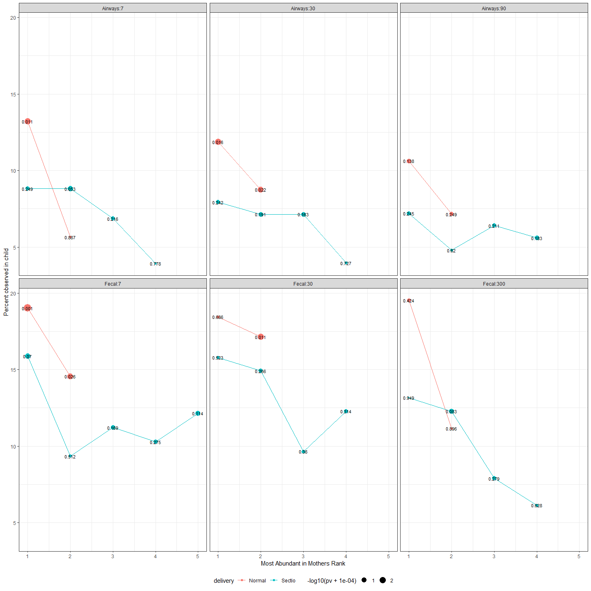

    ##    delivery rnk   n nC  nM   prcModel    pv Time    Type
    ## 1    Normal   1 426 81 426 0.19014085 0.001    7   Fecal
    ## 2    Normal   2 426 62 426 0.14553991 0.026    7   Fecal
    ## 3    Sectio   1 107 17 107 0.15887850 0.070    7   Fecal
    ## 4    Sectio   2 107 10 107 0.09345794 0.512    7   Fecal
    ## 5    Sectio   3 107 12 107 0.11214953 0.169    7   Fecal
    ## 6    Sectio   4 107 11 107 0.10280374 0.275    7   Fecal
    ## 7    Sectio   5 107 13 107 0.12149533 0.114    7   Fecal
    ## 8    Normal   1 461 85 461 0.18438178 0.686   30   Fecal
    ## 9    Normal   2 461 79 461 0.17136659 0.011   30   Fecal
    ## 10   Sectio   1 114 18 114 0.15789474 0.523   30   Fecal
    ## 11   Sectio   2 114 17 114 0.14912281 0.266   30   Fecal
    ## 12   Sectio   3 114 11 114 0.09649123 0.380   30   Fecal
    ## 13   Sectio   4 114 14 114 0.12280702 0.314   30   Fecal
    ## 14   Normal   1 466 91 466 0.19527897 0.424  300   Fecal
    ## 15   Normal   2 466 52 466 0.11158798 0.896  300   Fecal
    ## 16   Sectio   1 114 15 114 0.13157895 0.949  300   Fecal
    ## 17   Sectio   2 114 14 114 0.12280702 0.083  300   Fecal
    ## 18   Sectio   3 114  9 114 0.07894737 0.279  300   Fecal
    ## 19   Sectio   4 114  7 114 0.06140351 0.628  300   Fecal
    ## 20   Normal   1 424 56 424 0.13207547 0.011    7 Airways
    ## 21   Normal   2 424 24 424 0.05660377 0.887    7 Airways
    ## 22   Sectio   1 102  9 102 0.08823529 0.249    7 Airways
    ## 23   Sectio   2 102  9 102 0.08823529 0.053    7 Airways
    ## 24   Sectio   3 102  7 102 0.06862745 0.216    7 Airways
    ## 25   Sectio   4 102  4 102 0.03921569 0.778    7 Airways
    ## 26   Normal   1 480 57 480 0.11875000 0.016   30 Airways
    ## 27   Normal   2 480 42 480 0.08750000 0.022   30 Airways
    ## 28   Sectio   1 126 10 126 0.07936508 0.242   30 Airways
    ## 29   Sectio   2 126  9 126 0.07142857 0.191   30 Airways
    ## 30   Sectio   3 126  9 126 0.07142857 0.163   30 Airways
    ## 31   Sectio   4 126  5 126 0.03968254 0.727   30 Airways
    ## 32   Normal   1 489 52 489 0.10633947 0.138   90 Airways
    ## 33   Normal   2 489 35 489 0.07157464 0.249   90 Airways
    ## 34   Sectio   1 125  9 125 0.07200000 0.245   90 Airways
    ## 35   Sectio   2 125  6 125 0.04800000 0.620   90 Airways
    ## 36   Sectio   3 125  8 125 0.06400000 0.211   90 Airways
    ## 37   Sectio   4 125  7 125 0.05600000 0.183   90 Airways

|  rnk| ASV                        |    n|  ordr|
|----:|:---------------------------|----:|-----:|
|    1| Genus\_Lactobacillus\_139  |  227|     1|
|    1| Genus\_Lactobacillus\_323  |  224|     2|
|    1| Lactobacillus\_gasseri\_37 |   76|     3|
|    1| Genus\_Gardnerella\_40     |   30|     4|
|    1| Genus\_Gardnerella\_20     |   22|     5|
|    1| Genus\_Lactobacillus\_268  |   22|     6|
|    2| Genus\_Lactobacillus\_139  |   93|     1|
|    2| Genus\_Lactobacillus\_268  |   82|     2|
|    2| Genus\_Lactobacillus\_323  |   70|     3|
|    2| Lactobacillus\_gasseri\_37 |   59|     4|
|    2| Genus\_Gardnerella\_40     |   47|     5|
|    2| Genus\_Gardnerella\_20     |   44|     6|
|    2| Genus\_Megasphaera\_22     |   17|     7|
|    2| Genus\_Bifidobacterium\_60 |   15|     8|
|    2| Lactobacillus\_reuteri\_33 |   15|     9|
|    3| Genus\_Lactobacillus\_139  |   86|     1|
|    3| Genus\_Lactobacillus\_323  |   73|     2|
|    3| Lactobacillus\_gasseri\_37 |   47|     3|
|    3| Genus\_Gardnerella\_20     |   41|     4|
|    3| Genus\_Gardnerella\_40     |   37|     5|
|    3| Genus\_Lactobacillus\_268  |   36|     6|
|    3| Lactobacillus\_reuteri\_33 |   35|     7|
|    3| Genus\_Megasphaera\_22     |   24|     8|
|    3| Genus\_Atopobium\_36       |   17|     9|
|    4| Genus\_Lactobacillus\_323  |   70|     1|
|    4| Lactobacillus\_gasseri\_37 |   60|     2|
|    4| Genus\_Lactobacillus\_139  |   48|     3|
|    4| Genus\_Gardnerella\_40     |   45|     4|
|    4| Genus\_Lactobacillus\_268  |   40|     5|
|    4| Genus\_Gardnerella\_20     |   36|     6|
|    4| Lactobacillus\_reuteri\_33 |   32|     7|
|    4| Genus\_Ureaplasma\_8       |   19|     8|
|    4| Genus\_Megasphaera\_22     |   15|     9|

3.4 - Phylogenetic tree with transfer odds
------------------------------------------

Figure S5 - Results on the tree of life Here, we have the individual results shown on the phylogenetic tree (see **FigureS5\_phylotree\_transfer\_rect.pdf**)
