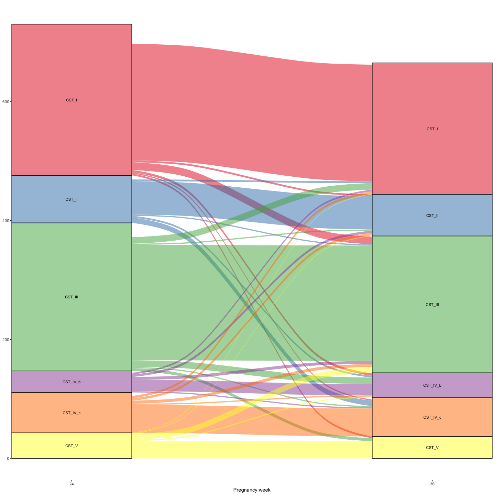
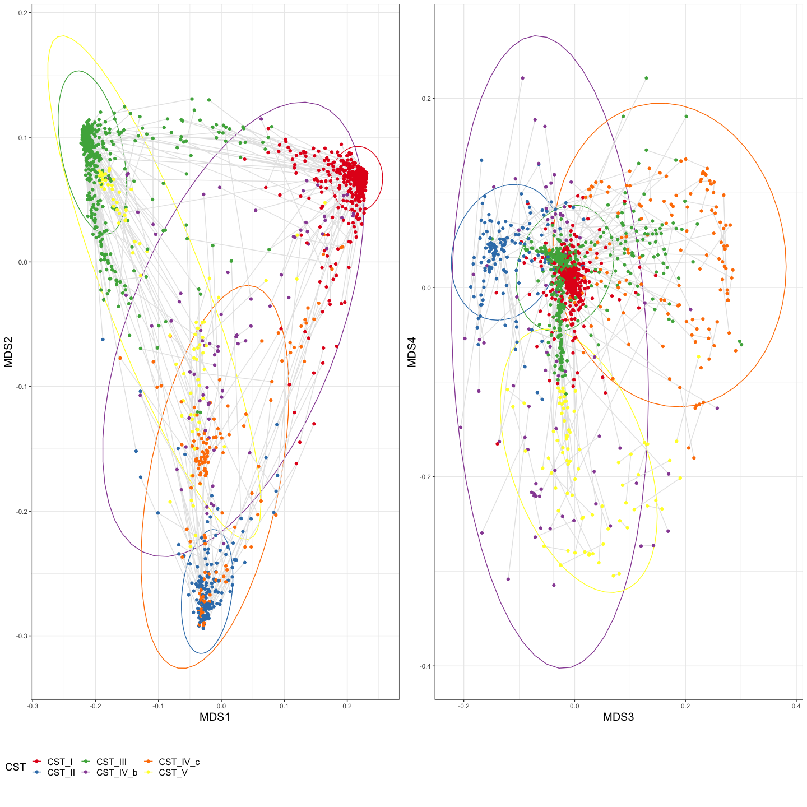
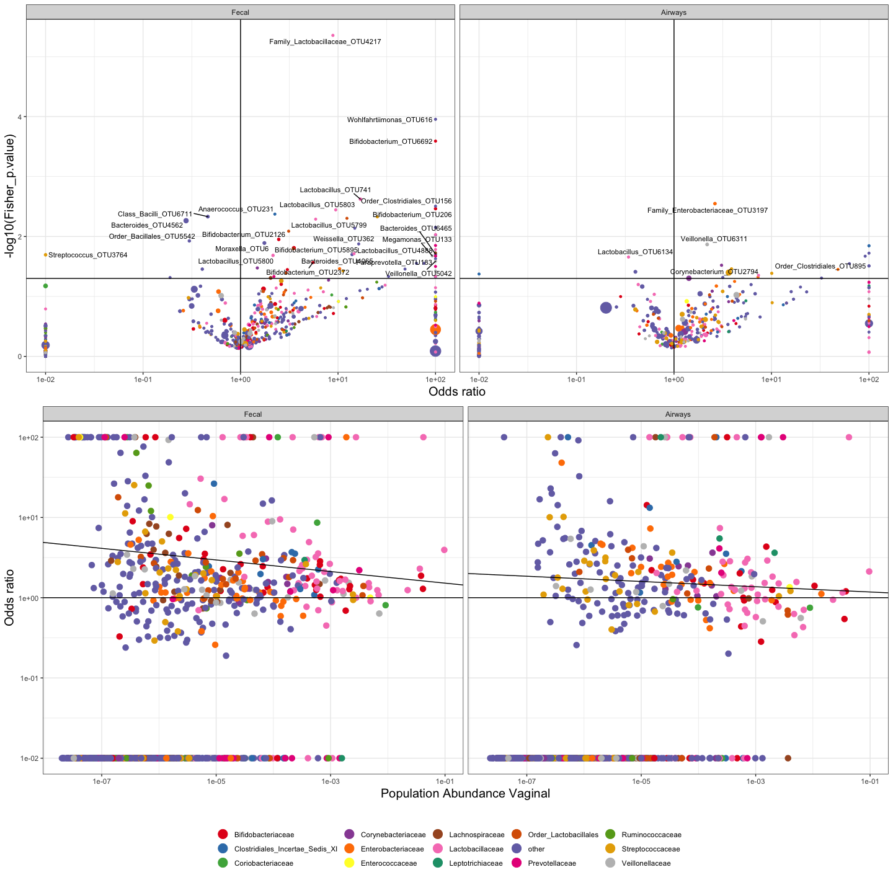
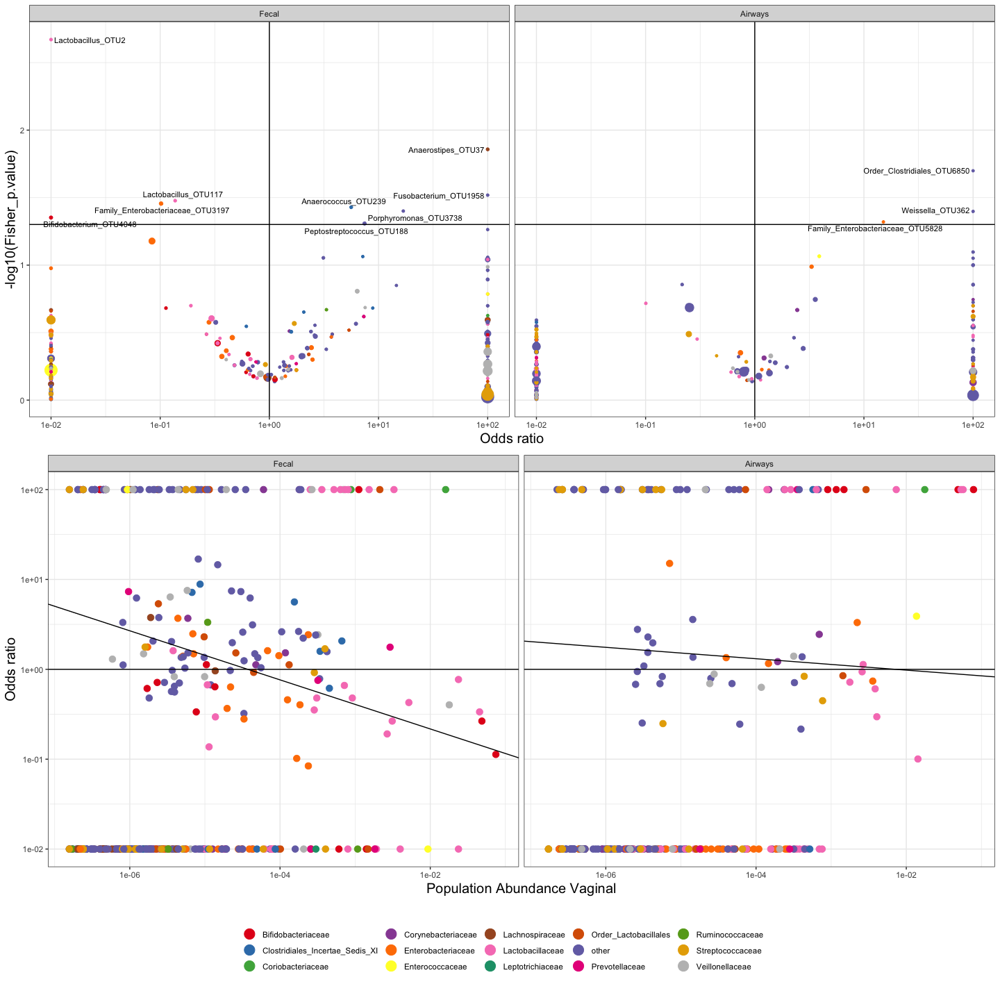
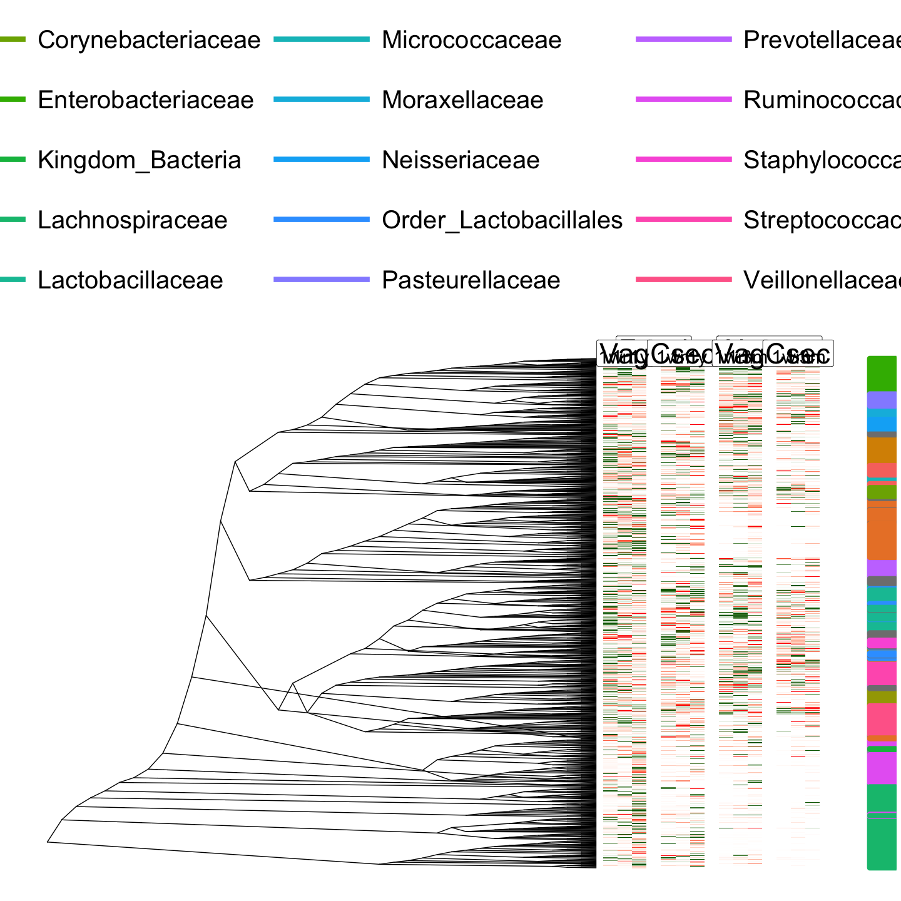

Stability of Vaginal microbiota during pregnancy and its importance for early infant microbiota
================

-   [Data](#data)
-   [Descriptives](#descriptives)
    -   [Size, number of reads and sparsity](#size-number-of-reads-and-sparsity)
-   [Vaginal descriptives](#vaginal-descriptives)
    -   [Community State Types](#community-state-types)
        -   [Figure S1 - Alluvial plot with CST](#figure-s1---alluvial-plot-with-cst)
    -   [Ordination of of vag samples with CTS and timepoints](#ordination-of-of-vag-samples-with-cts-and-timepoints)
        -   [Figure S2](#figure-s2)
    -   [Stability between w24 and w36](#stability-between-w24-and-w36)
        -   [Tables with stability results](#tables-with-stability-results)
-   [Infant descriptives](#infant-descriptives)
-   [Transfer](#transfer)
    -   [Functions for transfer models](#functions-for-transfer-models)
    -   [ALL individual OTU models](#all-individual-otu-models)
    -   [ALL - Compare weighted Ratios between c-section and vaginal birth at each timepoint](#all---compare-weighted-ratios-between-c-section-and-vaginal-birth-at-each-timepoint)
        -   [Table 1 - testable OTU's](#table-1---testable-otus)
        -   [Figure S3 - vaginal delivery](#figure-s3---vaginal-delivery)
        -   [Figure S4 - sectio delivery](#figure-s4---sectio-delivery)
    -   [Weighted Odds Ratio](#weighted-odds-ratio)
        -   [OVERALL ratio between positive and negative odds](#overall-ratio-between-positive-and-negative-odds)
        -   [Weigted Transfer Ratios](#weigted-transfer-ratios)
        -   [Figure 1 - Weigted Transfer Ratios](#figure-1---weigted-transfer-ratios)
        -   [Calculated for individual taxonomic levels](#calculated-for-individual-taxonomic-levels)
        -   [Figure 2 - Individual taxonomic levels](#figure-2---individual-taxonomic-levels)
        -   [Figure S5 - Results on the tree of life](#figure-s5---results-on-the-tree-of-life)

Data
====

Data for this project is from the COPSAC2010 cohort of 711 children / mother pairs. In this project we describe the vaginal microbiome development from mid pregnancy (week 24) to late pregnancy (week 36), and the transfer to the airways and gut of the children in the first year of life. A special focus is on the differences between transfer to vaginal and sectio born children.

``` r
library(tidyverse)
library(broom)
library(knitr)
library(ggrepel)
library(RColorBrewer)
library(cowplot)
library(ggtree)
library(ggalluvial)
library(vegan)
library(phyloseq)
load('COPSACbirthmicrobiome_v2.RData')
```

Descriptives
============

The microbiome make up is described here overall.

Size, number of reads and sparsity
----------------------------------

``` r
SD <- sample_data(phyX)
tb0 <- table(SD$Type,SD$Time)
rowSums(tb0)
```

    ##    F    T    V 
    ## 1784 1811 1395

``` r
tb <- table(SD$dyadnb,SD$Type) %>% as.data.frame.matrix()
dim(tb)
```

    ## [1] 743   3

``` r
sum(tb$V>0)
```

    ## [1] 738

``` r
tbpair <- tb[tb$V>0 & (tb$F> 0 | tb$T>0),]
dim(tbpair)
```

    ## [1] 695   3

``` r
print(phyX)
```

    ## phyloseq-class experiment-level object
    ## otu_table()   OTU Table:         [ 6846 taxa and 4990 samples ]
    ## sample_data() Sample Data:       [ 4990 samples by 4 sample variables ]
    ## tax_table()   Taxonomy Table:    [ 6846 taxa by 7 taxonomic ranks ]
    ## phy_tree()    Phylogenetic Tree: [ 6846 tips and 6840 internal nodes ]

``` r
fecX <- subset_samples(phyX,Type=='F')
airX <- subset_samples(phyX,Type=='T')
vagX <- subset_samples(phyX,Type=='V')

df_type_stat <- data.frame(
  nfec =  apply(otu_table(fecX)>0,1,sum),
  nair =  apply(otu_table(airX)>0,1,sum),
  nvag =  apply(otu_table(vagX)>0,1,sum))
apply(df_type_stat>0,2,sum)
```

    ## nfec nair nvag 
    ## 4524 3709 2291

``` r
# get number of identified OTU's in each compartment

df <- data.frame(depth = sample_sums(phyX),
                 nobserved = apply(otu_table(phyX)>0,2,sum),
                 sample_data(phyX))

tb <- df %>% group_by(Type,Time) %>% 
  summarise(median_count = median(depth), 
            mean_count = mean(depth), 
            sd_count = sd(depth), 
            q25_count= quantile(depth)[2],
            q75_count= quantile(depth)[4], 
            median_observed = median(nobserved),
            mean_observed = mean(nobserved), 
            sd_observed = sd(nobserved), 
            min_observed = min(nobserved), 
            max_observed = max(nobserved)
  )

kable(tb,caption = 'Summary stats for compartment/timepoint', digits = 0)
```

| Type | Time |  median\_count|  mean\_count|  sd\_count|  q25\_count|  q75\_count|  median\_observed|  mean\_observed|  sd\_observed|  min\_observed|  max\_observed|
|:-----|:-----|--------------:|------------:|----------:|-----------:|-----------:|-----------------:|---------------:|-------------:|--------------:|--------------:|
| F    | 1m   |          52122|        57858|      43118|       34348|       74682|               142|             147|            59|             44|            404|
| F    | 1w   |          57495|        63324|      47196|       24440|       97970|               135|             147|            64|             46|            640|
| F    | 1y   |          56962|        58147|      34271|       36324|       77173|               320|             317|           113|             84|            675|
| T    | 1m   |          57527|        58954|      35987|       36289|       78973|                96|             101|            49|             23|            767|
| T    | 1w   |          40824|        49427|      37361|       20616|       70036|                74|              76|            26|             18|            367|
| T    | 3m   |          44876|        49122|      36623|       19857|       68998|               102|             104|            36|             20|            291|
| V    | 24   |          47163|        50315|      21941|       35647|       62438|                78|              85|            39|             25|            297|
| V    | 36   |          46996|        51501|      25542|       35328|       64978|                74|              82|            40|             22|            433|

Vaginal descriptives
====================

The distribution of the vaginal reads are here summarized on phylum, family and individual OTU level.

``` r
vagX <- subset_samples(phyX,Type=='V')
vagXphy <- tax_glom(vagX,'Phylum')
vagXgenus <- tax_glom(vagX,'Genus')
infX <- subset_samples(phyX,Type!='V')
save(file = './vag_taxglm.RData',list = c('vagX','vagXphy','vagXgenus','infX'))
```

Observed vaginal OTU's:

``` r
load('./vag_taxglm.RData')

print(sum(apply(otu_table(vagX)>0,1,sum)>0))
```

    ## [1] 2291

``` r
txt <- vagXphy %>% tax_table() %>% as("matrix") %>% data.frame() 
df2 <- data.frame(txt,taxSum = taxa_sums(vagXphy))
df2$taxprc <- 100*df2$taxSum/sum(df2$taxSum)
txt <- vagXgenus %>% tax_table() %>% as("matrix") %>% data.frame() 
df3 <- data.frame(txt,taxSum = taxa_sums(vagXgenus))
df3$taxprc <- 100*df3$taxSum/sum(df3$taxSum)
txt <- vagX %>% tax_table() %>% as("matrix") %>% data.frame() 
df4 <- data.frame(txt,taxSum = taxa_sums(vagX))
df4$taxprc <- 100*df4$taxSum/sum(df4$taxSum)

# Top 3 dominating phyla prc reads "Firmicutes (85.0%), Acinobacteria (11.8%) and Proteobacteria (2.0%)"
kable(head(df2[order(df2$taxSum,decreasing = T),]), row.names = F,digits = 1, caption = 'Distribution of reads according to phylym')
```

| Kingdom  | Phylum         | Class | Order | Family | Genus | Species |    taxSum|  taxprc|
|:---------|:---------------|:------|:------|:-------|:------|:--------|---------:|-------:|
| Bacteria | Firmicutes     | NA    | NA    | NA     | NA    | NA      |  61399510|    86.5|
| Bacteria | Actinobacteria | NA    | NA    | NA     | NA    | NA      |   7696802|    10.8|
| Bacteria | Proteobacteria | NA    | NA    | NA     | NA    | NA      |   1128017|     1.6|
| Bacteria | Bacteroidetes  | NA    | NA    | NA     | NA    | NA      |    505046|     0.7|
| Bacteria | Fusobacteria   | NA    | NA    | NA     | NA    | NA      |    125943|     0.2|
| Bacteria | Tenericutes    | NA    | NA    | NA     | NA    | NA      |     85439|     0.1|

``` r
# Top 2 dominating genus prc reads "Lactobacillus (78.5%) and Gardnerella (8.7%)"
kable(head(df3[order(df3$taxSum,decreasing = T),]), row.names = F,digits = 1, caption = 'Distribution of reads according to genus')
```

| Kingdom  | Phylum         | Class               | Order             | Family             | Genus                      | Species |    taxSum|  taxprc|
|:---------|:---------------|:--------------------|:------------------|:-------------------|:---------------------------|:--------|---------:|-------:|
| Bacteria | Firmicutes     | Bacilli             | Lactobacillales   | Lactobacillaceae   | Lactobacillus              | NA      |  58162080|    81.9|
| Bacteria | Actinobacteria | Actinobacteria      | Bifidobacteriales | Bifidobacteriaceae | Gardnerella                | NA      |   5568094|     7.8|
| Bacteria | Proteobacteria | Gammaproteobacteria | Enterobacteriales | Enterobacteriaceae | Family\_Enterobacteriaceae | NA      |   1004543|     1.4|
| Bacteria | Actinobacteria | Actinobacteria      | Coriobacteriales  | Coriobacteriaceae  | Atopobium                  | NA      |    927147|     1.3|
| Bacteria | Actinobacteria | Actinobacteria      | Bifidobacteriales | Bifidobacteriaceae | Bifidobacterium            | NA      |    822452|     1.2|
| Bacteria | Firmicutes     | Negativicutes       | Selenomonadales   | Veillonellaceae    | Megasphaera                | NA      |    561064|     0.8|

``` r
# Top 4 Lactobacilli  "The most abundant lactobacilli were L. crispatus (33.3%), L. iners (28.6%), L. gasseri (10.7%), and L. jensenii (4.9%). ""
kable(head(df4[order(df4$taxSum,decreasing = T),]), row.names = F,digits = 1, caption = 'Distribution of reads according to OTU')
```

| Kingdom  | Phylum         | Class          | Order             | Family             | Genus         | Species                |    taxSum|  taxprc|
|:---------|:---------------|:---------------|:------------------|:-------------------|:--------------|:-----------------------|---------:|-------:|
| Bacteria | Firmicutes     | Bacilli        | Lactobacillales   | Lactobacillaceae   | Lactobacillus | Lactobacillus\_OTU5754 |  23697366|    33.4|
| Bacteria | Firmicutes     | Bacilli        | Lactobacillales   | Lactobacillaceae   | Lactobacillus | Lactobacillus\_OTU5773 |  18177669|    25.6|
| Bacteria | Firmicutes     | Bacilli        | Lactobacillales   | Lactobacillaceae   | Lactobacillus | Lactobacillus\_OTU4974 |   6038527|     8.5|
| Bacteria | Firmicutes     | Bacilli        | Lactobacillales   | Lactobacillaceae   | Lactobacillus | Lactobacillus\_OTU3    |   3048132|     4.3|
| Bacteria | Actinobacteria | Actinobacteria | Bifidobacteriales | Bifidobacteriaceae | Gardnerella   | Gardnerella\_OTU14     |   2731614|     3.8|
| Bacteria | Actinobacteria | Actinobacteria | Bifidobacteriales | Bifidobacteriaceae | Gardnerella   | Gardnerella\_OTU5813   |   2484452|     3.5|

Community State Types
---------------------

The vaginal microbiome is *not* a smooth continoum, but merely a partition between several microbiome-phenotypes, here refered to as Community State Types (CST). These are identified by clustering of *all* the samples based on Jensen Shannon Divergence as beta diversity measure. The dendrogram is cutted to reveal *6* clusters. These are refered to as community state types I to VI.

``` r
load('./vag_taxglm.RData')
vag.active <- prune_taxa(taxa_sums(vagX) > 0, vagX)
vag.active.r <- rarefy_even_depth(vag.active, 2000, rngseed = 2)
vag.transformed <- transform_sample_counts(vag.active.r, function(x) x/sum(x))
vag.jsd <- distance(vag.transformed, method="jsd")

clust <- hclust(vag.jsd, method = "ward.D2")
sample_data(vagX)$CST <- cutree(clust, k=6)

sample_data(vagX)$CST <- as.factor(sample_data(vagX)$CST)
levels(sample_data(vagX)$CST) <- list(CST_I = 3, CST_II = 1, CST_III = 2, CST_IV_b = 5, CST_IV_c = 4, CST_V = 6)

# table with top dominating taxa / OTUs in each CST

# Phylum
df2 <- data.frame(otu_table(vagXphy) %>% t(), sample_data(vagX)) 
txtb <- vagXphy %>% tax_table() %>% as("matrix") %>% data.frame() 
txtb$otu <- rownames(txtb)
tb0 <- df2 %>%
  group_by(dyadnb) %>%
  mutate(rep = n()) %>%
  ungroup() %>%
  group_by(CST) %>%
  summarise(n = n(), n_w_rep = sum(rep==2),
            n24 = sum(Time==24),n36 = sum(Time==36))

tb1 <- df2 %>%
  gather(otu,cnt,Kingdom_Eukaryota_OTU1224:Family_Anaerolineaceae_OTU4522) %>%
  left_join(txtb, by = 'otu') %>%
  group_by(dyadnb,Time) %>%
  mutate(libsize = sum(cnt), 
         cnt = cnt / libsize) %>%
  ungroup() %>%
  group_by(CST,Phylum) %>%
  summarise(totcnt = mean(cnt)*100) %>%
  ungroup() %>%
  group_by(CST) %>%
  mutate(rnk = rank(totcnt), 
         rnk = max(rnk)-rnk+1) %>%
  arrange(CST,desc(totcnt)) %>%
  filter(rnk<6)

# Genus
df2 <- data.frame(otu_table(vagXgenus) %>% t(), sample_data(vagX)) 
txtb <- tax_table(vagXgenus) %>% as.data.frame()
txtb$otu <- rownames(txtb)
tb1g <- df2 %>%
  gather(otu,cnt,Lactonifactor_OTU1485:Shuttleworthia_OTU472) %>%
  left_join(txtb, by = 'otu') %>%
  group_by(dyadnb,Time) %>%
  mutate(libsize = sum(cnt), 
         cnt = cnt / libsize) %>%
  ungroup() %>%
  group_by(CST,Genus) %>%
  summarise(totcnt = mean(cnt)*100) %>%
  ungroup() %>%
  group_by(CST) %>%
  mutate(rnk = rank(totcnt), 
         rnk = max(rnk)-rnk+1) %>%
  arrange(CST,desc(totcnt)) %>%
  filter(rnk<6)

# OTU

otutab <- otu_table(vagX) %>% t()
# top 100 overall
ss <- rank(apply(otutab,2,sum))
ss <- max(ss) - ss + 1
df2 <- data.frame(otutab[,ss<100], sample_data(vagX)) 
txtb <- tax_table(vagX) %>% as.data.frame()
txtb$otu <- rownames(txtb)
tb1otu <- df2 %>%
  gather(otu,cnt,Howardella_OTU169:Saccharofermentans_OTU124) %>%
  left_join(txtb, by = 'otu') %>%
  group_by(dyadnb,Time) %>%
  mutate(libsize = sum(cnt), 
         cnt = cnt / libsize) %>%
  ungroup() %>%
  group_by(CST,otu) %>%
  summarise(totcnt = mean(cnt)*100) %>%
  ungroup() %>%
  group_by(CST) %>%
  mutate(rnk = rank(totcnt), 
         rnk = max(rnk)-rnk+1) %>%
  arrange(CST,desc(totcnt)) %>%
  filter(rnk<6)


colnames(tb1)[3] <- 'Phylum_prc'
colnames(tb1g)[3] <- 'Genus_prc'
colnames(tb1otu)[3] <- 'OTU_prc'
tb1m <- merge(merge(tb1,tb1g, by = c('CST','rnk')), tb1otu,by = c('CST','rnk'))

save(file = './CommunityStateTypes.RData',list = c('vagX','clust','vag.jsd','tb0','tb1m'))
```

### Figure S1 - Alluvial plot with CST

``` r
load('./CommunityStateTypes.RData')

kable(tb0, caption = 'Sample Distribution, n: number of samples in CST, n_w_rep: number of samples in CST from women with both timepoints represented, n24 / n36: number of samples from week 24 and 36 respectively')
```

| CST        |    n|  n\_w\_rep|  n24|  n36|
|:-----------|----:|----------:|----:|----:|
| CST\_I     |  475|        439|  254|  221|
| CST\_II    |  150|        143|   80|   70|
| CST\_III   |  479|        454|  249|  230|
| CST\_IV\_b |   78|         74|   36|   42|
| CST\_IV\_c |  133|        124|   68|   65|
| CST\_V     |   80|         80|   43|   37|

``` r
kable(tb1m, caption = 'Top five Phylums / Genus / OTUs for each CST', digits = 2)
```

| CST        |  rnk| Phylum         |  Phylum\_prc| Genus                      |  Genus\_prc| otu                                 |  OTU\_prc|
|:-----------|----:|:---------------|------------:|:---------------------------|-----------:|:------------------------------------|---------:|
| CST\_I     |    1| Firmicutes     |        97.85| Lactobacillus              |       95.91| Lactobacillus\_OTU5754              |     83.76|
| CST\_I     |    2| Actinobacteria |         1.38| Gardnerella                |        1.03| Lactobacillus\_OTU2                 |      6.44|
| CST\_I     |    3| Proteobacteria |         0.36| Enterococcus               |        0.80| Lactobacillus\_OTU5773              |      1.43|
| CST\_I     |    4| Bacteroidetes  |         0.22| Family\_Enterobacteriaceae |        0.26| Lactobacillus\_OTU4974              |      1.09|
| CST\_I     |    5| Tenericutes    |         0.11| Order\_Lactobacillales     |        0.22| Enterococcus\_OTU22                 |      0.84|
| CST\_II    |    1| Firmicutes     |        89.18| Lactobacillus              |       83.61| Lactobacillus\_OTU4974              |     69.47|
| CST\_II    |    2| Actinobacteria |         8.74| Gardnerella                |        4.85| Lactobacillus\_OTU892               |      3.14|
| CST\_II    |    3| Proteobacteria |         1.34| Order\_Lactobacillales     |        2.42| Lactobacillus\_OTU146               |      3.01|
| CST\_II    |    4| Bacteroidetes  |         0.62| Bifidobacterium            |        1.76| Gardnerella\_OTU5813                |      2.69|
| CST\_II    |    5| Tenericutes    |         0.08| Atopobium                  |        1.74| Gardnerella\_OTU14                  |      1.92|
| CST\_III   |    1| Firmicutes     |        92.87| Lactobacillus              |       88.66| Lactobacillus\_OTU5773              |     67.87|
| CST\_III   |    2| Actinobacteria |         5.69| Gardnerella                |        5.01| Lactobacillus\_OTU3                 |     11.82|
| CST\_III   |    3| Bacteroidetes  |         0.60| Megasphaera                |        1.40| Lactobacillus\_OTU5754              |      3.38|
| CST\_III   |    4| Fusobacteria   |         0.42| Family\_Lachnospiraceae    |        0.99| Gardnerella\_OTU5813                |      2.37|
| CST\_III   |    5| Proteobacteria |         0.31| Prevotella                 |        0.57| Gardnerella\_OTU14                  |      2.21|
| CST\_IV\_b |    1| Firmicutes     |        46.39| Lactobacillus              |       26.26| Family\_Enterobacteriaceae\_OTU5820 |     15.96|
| CST\_IV\_b |    2| Actinobacteria |        28.73| Bifidobacterium            |       18.84| Bifidobacterium\_OTU6061            |     14.82|
| CST\_IV\_b |    3| Proteobacteria |        19.79| Family\_Enterobacteriaceae |       18.56| Lactobacillus\_OTU5754              |     12.12|
| CST\_IV\_b |    4| Bacteroidetes  |         4.31| Streptococcus              |        7.41| Atopobium\_OTU33                    |      5.29|
| CST\_IV\_b |    5| Synergistetes  |         0.24| Atopobium                  |        5.25| Streptococcus\_OTU34                |      5.20|
| CST\_IV\_c |    1| Actinobacteria |        66.71| Gardnerella                |       57.97| Gardnerella\_OTU14                  |     31.34|
| CST\_IV\_c |    2| Firmicutes     |        30.34| Lactobacillus              |       21.98| Gardnerella\_OTU5813                |     24.24|
| CST\_IV\_c |    3| Bacteroidetes  |         1.47| Atopobium                  |        6.67| Lactobacillus\_OTU4974              |     10.53|
| CST\_IV\_c |    4| Proteobacteria |         0.59| Megasphaera                |        3.66| Atopobium\_OTU33                    |      6.52|
| CST\_IV\_c |    5| Fusobacteria   |         0.46| Family\_Bifidobacteriaceae |        1.53| Lactobacillus\_OTU5754              |      6.51|
| CST\_V     |    1| Firmicutes     |        89.51| Lactobacillus              |       85.28| Lactobacillus\_OTU6106              |     43.81|
| CST\_V     |    2| Actinobacteria |         8.74| Gardnerella                |        6.85| Lactobacillus\_OTU5773              |     15.06|
| CST\_V     |    3| Bacteroidetes  |         0.91| Order\_Lactobacillales     |        2.74| Lactobacillus\_OTU102               |      5.71|
| CST\_V     |    4| Proteobacteria |         0.71| Atopobium                  |        1.42| Gardnerella\_OTU5813                |      4.59|
| CST\_V     |    5| Tenericutes    |         0.09| Prevotella                 |        0.85| Lactobacillus\_OTU5684              |      3.61|

``` r
gAL <- sample_data(vagX) %>%
  ggplot(data = .,
         aes(x = Time, stratum = CST, alluvium = dyadnb,
             # weight = 1,
             fill = CST, label = CST)) +
  geom_flow() +
  scale_fill_brewer(palette = 'Set1') + 
  scale_x_discrete(expand = c(0,0)) + 
  geom_stratum(alpha = .5) +
  # facet_grid(cleandef~trt) + 
  geom_text(stat = "stratum", size = 3) +
  theme_bw() + 
  xlab('Pregnancy week') + 
  theme(legend.position = 'none',panel.grid = element_blank(), panel.border = element_blank())

print(gAL)
```



``` r
pdf('FigureS1.pdf',height = 8, width = 4)
gAL
dev.off()
```

    ## quartz_off_screen 
    ##                 2

``` r
load('./vag_taxglm.RData')
load('./CommunityStateTypes.RData')

vag.active <- prune_taxa(taxa_sums(vagX) > 0, vagX)

cl <- makeCluster(20)
doParallel::registerDoParallel(cl)
vag.WUnifrac <- UniFrac(vag.active, weighted=TRUE, parallel = TRUE)
vag.all.nmds <- metaMDS(vag.WUnifrac, k = 4, trymax = 100)
vag.all.jsd.nmds <- metaMDS(vag.jsd, k = 5, trymax = 100)

save(file = './OrdinationRes.RData',list = c('vag.WUnifrac','vag.all.nmds','vag.all.jsd.nmds'))
```

Ordination of of vag samples with CTS and timepoints
----------------------------------------------------

### Figure S2

Here PCoA plots show the distirbution of the samples based on CST and beta diversity metric. Clearly, some of the CST are more well defined than others. E.g. CST\_IV\_b and CST\_IV\_c are all over the place.

``` r
g_legend<-function(a.gplot){ 
  tmp <- ggplot_gtable(ggplot_build(a.gplot)) 
  leg <- which(sapply(tmp$grobs, function(x) x$name) == "guide-box") 
  legend <- tmp$grobs[[leg]] 
  return(legend)} 
mytheme <- theme(axis.title = element_text(size = 15), axis.text = element_text(size = 10)) + theme_bw()

load('./vag_taxglm.RData')
load('./CommunityStateTypes.RData')
load('./OrdinationRes.RData')

# df <- rbind(data.frame(method = 'wunifrac', sample_data(vagX),vag.all.nmds$points, MDS5 = 0),
# data.frame(method = 'jsd', sample_data(vagX),vag.all.jsd.nmds$points))

df <- data.frame(method = 'jsd', sample_data(vagX),vag.all.jsd.nmds$points)


# PCoA with CST 1 vs 2
g1 <- ggplot(data = df, aes(MDS1,MDS2, color = CST,group= dyadnb)) + 
  stat_ellipse(aes(group = CST)) + 
  geom_line(color = 'grey90') + 
  geom_point() + 
  scale_color_brewer(palette = 'Set1') + 
  # facet_wrap(~method, scales = 'free') + 
  theme(legend.position = 'none')

# PCoA with CST 3 vs 4
g2 <- ggplot(data = df, aes(MDS3,MDS4, color = CST,group= dyadnb)) + 
  stat_ellipse(aes(group = CST)) + 
  geom_line(color = 'grey90') + 
  geom_point() + 
  scale_color_brewer(palette = 'Set1') + 
  # facet_wrap(~method, scales = 'free') + 
  theme(legend.position = 'bottom')


legend <- g_legend(g2)
# G1 <- ggdraw() + draw_plot(g1 +  mytheme + theme(legend.position = "hidden"), 0, .55, 1, .45) + 
# draw_plot(g2 + mytheme+ theme(legend.position = "hidden"), 0, 0.1, 1, .45)+
# draw_grob(legend, 0, 0, 1, .1) 
G1 <- ggdraw() + draw_plot(g1 +  mytheme + theme(legend.position = "hidden"), 0, 0.1, 0.5, 0.9) + 
  draw_plot(g2 + mytheme+ theme(legend.position = "hidden"), 0.5, 0.1, 0.5, 0.9)+
  draw_grob(legend, 0, 0, 1, .1) 

print(G1)
```



``` r
pdf('FigureS2.pdf', width = 10, height = 5)
print(G1)
dev.off()
```

    ## quartz_off_screen 
    ##                 2

Stability between w24 and w36
-----------------------------

In order to test the stability between time points, a permutation procedure is used. Here, the distance based on individual women from week 24 to week 36 are compared with random assignments of pairs.

``` r
nperm <- 2500

# get dist for all pairs
getDist <- function(x,D){
  id <- rownames(D) %in% x$smpname
  if (sum(id)==2){
    dd <- D[id,id]
    dst <- dd[1,2]
  }
  else {dst <- NA}
  return(data.frame(distw24_w36 = dst))
}

sd_vagX <- sample_data(vagX) 
sd_vagX$smpname = rownames(sd_vagX)

# Wunifrac
Dwuf <- as.matrix(vag.WUnifrac)

ddfmodel <- sd_vagX %>%
  group_by(dyadnb) %>%
  do(getDist(x = ., Dwuf)) %>%
  left_join(sd_vagX[sd_vagX$Time==24,], by = 'dyadnb')

ddfperm  <- c()
for (i in 1:nperm){
  print(i)
  sd_vagX$dyadnb2 <- sd_vagX$dyadnb
  sd_vagX$dyadnb2[sd_vagX$Time==36] <- sample(sd_vagX$dyadnb2[sd_vagX$Time==36])
  ddf2 <- sd_vagX %>%
    group_by(dyadnb2) %>%
    do(getDist(x = ., Dwuf)) %>%
    mutate(permutation = i)
  ddfperm <- rbind(ddfperm,ddf2)
}

# calculate the statistics
pv <- ddfperm %>%
  left_join(ddfmodel, by = c('dyadnb2' = 'dyadnb')) %>%
  filter(!is.na(distw24_w36.x) & !is.na(distw24_w36.y)) %>%
  group_by(dyadnb2) %>%
  summarise(n = n(), 
            npos = sum(distw24_w36.x < distw24_w36.x), 
            freq = npos / n) %>%
  ungroup %>%
  summarise(pv = mean(freq))

dfmodelwuf <- ddfmodel
dfpermwuf <- ddfperm
pv_wuf <- pv

# JSD model
Djsd <- as.matrix(vag.jsd)

ddfmodel <- sd_vagX %>%
  group_by(dyadnb) %>%
  do(getDist(x = ., Djsd)) %>%
  left_join(sd_vagX[sd_vagX$Time==24,], by = 'dyadnb')

ddfperm  <- c()
for (i in 1:nperm){
  print(i)
  sd_vagX$dyadnb2 <- sd_vagX$dyadnb
  sd_vagX$dyadnb2[sd_vagX$Time==36] <- sample(sd_vagX$dyadnb2[sd_vagX$Time==36])
  ddf2 <- sd_vagX %>%
    group_by(dyadnb2) %>%
    do(getDist(x = ., Djsd)) %>%
    mutate(permutation = i)
  ddfperm <- rbind(ddfperm,ddf2)
}

# calculate the statistics
pv <- ddfperm %>%
  left_join(ddfmodel, by = c('dyadnb2' = 'dyadnb')) %>%
  filter(!is.na(distw24_w36.x) & !is.na(distw24_w36.y)) %>%
  group_by(dyadnb2) %>%
  summarise(n = n(), 
            npos = sum(distw24_w36.x < distw24_w36.x), 
            freq = npos / n) %>%
  ungroup %>%
  summarise(pv = mean(freq))

dfmodeljsd <- ddfmodel
dfpermjsd <- ddfperm
pv_jsd <- pv


save(file = './Stability_w24_to_2w6_permresults.RData',
     list = c('dfmodelwuf','dfpermwuf','pv_wuf','dfmodeljsd','dfpermjsd','pv_jsd'))
```

### Tables with stability results

``` r
load('./Stability_w24_to_2w6_permresults.RData')

sd_vagX <- sample_data(vagX) 
# remove single tons
ttb <- sd_vagX %>%
  group_by(dyadnb) %>%
  mutate(n = n()) %>%
  filter(n==2) %>%
  group_by(dyadnb) %>%
  mutate(insame = ifelse(length(unique(CST))==1,1,0)) %>%
  group_by(CST,Time) %>%
  summarise(n = n(), 
            n_insame = sum(insame), 
            prc_insame = 100*n_insame/n)

ntot <- sum(ttb$n)/2

ttb2 <- ttb %>% 
  filter(Time==24) %>%
  ungroup %>%
  summarise(n = sum(n_insame), 
            prc = 100*n / ntot)

kable(ttb2,caption = 'overall stability descriptives from week 24 and w 36 dependent', digits = 1)
```

|    n|   prc|
|----:|-----:|
|  541|  82.3|

``` r
kable(ttb,caption = 'CST descriptives from week 24 and w 36 dependent', digits = 1)
```

| CST        | Time |    n|  n\_insame|  prc\_insame|
|:-----------|:-----|----:|----------:|------------:|
| CST\_I     | 24   |  221|        196|         88.7|
| CST\_I     | 36   |  218|        196|         89.9|
| CST\_II    | 24   |   73|         56|         76.7|
| CST\_II    | 36   |   70|         56|         80.0|
| CST\_III   | 24   |  225|        194|         86.2|
| CST\_III   | 36   |  229|        194|         84.7|
| CST\_IV\_b | 24   |   33|         19|         57.6|
| CST\_IV\_b | 36   |   41|         19|         46.3|
| CST\_IV\_c | 24   |   62|         47|         75.8|
| CST\_IV\_c | 36   |   62|         47|         75.8|
| CST\_V     | 24   |   43|         29|         67.4|
| CST\_V     | 36   |   37|         29|         78.4|

``` r
dfwuf <- dfpermwuf %>%
  left_join(dfmodelwuf, by = c('dyadnb2' = 'dyadnb')) 
dfjsd <- dfpermjsd %>%
  left_join(dfmodeljsd, by = c('dyadnb2' = 'dyadnb')) 


DF <- rbind(data.frame(dfwuf,method = 'wuf'),data.frame(dfjsd,method = 'jsd')) #%>%

tb <- DF %>%
  filter(!is.na(distw24_w36.y) & permutation==1) %>%
  group_by(method) %>%
  summarise(n= n(), median_dist = median(distw24_w36.y, na.rm = T))

tb_CST <- DF %>%
  filter(!is.na(distw24_w36.y) & permutation==1) %>%
  group_by(method,CST) %>%
  summarise(n= n(), median_dist = median(distw24_w36.y, na.rm = T))

tb_CSTpv <- DF %>%
  filter(!is.na(distw24_w36.y) & permutation==1) %>%
  group_by(method) %>%
  do(kruskal.test(data = .,distw24_w36.y~CST) %>% tidy %>% select(-method))


tb2 <- DF %>%
  filter(!is.na(distw24_w36.x) & !is.na(distw24_w36.y)) %>%
  group_by(method, permutation) %>%
  summarise(median_permdist = median(distw24_w36.x)) %>%
  ungroup %>%
  left_join(tb) %>%
  group_by(method) %>%
  summarise(
    n = n[1],
    median_dist = median_dist[1], 
    median_permdist = mean(median_permdist),
    R = median_permdist / median_dist,
    pv = sum(1+(median_permdist<median_dist)) / (1+n()))

kable(tb2, caption = 'Stability between week 24 and w 36 assigned as median distance between pairs as compared with mismatched pairs (# permutations = 2500)', digits = 5)
```

| method |    n|  median\_dist|  median\_permdist|         R|     pv|
|:-------|----:|-------------:|-----------------:|---------:|------:|
| wuf    |  657|       0.04967|           0.21963|   4.42144|  4e-04|
| jsd    |  657|       0.05259|           0.61727|  11.73806|  4e-04|

``` r
kable(tb_CST,caption = 'Stability between week 24 and w 36 dependent on week 24 CST', digits = 4)
```

| method | CST        |    n|  median\_dist|
|:-------|:-----------|----:|-------------:|
| wuf    | CST\_I     |   73|        0.0902|
| wuf    | CST\_II    |  221|        0.0211|
| wuf    | CST\_III   |  225|        0.0472|
| wuf    | CST\_IV\_b |   33|        0.2878|
| wuf    | CST\_IV\_c |   62|        0.1264|
| wuf    | CST\_V     |   43|        0.0611|
| jsd    | CST\_I     |   73|        0.0723|
| jsd    | CST\_II    |  221|        0.0349|
| jsd    | CST\_III   |  225|        0.0446|
| jsd    | CST\_IV\_b |   33|        0.2738|
| jsd    | CST\_IV\_c |   62|        0.0763|
| jsd    | CST\_V     |   43|        0.0780|

``` r
kable(tb_CSTpv,caption = 'Inference (kruskal walis) for differences in stability between week 24 and w 36 dependent on week 24 CST', digits = 100)
```

| method |  statistic|       p.value|  parameter|
|:-------|----------:|-------------:|----------:|
| wuf    |  133.36934|  4.585121e-27|          5|
| jsd    |   73.71207|  1.727056e-14|          5|

Infant descriptives
===================

``` r
infant <- sample_data(phyX) %>%
  data.frame() %>%
  filter(!is.na(DELIVERY)) %>%
  filter(!duplicated(dyadnb))

rbind(table(infant$DELIVERY) ,
      100*table(infant$DELIVERY) / dim(infant)[1])
```

    ##      Acute sectio    Normal Planned sectio
    ## [1,]     85.00000 549.00000      66.000000
    ## [2,]     12.14286  78.42857       9.428571

``` r
vagdyad <- sample_data(vagX)$dyadnb[sample_data(vagX)$Time == '36']

tb2 <- infX %>% 
  sample_data %>% 
  group_by(Type, Time,DELIVERY) %>% 
  summarise(n = n(), 
            n_with_vagw36 = sum(dyadnb %in% vagdyad  ), 
            prc = 100*n_with_vagw36 / n) %>%
  data.frame()
kable(tb2, digits = 1, caption = 'Number of infant samples (n), with a corresponding maternal vaginal w36 sample (n_with_vagw36)')
```

| Type | Time | DELIVERY       |    n|  n\_with\_vagw36|   prc|
|:-----|:-----|:---------------|----:|----------------:|-----:|
| F    | 1m   | Acute sectio   |   76|               63|  82.9|
| F    | 1m   | Normal         |  480|              457|  95.2|
| F    | 1m   | Planned sectio |   51|               49|  96.1|
| F    | 1w   | Acute sectio   |   60|               55|  91.7|
| F    | 1w   | Normal         |  438|              425|  97.0|
| F    | 1w   | Planned sectio |   54|               51|  94.4|
| F    | 1y   | Acute sectio   |   77|               60|  77.9|
| F    | 1y   | Normal         |  492|              467|  94.9|
| F    | 1y   | Planned sectio |   56|               53|  94.6|
| T    | 1m   | Acute sectio   |   79|               64|  81.0|
| T    | 1m   | Normal         |  501|              478|  95.4|
| T    | 1m   | Planned sectio |   65|               62|  95.4|
| T    | 1w   | Acute sectio   |   56|               50|  89.3|
| T    | 1w   | Normal         |  435|              420|  96.6|
| T    | 1w   | Planned sectio |   53|               51|  96.2|
| T    | 3m   | Acute sectio   |   74|               61|  82.4|
| T    | 3m   | Normal         |  492|              465|  94.5|
| T    | 3m   | Planned sectio |   56|               54|  96.4|

The statistics indicate that stability depends on CST.

Transfer
========

Functions for transfer models
-----------------------------

Here, we have a bunch of internal function with specific algorithms.

``` r
gt <- function(x){
  tb <- table(x$countC>0,x$count01) 
  dtb <- tb %>% dim()
  tb <- data.frame(n1 = dtb[1],n2 = dtb[2],nZero = sum(tb==0))
  return(tb)
}

getFisher <- function(x,doglm = TRUE){
  # x <- STS[1,1:5]
  # doglm = TRUE
  x$or <- (x$n00*x$n11) / (x$n10*x$n01)
  side <- ifelse(x$or<1,'less','greater')
  nn <- x$n00 + x$n10 + x$n01 + x$n11
  tb <- x[,c('n00','n01','n10','n11')] %>% 
    unlist() %>%
    matrix(2) %>%
    fisher.test(alternative = side) %>%
    tidy
  colnames(tb) <- paste('Fisher',colnames(tb),sep = '_')
  
  # bias corrected
  or_biascorr <- (x$n00 + 0.5)*(x$n11+0.5) / (x$n01 + 0.5)*(x$n10+0.5)
  t_biascorr <- (nn*(abs(x$n00*x$n11 - x$n10*x$n01) - 0.5*nn)^2) / ((x$n00 + x$n01)*(x$n00 + x$n10)*(x$n10 + x$n11)*(x$n01 + x$n11))
  pv_biascorr <- 2*(1 - pnorm(t_biascorr))
  biascorr <- data.frame(or_biascorr,t_biascorr,pv_biascorr)
  
  # Gtest accoring to 
  gtest <- x[,c('n00','n01','n10','n11')] %>% 
    unlist() %>%
    matrix(2) %>%
    # DescTools::GTest(correct = 'yates') %>% 
    DescTools::GTest() %>% 
    tidy
  colnames(gtest) <- paste('Gtest',colnames(gtest),sep = '_')
  tb <- cbind(tb,biascorr,gtest)
  
  # glm
  if (doglm){
    mom <- c(rep(0,x$n00), rep(0,x$n01), rep(1,x$n10),rep(1,x$n11))
    child <- c(rep(0,x$n00), rep(1,x$n01), rep(0,x$n10),rep(1,x$n11))
    mdl <- glm(child~mom,family = binomial('logit')) %>% 
      tidy %>%
      filter(term=='mom') %>%
      mutate(or = exp(estimate)) %>%
      select(-term)
    colnames(mdl) <- paste('Glm',colnames(mdl),sep = '_')
    tb <- cbind(tb,mdl)
  } 
  return(tb)
}

truncateZerosInf <- function(or,trc = 100){
  # trc = 100
  # or <- c(Inf,0.01,1,10,200,-Inf)
  trcm <- 10^-log10(trc)
  ornew <- or
  ornew[(is.infinite(or) & or>1) | or>trc ] <- trc
  ornew[(or==0 & or<1) | or<trcm] <- trcm
  return(ornew)
}

getWeigtedRatio <- function(x,e = 0.001){
  or <- x$Fisher_estimatetr
  # pv <- 1-x$Fisher_p.value
  pv <- -log10(x$Fisher_p.value)
  # pv <- -log10(x$Gtest_p.value)
  np <- sum(or>=1)
  nn <- sum(or<1)
  # mass
  area <- log(or)*pv
  ratio <- (sum(area[area>=0]) + e)/(-sum(area[area<0]) + e)
  R <- data.frame(np,nn , ratio)
  return(R)
}

shuffle <- function(nestedfactor){
  # nestedfactor <- sd1$delivery
  id <- 1:length(nestedfactor)
  df <- data.frame(nestedfactor,id,idnew=id)
  unf <- unique(df$nestedfactor)
  unf <- unf[!is.na(unf)]
  
  for (i in unf){
    ic <- df$nestedfactor==i & !is.na(df$nestedfactor)
    ids <- df$id[ic]
    df$idnew[ic] <- sample(ids)
  }
  ic <- is.na(df$nestedfactor)
  ids <- df$id[ic]
  df$idnew[ic] <- sample(ids)
  idnew <- df$idnew
  return(idnew)
}

getWeigtedRatio2 <- function(x,e = 0.001){
  or <- x$or_biascorr
  # pv <- 1-x$Fisher_p.value
  pv <- -log10(x$pv_biascorr)
  np <- sum(or>=1)
  nn <- sum(or<1)
  # mass
  area <- log(or)*pv
  ratio <- (sum(area[area>0]) + e)/(-sum(area[area<=0]) + e)
  R <- data.frame(np,nn , ratio)
  return(R)
}


extractPV <- function(permSTAT,modelratio,trm=100){
  # modelratio <- tb$ratio[5]
  # permSTAT <- permSTAT_w36_F1w_norm  
  # modelratio <- 2.5
  # trm <- 100
  
  
  niter <- dim(permSTAT)[3]
  tb <- c()
  for (i in 1:niter){
    xx <- permSTAT[,,i] %>%
      data.frame() %>%
      mutate(Fisher_estimatetr = truncateZerosInf(Fisher_estimate,trm)) %>%
      do(getWeigtedRatio(x = .))
    tb <- rbind(tb,xx)
  }
  pv <- sum(tb$ratio>modelratio) / niter
  
  # estimate null distribution for ratio
  lgratio <- log(tb$ratio)
  SElgratio <- sqrt(sum(lgratio^2)/length(lgratio))
  # 1 - pnorm(modelratio / SElgratio)
  
  # calculate SE for model ratio
  # qnorm(pv)
  
  print(c(i,median(tb$ratio),modelratio))
  df <- data.frame(pv, SElgratio, permmedian = median(tb$ratio), modelratio)
  
  return(df)
}


# "Transfer_Uni_dico_w36.pdf"
# Number of testable OTUs: "420 and 527 OTUs obtained a dynamic range in both mother and child for transfer to hypopharyngeal and fecal samples"
# Vulcano no dico-odds for tranfer
# Statistics on proportion of positive odds:  "factor of 1.8 (1.3-2.6) and 3.9 (2.8-5.4) (p < 0.001 for both) for hypopharyngeal and fecal samples"
```

ALL individual OTU models
-------------------------

Here all the combinations are calculated.

``` r
nperm <-1000
######### VAGINAL BORN
# w36 vs F week 1
phy1 <- phyX %>% subset_samples(Type=='V' & Time == '36' & DELIVERY=='Normal')
phy2 <- phyX %>% subset_samples(Time == '1w' & Type == 'F' & DELIVERY=='Normal') 

source('getTransferStats.R')
STAT_w36_F1w_norm <- STAT
permSTAT_w36_F1w_norm <- permSTATfisher

# w36 vs F month 1
phy2 <- phyX %>% subset_samples(Time == '1m' & Type == 'F' & DELIVERY=='Normal') 
source('getTransferStats.R')
STAT_w36_F1m_norm <- STAT
permSTAT_w36_F1m_norm <- permSTATfisher

# w36 vs F year 1
phy2 <- phyX %>% subset_samples(Time == '1y' & Type == 'F' & DELIVERY=='Normal') 
source('getTransferStats.R')
STAT_w36_F1y_norm <- STAT
permSTAT_w36_F1y_norm <- permSTATfisher

# w36 vs T week 1
phy2 <- phyX %>% subset_samples(Time == '1w' & Type == 'T' & DELIVERY=='Normal') 
source('getTransferStats.R')
STAT_w36_T1w_norm <- STAT
permSTAT_w36_T1w_norm <- permSTATfisher

# w36 vs T month 1
phy2 <- phyX %>% subset_samples(Time == '1m' & Type == 'T' & DELIVERY=='Normal') 
source('getTransferStats.R')
STAT_w36_T1m_norm <- STAT
permSTAT_w36_T1m_norm <- permSTATfisher

# w36 vs T month 3
phy2 <- phyX %>% subset_samples(Time == '3m' & Type == 'T' & DELIVERY=='Normal') 
source('getTransferStats.R')
STAT_w36_T3m_norm <- STAT
permSTAT_w36_T3m_norm <- permSTATfisher

######### C-sectio BORN
# w36 vs F week 1
phy1 <- phyX %>% subset_samples(Type=='V' & Time == '36' & DELIVERY!='Normal')
phy2 <- phyX %>% subset_samples(Time == '1w' & Type == 'F' & DELIVERY!='Normal') 
source('getTransferStats.R')
STAT_w36_F1w_csec <- STAT
permSTAT_w36_F1w_csec <- permSTATfisher

# w36 vs F month 1
phy2 <- phyX %>% subset_samples(Time == '1m' & Type == 'F' & DELIVERY!='Normal') 
source('getTransferStats.R')
STAT_w36_F1m_csec <- STAT
permSTAT_w36_F1m_csec <- permSTATfisher

# w36 vs F year 1
phy2 <- phyX %>% subset_samples(Time == '1y' & Type == 'F' & DELIVERY!='Normal') 
source('getTransferStats.R')
STAT_w36_F1y_csec <- STAT
permSTAT_w36_F1y_csec <- permSTATfisher

# w36 vs T week 1
phy2 <- phyX %>% subset_samples(Time == '1w' & Type == 'T' & DELIVERY!='Normal') 
source('getTransferStats.R')
STAT_w36_T1w_csec <- STAT
permSTAT_w36_T1w_csec <- permSTATfisher

# w36 vs T month 1
phy2 <- phyX %>% subset_samples(Time == '1m' & Type == 'T' & DELIVERY!='Normal') 
source('getTransferStats.R')
STAT_w36_T1m_csec <- STAT
permSTAT_w36_T1m_csec <- permSTATfisher

# w36 vs T month 3
phy2 <- phyX %>% subset_samples(Time == '3m' & Type == 'T' & DELIVERY!='Normal') 
source('getTransferStats.R')
STAT_w36_T3m_csec <- STAT
permSTAT_w36_T3m_csec <- permSTATfisher

######### C-sectio - planned 
# w36 vs F week 1
phy1 <- phyX %>% subset_samples(Type=='V' & Time == '36' & DELIVERY=='Planned sectio')
phy2 <- phyX %>% subset_samples(Time == '1w' & Type == 'F' & DELIVERY=='Planned sectio') 
source('getTransferStats.R')
STAT_w36_F1w_csec_planned <- STAT
permSTAT_w36_F1w_csec_planned <- permSTATfisher

# w36 vs F month 1
phy2 <- phyX %>% subset_samples(Time == '1m' & Type == 'F' & DELIVERY=='Planned sectio') 
source('getTransferStats.R')
STAT_w36_F1m_csec_planned <- STAT
permSTAT_w36_F1m_csec_planned <- permSTATfisher

# w36 vs F year 1
phy2 <- phyX %>% subset_samples(Time == '1y' & Type == 'F' & DELIVERY=='Planned sectio') 
source('getTransferStats.R')
STAT_w36_F1y_csec_planned <- STAT
permSTAT_w36_F1y_csec_planned <- permSTATfisher

# w36 vs T week 1
phy2 <- phyX %>% subset_samples(Time == '1w' & Type == 'T' & DELIVERY=='Planned sectio') 
source('getTransferStats.R')
STAT_w36_T1w_csec_planned <- STAT
permSTAT_w36_T1w_csec_planned <- permSTATfisher

# w36 vs T month 1
phy2 <- phyX %>% subset_samples(Time == '1m' & Type == 'T' & DELIVERY=='Planned sectio') 
source('getTransferStats.R')
STAT_w36_T1m_csec_planned <- STAT
permSTAT_w36_T1m_csec_planned <- permSTATfisher

# w36 vs T month 3
phy2 <- phyX %>% subset_samples(Time == '3m' & Type == 'T' & DELIVERY=='Planned sectio') 
source('getTransferStats.R')
STAT_w36_T3m_csec_planned <- STAT
permSTAT_w36_T3m_csec_planned <- permSTATfisher

######### C-sectio - Acute
# w36 vs F week 1
phy1 <- phyX %>% subset_samples(Type=='V' & Time == '36' & DELIVERY=='Acute sectio')
phy2 <- phyX %>% subset_samples(Time == '1w' & Type == 'F' & DELIVERY=='Acute sectio') 
source('getTransferStats.R')
STAT_w36_F1w_csec_acute <- STAT
permSTAT_w36_F1w_csec_acute <- permSTATfisher

# w36 vs F month 1
phy2 <- phyX %>% subset_samples(Time == '1m' & Type == 'F' & DELIVERY=='Acute sectio') 
source('getTransferStats.R')
STAT_w36_F1m_csec_acute <- STAT
permSTAT_w36_F1m_csec_acute <- permSTATfisher

# w36 vs F year 1
phy2 <- phyX %>% subset_samples(Time == '1y' & Type == 'F' & DELIVERY=='Acute sectio') 
source('getTransferStats.R')
STAT_w36_F1y_csec_acute <- STAT
permSTAT_w36_F1y_csec_acute <- permSTATfisher

# w36 vs T week 1
phy2 <- phyX %>% subset_samples(Time == '1w' & Type == 'T' & DELIVERY=='Acute sectio') 
source('getTransferStats.R')
STAT_w36_T1w_csec_acute <- STAT
permSTAT_w36_T1w_csec_acute <- permSTATfisher

# w36 vs T month 1
phy2 <- phyX %>% subset_samples(Time == '1m' & Type == 'T' & DELIVERY=='Acute sectio') 
source('getTransferStats.R')
STAT_w36_T1m_csec_acute <- STAT
permSTAT_w36_T1m_csec_acute <- permSTATfisher

# w36 vs T month 3
phy2 <- phyX %>% subset_samples(Time == '3m' & Type == 'T' & DELIVERY=='Acute sectio') 
source('getTransferStats.R')
STAT_w36_T3m_csec_acute <- STAT
permSTAT_w36_T3m_csec_acute <- permSTATfisher

# save.image('./tmp_backup.RData')
save.image('./ORresults.RData')
```

ALL - Compare weighted Ratios between c-section and vaginal birth at each timepoint
-----------------------------------------------------------------------------------

A permutation test between c-sectio and vaginal birth are conducted for all combinations.

``` r
nperm <-1000
# w36 vs F week 1
phy1 <- phyX %>% subset_samples(Type=='V' & Time == '36')
phy2 <- phyX %>% subset_samples(Time == '1w' & Type == 'F') 
source('inferenceTransferStat.R')
WeigtedRatio_F1w <- wrperm

phy2 <- phyX %>% subset_samples(Time == '1m' & Type == 'F') 
source('inferenceTransferStat.R')
WeigtedRatio_F1m <- wrperm


phy2 <- phyX %>% subset_samples(Time == '1y' & Type == 'F') 
source('inferenceTransferStat.R')
WeigtedRatio_F1y <- wrperm

phy2 <- phyX %>% subset_samples(Time == '1w' & Type == 'T') 
source('inferenceTransferStat.R')
WeigtedRatio_T1w <- wrperm

phy2 <- phyX %>% subset_samples(Time == '1m' & Type == 'T') 
source('inferenceTransferStat.R')
WeigtedRatio_T1m <- wrperm

phy2 <- phyX %>% subset_samples(Time == '3m' & Type == 'T') 
source('inferenceTransferStat.R')
WeigtedRatio_T3m <- wrperm

getPermutationPV <- function(WR){
  # WR <- WeigtedRatio_F1m
  pv <- sum(WR$Perm_ratioratio>WR$Model_ratioratio[1]) / dim(WR)[1]
  df <- data.frame(Model_ratioratio = WR$Model_ratioratio[1],
                   niter = dim(WR)[1]/2, 
                   Perm_ratioratio_median = median(WR$Perm_ratioratio), 
                   Perm_ratioratio_mean = mean(WR$Perm_ratioratio),
                   pv = pv)
  return(df)
}
WRpermstats <- rbind(
  data.frame(Type = 'Fecal', Time = 7, getPermutationPV(WeigtedRatio_F1w)),
  data.frame(Type = 'Fecal', Time = 30, getPermutationPV(WeigtedRatio_F1m)),
  data.frame(Type = 'Fecal', Time = 300, getPermutationPV(WeigtedRatio_F1y)),
  data.frame(Type = 'Airways', Time = 7, getPermutationPV(WeigtedRatio_T1w)),
  data.frame(Type = 'Airways', Time = 30, getPermutationPV(WeigtedRatio_T1m)),
  data.frame(Type = 'Airways', Time = 90, getPermutationPV(WeigtedRatio_T3m)))

save(file = './weighted_permutation_results_onesided.RData', list = c('WRpermstats'))
```

``` r
load('./weighted_permutation_results_onesided.RData')

load('./ORresults.RData')
STATtot <- rbind(
  data.frame(STAT_w36_F1m_csec, time =  30, type =  'Fecal', delivery =  'csec'),
  data.frame(STAT_w36_F1m_norm, time =  30, type =  'Fecal', delivery =  'norm'),
  data.frame(STAT_w36_F1w_csec, time =  7, type =  'Fecal', delivery =  'csec'),
  data.frame(STAT_w36_F1w_norm, time =  7, type =  'Fecal', delivery =  'norm'),
  data.frame(STAT_w36_F1y_csec, time =  300, type =  'Fecal', delivery =  'csec'),
  data.frame(STAT_w36_F1y_norm, time =  300, type =  'Fecal', delivery =  'norm'),
  data.frame(STAT_w36_T1m_csec, time =  30, type =  'Airways', delivery =  'csec'),
  data.frame(STAT_w36_T1m_norm, time =  30, type =  'Airways', delivery =  'norm'),
  data.frame(STAT_w36_T1w_csec, time =  7, type =  'Airways', delivery =  'csec'),
  data.frame(STAT_w36_T1w_norm, time =  7, type =  'Airways', delivery =  'norm'),
  data.frame(STAT_w36_T3m_csec, time =  90, type =  'Airways', delivery =  'csec'),
  data.frame(STAT_w36_T3m_norm, time =  90, type =  'Airways', delivery =  'norm'),
  data.frame(STAT_w36_F1m_csec_planned, time = 30, type = 'Fecal', delivery = 'csec_planned'),
  data.frame(STAT_w36_F1w_csec_planned, time = 7, type = 'Fecal', delivery = 'csec_planned'),
  data.frame(STAT_w36_F1y_csec_planned, time = 300, type = 'Fecal', delivery = 'csec_planned'),
  data.frame(STAT_w36_T1w_csec_planned, time = 7, type = 'Airways', delivery = 'csec_planned'),
  data.frame(STAT_w36_T1m_csec_planned, time = 30, type = 'Airways', delivery = 'csec_planned'),
  data.frame(STAT_w36_T3m_csec_planned, time = 90, type = 'Airways', delivery = 'csec_planned'),
  data.frame(STAT_w36_F1m_csec_acute, time = 30, type = 'Fecal', delivery = 'csec_acute'),
  data.frame(STAT_w36_F1w_csec_acute, time = 7, type = 'Fecal', delivery = 'csec_acute'),
  data.frame(STAT_w36_F1y_csec_acute, time = 300, type = 'Fecal', delivery = 'csec_acute'),
  data.frame(STAT_w36_T1w_csec_acute, time = 7, type = 'Airways', delivery = 'csec_acute'),
  data.frame(STAT_w36_T1m_csec_acute, time = 30, type = 'Airways', delivery = 'csec_acute'),
  data.frame(STAT_w36_T3m_csec_acute, time = 90, type = 'Airways', delivery = 'csec_acute'))

n_fam <- 15

d <- STATtot %>% 
  filter(time==7 & type == 'Fecal') %>%
  group_by(Family) %>%
  summarise(abu = sum(abuMrel)) 
d <- d[order(d$abu,decreasing = T),]
STATtot$Family2 <-STATtot$Family <- STATtot$Family %>% as.character()

# set legend and colors
Fam_keep <- d$Family[1:(n_fam-1)] %>% as.character()
STATtot$Family2[!(STATtot$Family2 %in% Fam_keep)] <- 'other'

# table(STATtot$Family2)
legend_names <- as.character(levels(factor(STATtot$Family2)))

cols  <- c(brewer.pal(8,"Set1"), brewer.pal(7,"Dark2"),brewer.pal(7,"Set2"),brewer.pal(12,"Set3"),brewer.pal(7,"Accent"),brewer.pal(12,"Paired"),"gray") 
cols <- c(cols[1:(length(legend_names)-1)],'gray')
```

``` r
## ALL most abundant models (Descriptives and inference)
nperm <- 1000
# w36 
phy1 <- phyX %>% subset_samples(Type=='V' & Time == '36')
sd1 <- sample_data(phy1) %>% mutate(delivery = DELIVERY, delivery = replace(delivery, delivery!='Normal','Sectio'))
ph <- filter_taxa(phy1,function(x) sum(x>0)>0, TRUE)
X1 <- data.frame(sd1,t(otu_table(ph)))

# vs F week 1
phy2 <- phyX %>% subset_samples(Time == '1w' & Type == 'F')
source('getWinnerStats.R')
winner_w36_F1w <- tb

# vs F week 1
phy2 <- phyX %>% subset_samples(Time == '1w' & Type == 'F')
source('getWinnerStats.R')
winner_w36_F1w <- tb


# vs F month 1
phy2 <- phyX %>% subset_samples(Time == '1m' & Type == 'F')
source('getWinnerStats.R')
winner_w36_F1m <- tb

# vs F year 1
phy2 <- phyX %>% subset_samples(Time == '1y' & Type == 'F')
source('getWinnerStats.R')
winner_w36_F1y <- tb

# vs T week 1
phy2 <- phyX %>% subset_samples(Time == '1w' & Type == 'T')
source('getWinnerStats.R')
winner_w36_T1w <- tb


# vs T month 1
phy2 <- phyX %>% subset_samples(Time == '1m' & Type == 'T')
source('getWinnerStats.R')
winner_w36_T1m <- tb

# vs T month 3
phy2 <- phyX %>% subset_samples(Time == '3m' & Type == 'T')
source('getWinnerStats.R')
winner_w36_T3m <- tb

## Descriptives

# w36 
phy1 <- phyX %>% subset_samples(Type=='V' & Time == '36')
sd1 <- sample_data(phy1) %>% mutate(delivery = DELIVERY, delivery = replace(delivery, delivery!='Normal','Sectio'))
ph <- filter_taxa(phy1,function(x) sum(x>0)>0, TRUE)
X1 <- data.frame(sd1,t(otu_table(ph)))

MostAbundantStats <- rbind(
  data.frame(winner_w36_F1w,Time = 7,Type = 'Fecal'),
  data.frame(winner_w36_F1m,Time = 30,Type = 'Fecal'),
  data.frame(winner_w36_F1y,Time = 300,Type = 'Fecal'),
  data.frame(winner_w36_T1w,Time = 7,Type = 'Airways'),
  data.frame(winner_w36_T1m,Time = 30,Type = 'Airways'),
  data.frame(winner_w36_T3m,Time = 90,Type = 'Airways'))

# save.image('./Winnerstats.RData')
save(file = './Winnerstats.RData', list = c('MostAbundantStats','X1'))


# In this analysis, the vaginal dominating OTU in each mother is looked for in the corresponding child. This analysis is OTU _unspecific_ I.e. just the dominating one we look for. The figure below shows the frequency on the y-axis of the OTU in the child, color indicate delivery mode, x-axis the domination rank (1 = most dominating, 2 = second,...), label refers to p-values towards H0 of no transfer. 
```

``` r
load('./Winnerstats.RData')

g1 <- ggplot(data = MostAbundantStats,aes(rnk,prcModel*100 , color = delivery, label = pv)) + 
  geom_point(aes(size = -log10(pv + 0.0001)))  + 
  geom_line() +
  geom_text(data = MostAbundantStats[MostAbundantStats$pv<1.05,],color = 'black', size = 3) + 
  facet_wrap(~factor(Type):factor(Time)) + 
  xlab('Most Abundant in Mothers Rank') + 
  ylab('Percent observed in child') + 
  theme_bw() + 
  theme(legend.position = 'bottom')

print(g1)

mX1 <- X1 %>% 
  gather(otu,Mcount,-c(dyadnb,Time,Type,DELIVERY,delivery)) %>%
  group_by(dyadnb) %>%
  arrange(desc(Mcount)) %>%
  mutate(rnk = 1:n()) %>%
  filter(rnk<20) %>%
  group_by(rnk,otu) %>%
  summarise(n = n()) %>%
  ungroup %>%
  group_by(rnk) %>%
  arrange(desc(n)) %>%
  mutate(ordr = 1:n()) %>%
  filter(ordr<10 & n>10) %>%
  ungroup %>%
  arrange(rnk)

mX1 %>% 
  filter(rnk<5) %>%
  data.frame() %>%
  kable(caption = 'Ranking of OTUs. I.e. which OTUs are dominating at which rank and in how many children')
```

### Table 1 - testable OTU's

``` r
getFDR <- function(x){
  # x <- STATtot
  notu = dim(x)[1] 
  relativeAbuM <- 100*sum(x$abuMrel)
  relativeAbuC <-  100*sum(x$abuCrel)
  pv <- x$Fisher_p.value
  pvadj <- p.adjust(pv, 'fdr')
  pmin = min(pv)
  pminadj = min(pvadj)
  n_crude_below_01 = sum(pv<=0.01)
  n_crude_below_05 = sum(pv<=0.05)
  n_fdr_below_10 = sum(pvadj<=0.1)
  n_fdr_below_05= sum(pvadj<=0.05)
  df <- data.frame(notu,relativeAbuM,relativeAbuC,
                   pmin,pminadj,
                   n_crude_below_01,n_crude_below_05,
                   n_fdr_below_05,n_fdr_below_10)
  df
}

ttb <- STATtot %>%
  filter(delivery %in% c('csec','norm')) %>%
  group_by(delivery, time,type) %>%
  do(getFDR(x = .))

kable(ttb,caption = 'Individual transfermodels, coverage of testable OTUs and strongest results', digits = 3)
```

| delivery |  time| type    |  notu|  relativeAbuM|  relativeAbuC|   pmin|  pminadj|  n\_crude\_below\_01|  n\_crude\_below\_05|  n\_fdr\_below\_05|  n\_fdr\_below\_10|
|:---------|-----:|:--------|-----:|-------------:|-------------:|------:|--------:|--------------------:|--------------------:|------------------:|------------------:|
| csec     |     7| Fecal   |   564|        37.339|        57.309|  0.003|    0.991|                    2|                   11|                  0|                  0|
| csec     |     7| Airways |   352|        37.933|        33.921|  0.020|    0.990|                    0|                    5|                  0|                  0|
| csec     |    30| Fecal   |   569|        33.175|        39.016|  0.026|    0.991|                    0|                    8|                  0|                  0|
| csec     |    30| Airways |   452|        36.220|        84.979|  0.001|    0.562|                    2|                   10|                  0|                  0|
| csec     |    90| Airways |   459|        36.277|        95.499|  0.001|    0.626|                    1|                    8|                  0|                  0|
| csec     |   300| Fecal   |   547|        36.936|        57.955|  0.005|    0.991|                    2|                   11|                  0|                  0|
| norm     |     7| Fecal   |  1142|        41.246|        61.100|  0.000|    0.005|                   20|                   58|                  1|                  3|
| norm     |     7| Airways |   764|        42.378|        46.712|  0.003|    0.998|                    1|                   20|                  0|                  0|
| norm     |    30| Fecal   |  1081|        40.572|        63.182|  0.000|    0.236|                   15|                   51|                  0|                  0|
| norm     |    30| Airways |   902|        41.834|        43.900|  0.000|    0.097|                    8|                   29|                  0|                  1|
| norm     |    90| Airways |   995|        42.266|        73.316|  0.001|    0.968|                    5|                   27|                  0|                  0|
| norm     |   300| Fecal   |  1182|        42.625|        87.238|  0.002|    0.998|                    2|                   22|                  0|                  0|

``` r
rio::export(ttb,file = 'Table1.xlsx')
```

### Figure S3 - vaginal delivery

The odds for transfer between mother (week 36), child (week 1). Top panel shows the OR (x-axis) and the strength (p-value). Lower panel shows OR (y-axis) versus the population wide vaginal abundance (x-axis). This shows, that 1) there is trend of transfer from more OTU's being positive (OR&gt;1) than negative, more signal in fecal, that none is strongly significant controling for fdr, and that those which obtain the strongest tranfer results are those which are in low populationwide vaginal abundance.

``` r
g_legend<-function(a.gplot){ 
  tmp <- ggplot_gtable(ggplot_build(a.gplot)) 
  leg <- which(sapply(tmp$grobs, function(x) x$name) == "guide-box") 
  legend <- tmp$grobs[[leg]] 
  return(legend)} 
mytheme <- theme(axis.title = element_text(size = 15), axis.text = element_text(size = 10)) + theme_bw()

DF <- STATtot %>%
  filter(time==7 & delivery=='norm')

n_labels <- 30
DFlab <- DF %>%
  filter(Fisher_p.value<0.05) %>%
  arrange(round(log10(Fisher_p.value)), -abuC) 
nn <- dim(DFlab)[1]

g1 <- 
  ggplot(data = DF,aes(x = Fisher_estimatetr,y = -log10(Fisher_p.value),color = Family2,label = otu,size = abuCrel))+ 
  geom_point() + 
  facet_wrap(~type) + 
  geom_text_repel(color = 'black',fill = NA,data = DFlab[1:min(nn,n_labels),],size = 3) + 
  geom_hline(yintercept = -log10(0.05)) + theme_bw() +
  scale_size(guide = "none") +
  scale_color_manual(values = cols,labels = legend_names) + 
  geom_vline(xintercept = 1) + 
  scale_x_log10() +
  labs(col = '')+
  guides(colour = guide_legend(override.aes = list(size=5))) + 
  theme(legend.position = 'bottom') + xlab('Odds ratio')

# Set data
df <- DF
# Calculate trend line for type
tb <- df %>%
  group_by(type) %>%
  do(lm(data = ., log10(Fisher_estimatetr)~log10(abuMrel),weights = -log10(Fisher_p.value)) %>% tidy) %>%
  select(term,estimate) %>%
  spread(term,estimate) %>%
  rename(a = `(Intercept)`, 
         b = `log10(abuMrel)`)

g11 <- ggplot(data = df,
              aes(x = abuMrel,y =  Fisher_estimatetr,color = Family2, label = otu)) +
  geom_point(size = 3) +
  facet_wrap(~type)  + 
  scale_x_log10() + 
  scale_y_log10() + 
  geom_abline(data = tb, aes(intercept = a, slope = b)) + 
  geom_hline(yintercept = 1) + 
  scale_color_manual(values = cols,labels = legend_names)  + xlab('Population Abundance Vaginal') + ylab('Odds ratio')

legend <- g_legend(g1) 

G1 <- ggdraw() + draw_plot(g1 +  mytheme + theme(legend.position = "hidden"), 0, .55, 1, .45) + 
  draw_plot(g11 + mytheme+ theme(legend.position = "hidden"), 0, 0.1, 1, .45)+
  draw_grob(legend, 0, 0, 1, .1) 
print(G1)
```



``` r
# pdf('FigureS3.pdf', height = 13, width = 13)
# G1
# dev.off()

tb <- STATtot %>%
  # filter(time==7) %>%
  filter(delivery %in% c('norm','csec')) %>%
  group_by(type,time,delivery) %>%
  do(lm(data = ., log10(Fisher_estimatetr)~log10(abuMrel),weights = -log10(Fisher_p.value)) %>% tidy) %>%
  filter(term!='(Intercept)') %>%
  select(-statistic)

kable(tb, digits = 4,caption = 'inference for relation between odds for tranfers and population maternal abundance')
```

| type    |  time| delivery | term           |  estimate|  std.error|  p.value|
|:--------|-----:|:---------|:---------------|---------:|----------:|--------:|
| Fecal   |     7| csec     | log10(abuMrel) |   -0.2545|     0.0433|   0.0000|
| Fecal   |     7| norm     | log10(abuMrel) |   -0.0724|     0.0246|   0.0033|
| Fecal   |    30| csec     | log10(abuMrel) |   -0.0456|     0.0443|   0.3035|
| Fecal   |    30| norm     | log10(abuMrel) |   -0.0666|     0.0244|   0.0064|
| Fecal   |   300| csec     | log10(abuMrel) |    0.0140|     0.0466|   0.7641|
| Fecal   |   300| norm     | log10(abuMrel) |   -0.0469|     0.0238|   0.0494|
| Airways |     7| csec     | log10(abuMrel) |    0.0039|     0.0614|   0.9495|
| Airways |     7| norm     | log10(abuMrel) |   -0.0328|     0.0306|   0.2832|
| Airways |    30| csec     | log10(abuMrel) |   -0.0827|     0.0458|   0.0712|
| Airways |    30| norm     | log10(abuMrel) |   -0.0058|     0.0276|   0.8333|
| Airways |    90| csec     | log10(abuMrel) |   -0.0592|     0.0519|   0.2541|
| Airways |    90| norm     | log10(abuMrel) |   -0.0326|     0.0280|   0.2451|

### Figure S4 - sectio delivery

Same figure, just for sectio born children, where the signal is diluted. In this analysis the transfer to fecal is strongly inversely associated with population wide vaginal abundance.

``` r
DF <- STATtot %>%
  filter(time==7 & delivery=='csec_acute')

DFlab <- DF %>%
  filter(Fisher_p.value<0.05) %>%
  arrange(round(log10(Fisher_p.value)), -abuC) 
nn <- dim(DFlab)[1]

g1 <- 
  ggplot(data = DF,aes(x = Fisher_estimatetr,y = -log10(Fisher_p.value),color = Family2,label = otu,size = abuCrel))+ 
  geom_point() + 
  facet_wrap(~type) + 
  geom_text_repel(color = 'black',fill = NA,data = DFlab[1:min(nn,n_labels),],size = 3) + 
  geom_hline(yintercept = -log10(0.05)) + theme_bw() +
  scale_size(guide = "none") +
  scale_color_manual(values = cols,labels = legend_names) + 
  geom_vline(xintercept = 1) + 
  scale_x_log10() +
  labs(col = '')+
  guides(colour = guide_legend(override.aes = list(size=5))) + 
  theme(legend.position = 'bottom') + xlab('Odds ratio')


# Set data
df <- DF
# Calculate trend line for type
tb <- df %>%
  group_by(type) %>%
  do(lm(data = ., log10(Fisher_estimatetr)~log10(abuMrel),weights = -log10(Fisher_p.value)) %>% tidy) %>%
  select(term,estimate) %>%
  spread(term,estimate) %>%
  rename(a = `(Intercept)`, 
         b = `log10(abuMrel)`)

g11 <- ggplot(data = df,
              aes(x = abuMrel,y =  Fisher_estimatetr,color = Family2, label = otu)) +
  geom_point(size = 3) +
  facet_wrap(~type)  + 
  scale_x_log10() + 
  scale_y_log10() + 
  geom_abline(data = tb, aes(intercept = a, slope = b)) + 
  geom_hline(yintercept = 1) + 
  scale_color_manual(values = cols,labels = legend_names)  + xlab('Population Abundance Vaginal') + ylab('Odds ratio')

legend <- g_legend(g1) 

G2 <- ggdraw() + draw_plot(g1 +  mytheme + theme(legend.position = "hidden"), 0, .55, 1, .45) + 
  draw_plot(g11 + mytheme+ theme(legend.position = "hidden"), 0, 0.1, 1, .45)+
  draw_grob(legend, 0, 0, 1, .1) 
print(G2)
```



``` r
# pdf('FigureS4.pdf', height = 13, width = 13)
# G2
# dev.off()
```

Weighted Odds Ratio
-------------------

In order to make a commen measure for the tranfer signal, a weigthed ratio of positive vs negative otu's. For each OTU the ratio is defined as the sum of -log(OR)\*log(p\_value) which should be around 1 in case of no tranfer, and larger when present. To test for transfer, the dyads are scrampled to construct a null distribution for the ratio.

Due to the high sparsity, the null distribution is not always centered around 1, therefore the ratios reported is the model ratio relative to the median of the null distribution.

### OVERALL ratio between positive and negative odds

The figure shows time point on x-axis, ratio on y-axis color is mode of delivery and panel is compartment. The text reflects the p-value.

``` r
tbWeigtedSTATs <- STATtot %>%
  mutate(Fisher_estimatetr = truncateZerosInf(Fisher_estimate)) %>%
  filter(delivery %in% c('csec','norm')) %>%
  group_by(type,delivery,time) %>%
  do(getWeigtedRatio(x = .)) 

permstats <- rbind(
  extractPV(permSTAT_w36_F1w_csec, modelratio = tbWeigtedSTATs$ratio[tbWeigtedSTATs$time==7 & tbWeigtedSTATs$type=='Fecal' & tbWeigtedSTATs$delivery=='csec']), 
  extractPV(permSTAT_w36_F1m_csec, modelratio = tbWeigtedSTATs$ratio[tbWeigtedSTATs$time==30 & tbWeigtedSTATs$type=='Fecal' & tbWeigtedSTATs$delivery=='csec']), 
  extractPV(permSTAT_w36_F1y_csec, modelratio = tbWeigtedSTATs$ratio[tbWeigtedSTATs$time==300 & tbWeigtedSTATs$type=='Fecal' & tbWeigtedSTATs$delivery=='csec']), 
  extractPV(permSTAT_w36_F1w_norm, modelratio = tbWeigtedSTATs$ratio[tbWeigtedSTATs$time==7 & tbWeigtedSTATs$type=='Fecal' & tbWeigtedSTATs$delivery=='norm']), 
  extractPV(permSTAT_w36_F1m_norm, modelratio = tbWeigtedSTATs$ratio[tbWeigtedSTATs$time==30 & tbWeigtedSTATs$type=='Fecal' & tbWeigtedSTATs$delivery=='norm']), 
  extractPV(permSTAT_w36_F1y_norm, modelratio = tbWeigtedSTATs$ratio[tbWeigtedSTATs$time==300 & tbWeigtedSTATs$type=='Fecal' & tbWeigtedSTATs$delivery=='norm']), 
  extractPV(permSTAT_w36_T1w_csec, modelratio = tbWeigtedSTATs$ratio[tbWeigtedSTATs$time==7 & tbWeigtedSTATs$type=='Airways' & tbWeigtedSTATs$delivery=='csec']), 
  extractPV(permSTAT_w36_T1m_csec, modelratio = tbWeigtedSTATs$ratio[tbWeigtedSTATs$time==30 & tbWeigtedSTATs$type=='Airways' & tbWeigtedSTATs$delivery=='csec']), 
  extractPV(permSTAT_w36_T3m_csec, modelratio = tbWeigtedSTATs$ratio[tbWeigtedSTATs$time==90 & tbWeigtedSTATs$type=='Airways' & tbWeigtedSTATs$delivery=='csec']),
  extractPV(permSTAT_w36_T1w_norm, modelratio = tbWeigtedSTATs$ratio[tbWeigtedSTATs$time==7 & tbWeigtedSTATs$type=='Airways' & tbWeigtedSTATs$delivery=='norm']), 
  extractPV(permSTAT_w36_T1m_norm, modelratio = tbWeigtedSTATs$ratio[tbWeigtedSTATs$time==30 & tbWeigtedSTATs$type=='Airways' & tbWeigtedSTATs$delivery=='norm']), 
  extractPV(permSTAT_w36_T3m_norm, modelratio = tbWeigtedSTATs$ratio[tbWeigtedSTATs$time==90 & tbWeigtedSTATs$type=='Airways' & tbWeigtedSTATs$delivery=='norm']) 
) 

# tbWeigtedSTATs$p_value <- p.values
tbWeigtedSTATs <- cbind(data.frame(tbWeigtedSTATs),permstats)

save(file = './RatioStats_onesided.RData',list = c('tbWeigtedSTATs'))
```

### Weigted Transfer Ratios

``` r
load('./RatioStats_onesided.RData')
tbWeigtedSTATs <- tbWeigtedSTATs %>%
  mutate(model_over_perm = modelratio/permmedian)

tb1 <- kable(tbWeigtedSTATs, caption = 'Weigthed Transfer Odds as function of delivery mode, compartment and age',digits = 5)
tb1
```

| type    | delivery |  time|   np|   nn|    ratio|     pv|  SElgratio|  permmedian|  modelratio|  model\_over\_perm|
|:--------|:---------|-----:|----:|----:|--------:|------:|----------:|-----------:|-----------:|------------------:|
| Fecal   | csec     |     7|  176|  388|  1.49582|  0.131|    0.27907|     1.11941|     1.49582|            1.33625|
| Fecal   | csec     |    30|  171|  398|  1.01035|  0.594|    0.27114|     1.07684|     1.01035|            0.93825|
| Fecal   | csec     |   300|  193|  354|  1.25711|  0.272|    0.25233|     1.07693|     1.25711|            1.16731|
| Fecal   | norm     |     7|  331|  811|  3.06311|  0.002|    0.24549|     0.97329|     3.06311|            3.14718|
| Fecal   | norm     |    30|  315|  766|  1.75411|  0.003|    0.22246|     0.94456|     1.75411|            1.85708|
| Fecal   | norm     |   300|  335|  847|  1.19341|  0.306|    0.24543|     1.06141|     1.19341|            1.12437|
| Airways | csec     |     7|   95|  257|  0.93844|  0.770|    0.32325|     1.15459|     0.93844|            0.81279|
| Airways | csec     |    30|  132|  320|  1.43305|  0.168|    0.29692|     1.10109|     1.43305|            1.30148|
| Airways | csec     |    90|  115|  344|  0.95673|  0.678|    0.27989|     1.07767|     0.95673|            0.88778|
| Airways | norm     |     7|  194|  570|  1.60201|  0.018|    0.23538|     1.00634|     1.60201|            1.59192|
| Airways | norm     |    30|  239|  663|  2.38850|  0.000|    0.21577|     1.01776|     2.38850|            2.34682|
| Airways | norm     |    90|  210|  785|  1.20605|  0.263|    0.22163|     1.04145|     1.20605|            1.15805|

### Figure 1 - Weigted Transfer Ratios

``` r
g1 <- ggplot(data = tbWeigtedSTATs, 
             aes(time,modelratio,  
                 ymin = exp(log(modelratio) - SElgratio),
                 ymax = exp(log(modelratio) + SElgratio),
                 color = delivery, group = delivery:type, label = paste('p =',pv))) + 
  geom_line(size = 1, position = position_dodge(width = 0.1)) + 
  geom_point(size = 2,position = position_dodge(width = 0.1)) + 
  #geom_text(color = 'black') + 
  scale_x_log10() + 
  scale_color_manual(values = c('red','blue')) + 
  # scale_y_log10() + 
  geom_hline(yintercept = 1) + 
  geom_errorbar(width = 0.1,position = position_dodge(width = 0.1)) + 
  # scale_color_manual(values = c('brown','blue','steelblue','darkblue') ) + 
  xlab('Age (Days)') + 
  facet_wrap(~type) +
  theme_bw() + 
  theme(legend.position = 'none',panel.grid.minor = element_blank())

# pdf('Figure1.pdf',width = 5,height = 2.5)
# g1 + ylab('WTR')
# dev.off()

kable(WRpermstats, digits = 2, caption = 'Inference for the difference in weigted ratios between sectio- and vaginal born children')
```

| Type    |  Time|  Model\_ratioratio|  niter|  Perm\_ratioratio\_median|  Perm\_ratioratio\_mean|    pv|
|:--------|-----:|------------------:|------:|-------------------------:|-----------------------:|-----:|
| Fecal   |     7|               2.05|   1000|                      1.29|                    1.34|  0.05|
| Fecal   |    30|               1.74|   1000|                      1.04|                    1.08|  0.05|
| Fecal   |   300|               0.95|   1000|                      0.95|                    1.02|  0.50|
| Airways |     7|               1.71|   1000|                      1.02|                    1.08|  0.07|
| Airways |    30|               1.67|   1000|                      1.19|                    1.27|  0.19|
| Airways |    90|               1.26|   1000|                      1.09|                    1.16|  0.34|

### Calculated for individual taxonomic levels

Mostly based on family, but for families with low number of testable otu's these are merged based on the Phylum level.

Same type of figure as above.

``` r
# merge on large families. 
tbsel <- STATtot %>%
  filter(delivery %in% c('csec','norm')) %>%
  group_by(Family,time,type,delivery) %>%
  summarise(n = n()) %>%
  ungroup() %>%
  group_by(Family) %>%
  summarise(nmin = min(n),
            nmax = max(n)) %>%
  ungroup() %>%
  left_join(TAXtb[!duplicated(TAXtb$Family    ),1:5], by = c('Family'= 'Family')) %>%
  arrange(desc(nmin)) %>%
  filter((nmin>6 | nmax > 15) & nmin>2)

STATtot$Family3 <- STATtot$Family %>% as.character()
STATtot2 <- STATtot %>% filter(Family3 %in% tbsel$Family)
ttb <- table(STATtot2$Family3)
ttb <- ttb[order(ttb,decreasing = T)]

tbsel <- STATtot2 %>%
  filter(delivery %in% c('csec','norm')) %>%
  group_by(Family3,time,type,delivery) %>%
  summarise(n = n()) %>%
  ungroup() %>%
  group_by(Family3) %>%
  summarise(nmin = min(n),
            nmax = max(n), 
            nmedian = median(n)) %>%
  ungroup() 


tb2 <- STATtot2 %>%
  filter(delivery %in% c('csec','norm')) %>%
  group_by(Family3,time,type,delivery) %>%
  mutate(nt = n()) %>%
  # filter(nt>5) %>%
  do(getWeigtedRatio(x = .)) %>%
  filter(!is.na(ratio) & !is.infinite(ratio)) 

# get the corresponding PVs and median perm ratio
permSTATall_df2 <- data.frame(type = c(rep('Fecal',6),rep('Airways',6)), time = c(7,30,300,7,30,300,7,30,90,7,30,90), delivery =as.character(c( rep('csec',3),rep('norm',3))))

permSTATall <- list(permSTAT_w36_F1w_csec, 
                    permSTAT_w36_F1m_csec, 
                    permSTAT_w36_F1y_csec, 
                    permSTAT_w36_F1w_norm, 
                    permSTAT_w36_F1m_norm, 
                    permSTAT_w36_F1y_norm, 
                    permSTAT_w36_T1w_csec, 
                    permSTAT_w36_T1m_csec, 
                    permSTAT_w36_T3m_csec, 
                    permSTAT_w36_T1w_norm, 
                    permSTAT_w36_T1m_norm, 
                    permSTAT_w36_T3m_norm)

permstat_df2 <- c()
for (i in 1:dim(tb2)[1]){
  # for (i in 1:2){
  # i <- 1
  print(i)
  rw <- tb2[i,]
  otusel <- unique(STATtot2$otu[STATtot2$Family3==rw$Family3])
  idL <- permSTATall_df2$type==rw$type & permSTATall_df2$time==rw$time & permSTATall_df2$delivery==as.character(rw$delivery) 
  permSTAT <- permSTATall[[which(idL)]]
  permSTAT <- permSTAT[dimnames(permSTAT)[[1]] %in% otusel,,]
  permstat_df2 <- rbind(permstat_df2,data.frame(extractPV(permSTAT,modelratio = rw$ratio),notus = dim(permSTAT)[1]))
  # print(dim(permSTAT))
}
```

    ## [1] 1
    ## [1] 1.000000e+03 6.677514e-01 7.678977e-02
    ## [1] 2
    ## [1] 1000.0000000    0.6794588    2.4938854
    ## [1] 3
    ## [1] 1.000000e+03 1.871487e-01 1.561209e-04
    ## [1] 4
    ## [1] 1000.0000000    0.7575522    4.7977767
    ## [1] 5
    ## [1] 1000.0000000    0.5990146    3.2678231
    ## [1] 6
    ## [1] 1000.0000000    0.7149335    5.9488747
    ## [1] 7
    ## [1] 1.000000e+03 6.665572e-01 8.584835e-02
    ## [1] 8
    ## [1] 1000.0000000    0.8957593    5.8089508
    ## [1] 9
    ## [1] 1000.0000000    0.7633875    1.2958364
    ## [1] 10
    ## [1] 1000.000000    1.349121    1.502588
    ## [1] 11
    ## [1] 1000.0000000    0.7491370    0.9160303
    ## [1] 12
    ## [1] 1000.000000    0.635740    1.019158
    ## [1] 13
    ## [1] 1000.000000    1.373165    2.423108
    ## [1] 14
    ## [1] 1000.000000    1.016229    2.794605
    ## [1] 15
    ## [1] 1.000000e+03 6.466867e-01 1.249504e-04
    ## [1] 16
    ## [1] 1.000000e+03 6.761369e-01 3.344805e-04
    ## [1] 17
    ## [1] 1000.000000    1.350102    1.053364
    ## [1] 18
    ## [1] 1000.000000    1.086679    1.398852
    ## [1] 19
    ## [1] 1000.0000000    0.2920481    6.1760293
    ## [1] 20
    ## [1] 1000.0000000    0.8569331    5.7813838
    ## [1] 21
    ## [1] 1000.0000000    0.9410887    0.6555709
    ## [1] 22
    ## [1] 1.000000e+03 8.387314e-01 1.478723e-02
    ## [1] 23
    ## [1] 1000.0000000    1.0106809    0.1183801
    ## [1] 24
    ## [1] 1000.000000    1.365033    2.270909
    ## [1] 25
    ## [1] 1000.000000    1.065746    2.947068
    ## [1] 26
    ## [1] 1000.000000    0.901022   14.830149
    ## [1] 27
    ## [1] 1000.0000000    1.3085722    0.5809579
    ## [1] 28
    ## [1] 1000.0000000    0.9392142    2.3543863
    ## [1] 29
    ## [1] 1000.0000000    1.2239708    0.4763692
    ## [1] 30
    ## [1] 1000.000000    1.032351    1.462412
    ## [1] 31
    ## [1] 1000.000000    1.342654    1.241348
    ## [1] 32
    ## [1] 1000.0000000    0.7783191    7.0387507
    ## [1] 33
    ## [1] 1000.0000000    0.8668921    0.1353269
    ## [1] 34
    ## [1] 1000.0000000    0.9890197    5.7699503
    ## [1] 35
    ## [1] 1000.0000000    0.9508875    0.7604047
    ## [1] 36
    ## [1] 1000.0000000    0.8884102    1.1046002
    ## [1] 37
    ## [1] 1000.0000000    0.5139463    1.8971815
    ## [1] 38
    ## [1] 1000.0000000    0.3780698    2.1919898
    ## [1] 39
    ## [1] 1.000000e+03 8.670057e-01 9.267189e-02
    ## [1] 40
    ## [1] 1000.0000000    0.4627323    0.1319601
    ## [1] 41
    ## [1] 1.000000e+03 4.362548e-01 2.318348e-03
    ## [1] 42
    ## [1] 1000.0000000    0.5194492    0.2807037
    ## [1] 43
    ## [1] 1000.0000000    0.8481828    2.9389953
    ## [1] 44
    ## [1] 1000.0000000    0.5614685    1.8957334
    ## [1] 45
    ## [1] 1000.0000000    0.7847214    0.1108904
    ## [1] 46
    ## [1] 1000.0000000    0.5564689    0.4087224
    ## [1] 47
    ## [1] 1.000000e+03 4.325470e-01 4.837719e-03
    ## [1] 48
    ## [1] 1.000000e+03 5.100246e-01 5.476754e-03
    ## [1] 49
    ## [1] 1000.0000000    0.8288780    0.4546257
    ## [1] 50
    ## [1] 1000.0000000    0.6037895    2.7725092
    ## [1] 51
    ## [1] 1.000000e+03 1.156922e+00 1.098361e-02
    ## [1] 52
    ## [1] 1000.000000    1.024145    1.637390
    ## [1] 53
    ## [1] 1.000000e+03 6.567540e-01 8.415233e-02
    ## [1] 54
    ## [1] 1000.0000000    0.6433037    1.3666539
    ## [1] 55
    ## [1] 1000.000000    1.106116    0.273304
    ## [1] 56
    ## [1] 1000.0000000    0.8367687   11.4466752
    ## [1] 57
    ## [1] 1000.000000    0.840276    0.106811
    ## [1] 58
    ## [1] 1000.0000000    0.6143458    0.3876026
    ## [1] 59
    ## [1] 1000.0000000    0.8488856    1.0525942
    ## [1] 60
    ## [1] 1000.0000000    0.6706994    0.8868107
    ## [1] 61
    ## [1] 1000.0000000    0.9328879    0.6116488
    ## [1] 62
    ## [1] 1000.000000    0.523547    1.476546
    ## [1] 63
    ## [1] 1000.0000000    0.9317403    7.7882002
    ## [1] 64
    ## [1] 1000.0000000    0.6984518    1.1059447
    ## [1] 65
    ## [1] 1.000000e+03 9.289695e-01 1.670868e-02
    ## [1] 66
    ## [1] 1000.0000000    0.7002209    0.9988599
    ## [1] 67
    ## [1] 1000.0000000    0.9680868    0.9864707
    ## [1] 68
    ## [1] 1000.0000000    0.6822825    1.3501389
    ## [1] 69
    ## [1] 1000.0000000    0.6567875    0.9889638
    ## [1] 70
    ## [1] 1000.0000000    0.6989293    0.3150733
    ## [1] 71
    ## [1] 1000.000000    0.946083   23.011536
    ## [1] 72
    ## [1] 1000.0000000    0.8362991    1.3370770
    ## [1] 73
    ## [1] 1000.0000000    0.8994424    1.3096359
    ## [1] 74
    ## [1] 1000.0000000    0.6849807    1.3785903
    ## [1] 75
    ## [1] 1000.0000000    0.6603061    0.1906300
    ## [1] 76
    ## [1] 1000.000000    0.526927    3.037849
    ## [1] 77
    ## [1] 1000.0000000    0.9293102    2.7238124
    ## [1] 78
    ## [1] 1000.0000000    0.6742369    2.5158309
    ## [1] 79
    ## [1] 1000.0000000    0.5711362    0.5950457
    ## [1] 80
    ## [1] 1000.0000000    0.5000061    2.1952522
    ## [1] 81
    ## [1] 1000.0000000    0.6707038    2.1168186
    ## [1] 82
    ## [1] 1000.0000000    0.5827388    1.1777657
    ## [1] 83
    ## [1] 1000.0000000    0.9488603    6.0438452
    ## [1] 84
    ## [1] 1000.0000000    0.6520542    1.0226098
    ## [1] 85
    ## [1] 1.000000e+03 5.802011e-01 5.443152e-04
    ## [1] 86
    ## [1] 1000.000000    0.134962   30.288859
    ## [1] 87
    ## [1] 1.00000e+03 3.08177e-03 3.08177e-03
    ## [1] 88
    ## [1] 1000.0000000    0.4471942    1.1057210
    ## [1] 89
    ## [1] 1.000000e+03 1.751466e+00 6.593316e-04
    ## [1] 90
    ## [1] 1000.0000000    0.3811583    0.1010660
    ## [1] 91
    ## [1] 1.00000e+03 1.29396e-03 1.29396e-03
    ## [1] 92
    ## [1] 1.000000e+03 2.579274e-01 5.199105e-02
    ## [1] 93
    ## [1] 1.000000e+03 2.683531e-03 6.791251e+01
    ## [1] 94
    ## [1] 1.000000e+03 8.791758e-04 8.791758e-04
    ## [1] 95
    ## [1] 1000.000000    0.439624   13.128052
    ## [1] 96
    ## [1] 1000.000000    1.387043    1.349937
    ## [1] 97
    ## [1] 1000.0000000    0.9561789    2.1064776
    ## [1] 98
    ## [1] 1000.000000    1.066131    3.153523
    ## [1] 99
    ## [1] 1.000000e+03 2.584236e-03 2.584236e-03
    ## [1] 100
    ## [1] 1000.000000    1.621294    2.236667
    ## [1] 101
    ## [1] 1000.0000000    0.9914836    1.2780041
    ## [1] 102
    ## [1] 1000.0000000    0.9166544    2.4190514
    ## [1] 103
    ## [1] 1.000000e+03 9.183468e-01 3.918414e-04
    ## [1] 104
    ## [1] 1000.000000    1.431125    2.787682
    ## [1] 105
    ## [1] 1000.0000000    0.8549624    0.7740207
    ## [1] 106
    ## [1] 1000.0000000    1.2295522    0.5106023
    ## [1] 107
    ## [1] 1000.000000    1.208677    1.451655
    ## [1] 108
    ## [1] 1000.000000    1.120208    2.124970
    ## [1] 109
    ## [1] 1000.0000000    1.1052873    0.4907811
    ## [1] 110
    ## [1] 1000.0000000    0.9141958   11.0412875
    ## [1] 111
    ## [1] 1000.000000    1.309753    1.008005
    ## [1] 112
    ## [1] 1000.000000    1.003542    2.741491
    ## [1] 113
    ## [1] 1000.000000    1.072758    1.529304
    ## [1] 114
    ## [1] 1000.000000    0.850707    1.990586
    ## [1] 115
    ## [1] 1000.000000    1.203096    1.180125
    ## [1] 116
    ## [1] 1000.000000    1.061908    5.694067
    ## [1] 117
    ## [1] 1000.000000    1.204031    1.149480
    ## [1] 118
    ## [1] 1000.0000000    0.9748168    1.2654717
    ## [1] 119
    ## [1] 1000.000000    1.052783    1.782121
    ## [1] 120
    ## [1] 1000.0000000    0.9073528    1.0165547
    ## [1] 121
    ## [1] 1000.0000000    0.8420961    4.9299433
    ## [1] 122
    ## [1] 1000.0000000    0.6003940    0.6772293
    ## [1] 123
    ## [1] 1000.000000    1.176163    3.740644
    ## [1] 124
    ## [1] 1000.0000000    0.7377322    1.8198202
    ## [1] 125
    ## [1] 1000.0000000    0.2842683    3.1377120
    ## [1] 126
    ## [1] 1000.0000000    0.5926567    0.6572542
    ## [1] 127
    ## [1] 1000.000000    1.166897    5.141566
    ## [1] 128
    ## [1] 1000.0000000    0.6911002    0.9263615
    ## [1] 129
    ## [1] 1000.000000    1.345436    1.419847
    ## [1] 130
    ## [1] 1000.0000000    0.7681185    0.7949385
    ## [1] 131
    ## [1] 1.000000e+03 7.623882e-01 6.386784e-04
    ## [1] 132
    ## [1] 1.000000e+03 7.050197e-01 3.514167e-02
    ## [1] 133
    ## [1] 1000.0000000    0.8037115    4.6791420
    ## [1] 134
    ## [1] 1000.0000000    0.5009588    0.3099507
    ## [1] 135
    ## [1] 1000.0000000    0.9572466    0.5232149
    ## [1] 136
    ## [1] 1000.0000000    0.6301275    1.4365160
    ## [1] 137
    ## [1] 1000.0000000    0.8054259    0.1102879
    ## [1] 138
    ## [1] 1.000000e+03 4.371441e-01 9.753044e-02
    ## [1] 139
    ## [1] 1000.0000000    0.8167181    2.7000277
    ## [1] 140
    ## [1] 1000.0000000    0.6378614    1.0318644
    ## [1] 141
    ## [1] 1000.0000000    0.8476211    0.7264955
    ## [1] 142
    ## [1] 1000.0000000    0.9185855    0.5041959
    ## [1] 143
    ## [1] 1.000000e+03 4.090428e-01 1.233540e-03
    ## [1] 144
    ## [1] 1.000000e+03 5.752201e-01 2.067804e-04
    ## [1] 145
    ## [1] 1000.0000000    0.3749751    7.7186443
    ## [1] 146
    ## [1] 1000.0000000    0.6503452    4.2106967
    ## [1] 147
    ## [1] 1.000000e+03 7.736199e-01 2.429866e-02
    ## [1] 148
    ## [1] 1000.0000000    0.5668459    1.9401538
    ## [1] 149
    ## [1] 1000.0000000    0.4733294    0.1426427
    ## [1] 150
    ## [1] 1000.000000    0.480175    1.628774
    ## [1] 151
    ## [1] 1000.0000000    0.7858146   30.6729619
    ## [1] 152
    ## [1] 1000.0000000    0.6956687    0.9911074
    ## [1] 153
    ## [1] 1.000000e+03 8.789311e-01 1.745927e-04
    ## [1] 154
    ## [1] 1000.0000000    0.9555054    2.1432424
    ## [1] 155
    ## [1] 1.000000e+03 4.098579e-01 3.355602e-04
    ## [1] 156
    ## [1] 1000.0000000    0.8395359    0.7105837
    ## [1] 157
    ## [1] 1000.0000000    0.8355892    2.2962334
    ## [1] 158
    ## [1] 1000.000000    0.597259   33.553462
    ## [1] 159
    ## [1] 1000.0000000    0.7027498    0.3337912
    ## [1] 160
    ## [1] 1000.000000    0.654761    1.272772
    ## [1] 161
    ## [1] 1000.0000000    0.7139425    2.2730500
    ## [1] 162
    ## [1] 1000.0000000    0.5543908    6.4402463
    ## [1] 163
    ## [1] 1000.0000000    0.7211053    0.5756393
    ## [1] 164
    ## [1] 1000.0000000    0.6762732    3.7908473
    ## [1] 165
    ## [1] 1000.000000    1.636117    1.608652
    ## [1] 166
    ## [1] 1000.0000000    0.6144999    0.7112142
    ## [1] 167
    ## [1] 1000.0000000    1.0050165    0.2038151
    ## [1] 168
    ## [1] 1000.0000000    0.8029303    0.1362618
    ## [1] 169
    ## [1] 1000.000000    1.021651   10.656776
    ## [1] 170
    ## [1] 1000.0000000    0.8142301    0.7145299
    ## [1] 171
    ## [1] 1000.000000    1.222059    5.724902
    ## [1] 172
    ## [1] 1.000000e+03 1.001425e+00 3.406043e-02
    ## [1] 173
    ## [1] 1000.000000    1.173136    2.789249
    ## [1] 174
    ## [1] 1000.0000000    0.7024363    0.1367583
    ## [1] 175
    ## [1] 1000.000000    1.229314  130.131809
    ## [1] 176
    ## [1] 1000.000000    1.005505    1.325830
    ## [1] 177
    ## [1] 1000.0000000    1.3540897    0.6372083
    ## [1] 178
    ## [1] 1000.000000    1.205157    2.855413
    ## [1] 179
    ## [1] 1000.0000000    0.8229363    0.4527863
    ## [1] 180
    ## [1] 1000.0000000    0.8532341    0.7105857
    ## [1] 181
    ## [1] 1000.0000000    0.7985890    0.2114351
    ## [1] 182
    ## [1] 1000.000000    1.051797    6.261137
    ## [1] 183
    ## [1] 1000.0000000    0.4583951    0.8216919
    ## [1] 184
    ## [1] 1000.0000000    0.9879918    1.4770421
    ## [1] 185
    ## [1] 1000.0000000    0.8701634    1.4688070
    ## [1] 186
    ## [1] 1000.0000000    0.7621448    4.1150726
    ## [1] 187
    ## [1] 1000.0000000    0.4988757    0.1524605
    ## [1] 188
    ## [1] 1000.0000000    0.8974142    6.0221163
    ## [1] 189
    ## [1] 1000.0000000    1.1601150    0.8278539
    ## [1] 190
    ## [1] 1000.0000000    0.9595274    2.6463649
    ## [1] 191
    ## [1] 1000.000000    1.202194   13.084420
    ## [1] 192
    ## [1] 1000.0000000    0.9762089    1.4096576
    ## [1] 193
    ## [1] 1.000000e+03 8.935142e-01 1.200331e-02
    ## [1] 194
    ## [1] 1000.0000000    0.8482679    1.1346737
    ## [1] 195
    ## [1] 1.000000e+03 9.890473e-03 9.890473e-03
    ## [1] 196
    ## [1] 1.000000e+03 6.339412e-01 3.722409e-04
    ## [1] 197
    ## [1] 1000.0000000    0.9025238    0.5837413
    ## [1] 198
    ## [1] 1000.0000000    0.8697331    1.3166277
    ## [1] 199
    ## [1] 1.000000e+03 3.604768e-01 2.734747e-04
    ## [1] 200
    ## [1] 1000.0000000    0.9525927    0.3705411
    ## [1] 201
    ## [1] 1.000000e+03 4.084760e-01 6.772409e-04
    ## [1] 202
    ## [1] 1000.0000000    0.8250055    8.5253439
    ## [1] 203
    ## [1] 1000.0000000    1.0547292    0.9725289
    ## [1] 204
    ## [1] 1000.000000    1.058484    1.564180
    ## [1] 205
    ## [1] 1000.000000    1.188613   76.811760
    ## [1] 206
    ## [1] 1000.0000000    0.8315310    0.3495593
    ## [1] 207
    ## [1] 1000.0000000    1.5066446    0.2852297
    ## [1] 208
    ## [1] 1.000000e+03 2.008301e+00 4.803903e-02
    ## [1] 209
    ## [1] 1000.0000000    0.5654871    1.0406442
    ## [1] 210
    ## [1] 1.000000e+03 5.367711e-01 5.893739e-02
    ## [1] 211
    ## [1] 1.000000e+03 1.746801e+00 1.577864e-02
    ## [1] 212
    ## [1] 1.000000e+03 1.198676e+00 4.839538e-02
    ## [1] 213
    ## [1] 1000.0000000    0.6627848    1.1343839
    ## [1] 214
    ## [1] 1000.0000000    0.8095065    0.1341791
    ## [1] 215
    ## [1] 1000.0000000    0.4297917    0.1084439
    ## [1] 216
    ## [1] 1000.0000000    0.5267159    0.5838596
    ## [1] 217
    ## [1] 1000.0000000    0.9863575    0.4376110
    ## [1] 218
    ## [1] 1000.0000000    0.6960429    1.2921693
    ## [1] 219
    ## [1] 1000.0000000    1.3164582    0.6202459
    ## [1] 220
    ## [1] 1000.000000    1.026677    1.857775
    ## [1] 221
    ## [1] 1000.0000000    0.8516506    0.1686547
    ## [1] 222
    ## [1] 1000.0000000    0.7161277    1.4760603
    ## [1] 223
    ## [1] 1000.000000    1.029517    1.821993
    ## [1] 224
    ## [1] 1000.000000    1.199463    1.521724
    ## [1] 225
    ## [1] 1000.0000000    1.1978610    0.3639077
    ## [1] 226
    ## [1] 1000.000000    1.254201    3.112466
    ## [1] 227
    ## [1] 1000.000000    1.028064    1.132091
    ## [1] 228
    ## [1] 1000.0000000    0.7026681    0.3839887
    ## [1] 229
    ## [1] 1000.000000    1.115682    1.861496
    ## [1] 230
    ## [1] 1000.000000    0.793717    6.910153
    ## [1] 231
    ## [1] 1000.0000000    0.8332871   17.8109159
    ## [1] 232
    ## [1] 1000.0000000    0.8714574    3.3496484
    ## [1] 233
    ## [1] 1000.0000000    1.0753469    0.3299717
    ## [1] 234
    ## [1] 1000.0000000    0.7344082    1.1713856
    ## [1] 235
    ## [1] 1000.0000000    0.8207674    0.4191366
    ## [1] 236
    ## [1] 1000.0000000    0.9211168    5.2018168
    ## [1] 237
    ## [1] 1000.0000000    0.9505188    0.1640238
    ## [1] 238
    ## [1] 1000.0000000    0.8443153    0.6711551
    ## [1] 239
    ## [1] 1000.0000000    1.0768703    0.6171762
    ## [1] 240
    ## [1] 1000.0000000    0.8260321    0.4825465

``` r
FamilyWRstats2 <- cbind(data.frame(tb2),permstat_df2) 

save(file = './FamilyRatioSTATs_v2.RData',list = c('FamilyWRstats2','tbsel','STATtot2'))
```

### Figure 2 - Individual taxonomic levels

``` r
load('./FamilyRatioSTATs_v2.RData')

kable(tbsel, caption = 'Number of OTUs for each taxonomic partitioning based on Family or Phylum across all models')
```

| Family3                            |  nmin|  nmax|  nmedian|
|:-----------------------------------|-----:|-----:|--------:|
| Actinomycetaceae                   |     4|    18|     11.5|
| Bacteroidaceae                     |     8|    82|     34.0|
| Bifidobacteriaceae                 |    20|    42|     31.0|
| Carnobacteriaceae                  |     7|     9|      8.0|
| Clostridiales\_Incertae\_Sedis\_XI |     4|    20|     15.0|
| Corynebacteriaceae                 |     7|    17|     13.0|
| Enterobacteriaceae                 |    36|    56|     46.5|
| Kingdom\_Bacteria                  |     4|    31|      9.5|
| Lachnospiraceae                    |     5|   150|     53.0|
| Lactobacillaceae                   |    31|    68|     52.0|
| Micrococcaceae                     |     3|    17|     11.0|
| Moraxellaceae                      |    11|    24|     15.5|
| Neisseriaceae                      |     4|    18|     10.0|
| Order\_Lactobacillales             |     9|    21|     17.0|
| Pasteurellaceae                    |     8|    19|     13.5|
| Prevotellaceae                     |     4|    46|     19.0|
| Ruminococcaceae                    |     3|   105|     28.0|
| Staphylococcaceae                  |     8|    13|     12.0|
| Streptococcaceae                   |    23|    38|     33.0|
| Veillonellaceae                    |    14|    45|     32.5|

``` r
FamilyWRstats2 <- FamilyWRstats2 %>%
  group_by(Family3) %>%
  mutate(notus_fam = mean(notus)) %>%
  ungroup %>%
  group_by(Family3, type) %>%
  mutate(notus_fam_type = mean(notus)) %>%
  ungroup 

FamilyWRstats2_sel <- FamilyWRstats2 %>%
  filter(notus_fam>=30) %>%
  mutate(modelratio_tr = truncateZerosInf(modelratio,16), 
         Family4 = paste(str_pad(round(notus_fam),2,pad = '0'),Family3,sep = '_'), 
         Family4 = factor(Family4)) 

tbb <- FamilyWRstats2_sel %>%
  group_by(Family3) %>%
  summarise(N = mean(notus_fam)) %>%
  arrange(desc(N))

FamilyWRstats2_sel$Family4 = factor(FamilyWRstats2_sel$Family4, rev(levels(FamilyWRstats2_sel$Family4)))
FamilyWRstats2_sel$Family5 = factor(FamilyWRstats2_sel$Family3, tbb$Family3)

FamilyWRstats2_sel %>%
  select(-np,-nn,-ratio,-Family4) %>%
  rio::export(x = ., file = 'Family_WR.xlsx')

gg <- FamilyWRstats2 %>%
  # filter(notus_fam>=399) %>%
  ggplot(data = ., aes(modelratio,permmedian)) + geom_point()

plotWR <- function(df,brks = 2^c(-8:8)) {
  df %>% 
    group_by(Family3, time, type,delivery) %>% 
    mutate(ymax = min(exp(log(modelratio) + SElgratio),max(brks)),
           ymin = max(exp(log(modelratio) - SElgratio),min(brks))) %>%
    ggplot(data = ., aes(time,
                         # modelratio/permmedian, 
                         modelratio_tr,
                         ymax = ymax,
                         ymin = ymin,
                         color = delivery, 
                         group = delivery:type, 
                         #linetype = type, 
                         label = notus, 
                         linetype = notus_fam_type<=30)) + 
    geom_line(size = 1,position=position_dodge(width = 0.1)) + 
    #geom_point(aes(size = log10(nn +np))) + 
    geom_point(size = 2,position=position_dodge(width = 0.1)) + 
    geom_errorbar(width = 0.1, size = 1, position=position_dodge(width = 0.1)) + 
    scale_color_manual(values = c('red','blue')) + 
    # scale_alpha_discrete(breaks = c(0.1,1)) + 
    facet_grid(Family5~type) + 
    scale_x_log10() + 
    scale_y_log10(breaks=brks,labels=brks, limits = c(min(brks),max(brks))) + 
    geom_hline(yintercept = 1) + 
    xlab('Age (Days)') + 
    theme_bw() + 
    theme(legend.position = 'none',panel.grid.minor = element_blank())
}
brks <- 2^c(-4:4)
g3a1 <- FamilyWRstats2_sel %>%  filter(notus_fam>41) %>% plotWR(df = ., brks)
g3a2 <- FamilyWRstats2_sel %>%  filter(notus_fam<41) %>% plotWR(df = ., brks)

G3 <- ggdraw() + 
  draw_plot(g3a1 + ylab('WTR'),0,0,0.5,1) + 
  draw_plot(g3a2 + ylab(''),0.5,0,0.5,1) 

# pdf('Figure2.pdf',height = 10, width = 10)
# G3
# dev.off()
```

### Figure S5 - Results on the tree of life

Here, we have the individual results shown on the phylogenetic tree (see *phylotree\_transfer\_rect.pdf*)

``` r
#############################
AA <- STATtot2 %>%
  filter(Fisher_p.value<0.9) %>%
  mutate(Fisher_estimatetr = truncateZerosInf(Fisher_estimate,10)) %>%
  mutate(cat = paste(type,time,delivery,sep = '_')) %>%
  select(otu,Fisher_estimatetr,cat,Family3) %>%
  spread(cat,Fisher_estimatetr)

AA <- STATtot2 %>%
  filter(Fisher_p.value<0.9) %>%
  mutate(a = ceiling(sqrt(1-Fisher_p.value)*5)+1) %>%
  mutate(cat = paste(type,time,delivery,'a',sep = '_')) %>%
  select(otu,a,cat,Family3) %>%
  spread(cat,a) %>%
  left_join(AA)

# select which of the OTU's (in total) to include in the plotting
xOTU <- otu_table(phyX)

ic1 <- rownames(xOTU) %in% AA$otu
ic2 <- apply(xOTU>1,1,sum) > dim(xOTU)[2]*0.1
ictaxa <- ic1 | ic2 

x <- subset_taxa(phyX,ictaxa)
# extract tree and taxonomic info
TREE <- phy_tree(x)
TXtab <- as.data.frame(tax_table(x))

# merge on inferential stats
AA <- merge(TXtab,AA,by.x = 'row.names',by.y = 'otu',all = T)
size1 <- 0
size2 <- size1
# initiale tree
g3 <- ggtree(TREE,layout = 'slanted',branch.length="none")
g3 <- g3 %<+%  AA 
# change 'left side' labels
g3$data$label2 <- as.character(g3$data$Species)

# sel <- c('Fecal_7_norm',  'Fecal_30_norm',  'Fecal_300_norm',  'Fecal_7_csec',  'Fecal_30_csec',  'Fecal_300_csec',  'Airways_7_norm',  'Airways_30_norm',  'Airways_90_norm',  'Airways_7_csec',  'Airways_30_csec',  'Airways_90_csec')
dfg3 <- g3$data[g3$data$isTip,] %>%
  select(x,y,label) %>%
  left_join(STATtot, by = c('label' = 'otu')) %>%
  filter(delivery %in% c('csec','norm')) %>%
  mutate(xtype = ifelse(type=='Fecal',0,8),
         xtime = ifelse(time==7,0,ifelse(time==30,1,2)), 
         xdelivery = ifelse(delivery=='norm',0,4), 
         xx = x + xtype + xtime + xdelivery+1, 
         z = -log10(Fisher_estimatetr)*log10(Fisher_p.value), 
         z = log(truncateZerosInf(10^z,10)))

g3 <- g3 + 
  geom_tile(data = dfg3,aes(xx,y,fill = z))  + 
  scale_fill_gradient2(low = 'red',high = 'darkgreen',midpoint = 0,mid = 'white',na.value = 'grey95',name = 'weigted_OR') + 
  geom_rug(data = g3$data[g3$data$isTip,],sides = 'r', size = 3, aes(color = Family3)) + 
  # scale_color_manual(values = cols) +
  geom_label(data = data.frame(x = max(g3$data$x) + c(4,12, 2,6,10,14),
                               y = max(g3$data$y)+c(14,14,rep(8,4)), 
                               lb = c('Fecal','Airways','Vag','Csec','Vag','Csec')), 
             aes(x,y,label = lb),size = 12) + 
  geom_text(data = data.frame(x = max(g3$data$x) + c(1,2,3,5,6,7,9,10,11,13,14,15),
                              y = max(g3$data$y)+3, 
                              lb = c(rep(c('1w','1m','1y'),2),rep(c('1w','1m','3m'),2))), 
            aes(x,y,label = lb),size = 8) + 
  theme(legend.position="right",legend.title=element_blank())


# g3
# pdf('./phylotree_transfer_rect_family3.pdf',width = 20,height = 80)
g3 + xlim(c(0,56)) + guides(fill =  guide_legend(title = 'wOR', keywidth = 4, keyheight = 5),
                            color =  guide_legend(title = '', keywidth = 10, keyheight = 5, nrow = 5)) + 
  theme(legend.position = 'top',    legend.text=element_text(size=30))
```



``` r
# dev.off()
```
